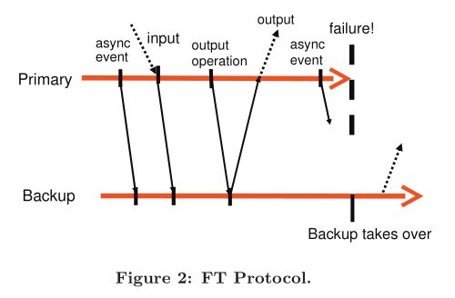
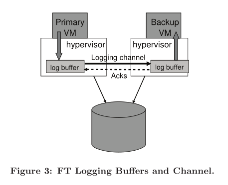
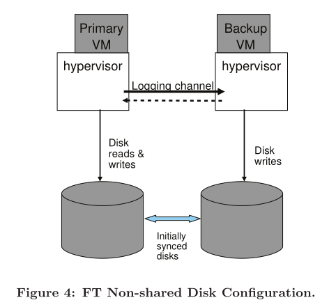
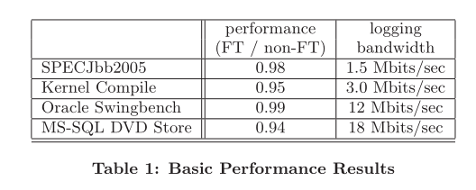
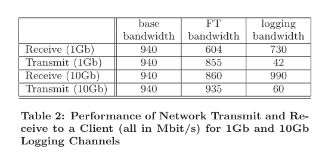

<h1 align="center">The Design of a Practical System for Fault-Tolerant Virtual Machines</h1>

Daniel J. Scales, Mike Nelson, and Ganesh Venkitachalam

## ABSTRACT

We have implemented a commercial enterprise-grade system for providing fault-tolerant virtual machines, based on the approach of replicating the execution of a primary virtual machine (VM) via a backup virtual machine on another server. We have designed a complete system in VMware vSphere 4.0 that is easy to use, runs on commodity servers, and typically reduces performance of real applications by less than 10%. In addition, the data bandwidth needed to keep the primary and secondary VM executing in lockstep is less than 20 Mbit/s for several real applications, which allows for the possibility of implementing fault tolerance over longer distances. An easy-to-use, commercial system that automatically restores redundancy after failure requires many additional components beyond replicated VM execu- tion. We have designed and implemented these extra com- ponents and addressed many practical issues encountered in supporting VMs running enterprise applications. In this paper, we describe our basic design, discuss alternate design choices and a number of the implementation details, and provide performance results for both micro-benchmarks and real applications.

通过提供故障容错性的虚拟机，我们已经实现了一个商业化的企业级系统，它建立在复制一个主虚拟机的执行过程到另一个服务器上的备份虚拟机的基础上。我们已经在 VMware vSphere4.0 上设计了一个完整的系统，它运行在商业用的服务器上，很容易使用，同时保证了应用的性能仅有少于 10% 的降低。另外，为了让 primary VM 和 secondary VM 的执行活动保持一致，对于几个实际的应用而言，需要的数据带宽少于 20Mbit/s，这也允许实现更长距离的故障容错的可能性。一种容易使用，在故障后自动恢复备份的商业化系统，在复制 VM 执行之前需要额外的组件。我们已经设计并且实现了这些额外的组件，并且解决了在支持 VM 运行企业级应用的时候，遇到的许多实际问题。在这篇文章中，我们描述了我们基础的设计，讨论了可替代的设计选择和很多实现的细节，并且针对微基准和真实应用，提供了性能结果。

## 1. INTRODUCTION

A common approach to implementing fault-tolerant servers is the primary/backup approach [1], where a backup server is always available to take over if the primary server fails. The state of the backup server must be kept nearly identical to the primary server at all times, so that the backup server can take over immediately when the primary fails, and in such a way that the failure is hidden to external clients and no data is lost. One way of replicating the state on the backup server is to ship changes to all state of the primary, includ- ing CPU, memory, and I/O devices, to the backup nearly continuously. However, the bandwidth needed to send this state, particular changes in memory, can be very large.

一个实现故障容忍服务器的常见方法是主备机制，如果主服务器失败，一个备份服务器总是可以进行接管。在任何时间，备份服务器的状态必须和主服务器几乎保持一致，因此当主服务器失败的时候，备份服务器可以立刻接管，此时对于外部客户端而言，故障就相当于被隐藏了起来，并且不会造成数据丢失。在备份服务器上复制状态的一种方法是将主服务器的所有状态，包括 CPU、memory、IO 设备，连续地送给备份服务器。然而，这种发送状态的方法，尤其是涉及到内存中的变更，其需要的带宽非常大。

A different method for replicating servers that can use much less bandwidth is sometimes referred to as the state- machine approach [13]. The idea is to model the servers as deterministic state machines that are kept in sync by starting them from the same initial state and ensuring that they receive the same input requests in the same order. Since most servers or services have some operations that are not deterministic, extra coordination must be used to ensure that a primary and backup are kept in sync. However, the amount of extra information need to keep the primary and backup in sync is far less than the amount of state (mainly memory updates) that is changing in the primary.

另一种可以用更少带宽复制服务器的方法类似于状态机。这种思路是将服务器建模为确定性的状态机，他们从相同的初始状态开始，并且确保以相同的顺序接收相同的输入请求，这样就能保持同步。因为大多数服务器或服务有一些不确定性的操作，因此必须使用额外的协调机制来确保主备同步。然而，需要保持主备一致性的额外信息数目，远远少于正在变更的主服务器上状态（主要是内存更新）的数目。

Implementing coordination  to  ensure  deterministic  execution of physical servers [14] is difficult, particularly as processor frequencies increase. In contrast, a virtual ma- chine (VM) running on top of a hypervisor is an excellent platform for implementing the state-machine approach. A VM can be considered a well-defined state machine whose operations are the operations of the machine being virtu- alized (including all its devices). As with physical servers, VMs have some non-deterministic operations (e.g. reading a time-of-day clock or delivery of an interrupt), and so extra information must be sent to the backup to ensure that it is kept in sync. Since the hypervisor has full control over the execution of a VM, including delivery of all inputs, the hypervisor is able to capture all the necessary information about non-deterministic operations on the primary VM and to replay these operations correctly on the backup VM.

实现协调机制来确保物理服务器的确定性操作是困难的，尤其随着处理器频率增长。反之，一个运行在管理程序（hypervisor）上的 VM，是一个实现状态机方法的很好的平台。一个 VM 可以被当作一个定义好的状态机，它的操作是机器被虚拟化的操作（包括它所有的设备）。和物理服务器一样，VM 有相同的非确定性操作（例如读取时钟或发送中断），因此为了保持同步，额外的信息必须被发送给备份服务器。管理程序（hypervisor）有 VM 的全权控制权利，包括处理所有输入，因此它能够获得所有与主 VM 上的非确定性操作有关的必要信息，并且能正确地重放这些操作。

Hence, the state-machine approach can be implemented for virtual machines on commodity hardware, with no hard- ware modifications, allowing fault tolerance to be imple- mented immediately for the newest microprocessors. In ad- dition, the low bandwidth required for the state-machine approach allows for the possibility of greater physical sepa- ration of the primary and the backup. For example, repli- cated virtual machines can be run on physical machines dis- tributed across a campus, which provides more reliability than VMs running in the same building.

因此，这个状态机方法可以通过商业化软件上的 VM 来实现，它不需要硬件更改，允许在最新的微处理器上立刻实现故障容错。另外，状态机方法需要的低带宽允许了主备服务器能更好地进行物理分隔。例如，被复制的 VM 可以运行在横跨一个学校的物理机器上，相比于运行在同一建筑内的 VM 而言，可以提供更多的可靠性。

We have implemented fault-tolerant VMs using the pri- mary/backup approach on the VMware vSphere 4.0 plat- form, which runs fully virtualized x86 virtual machines in a highly-efficient manner. Since VMware vSphere imple- ments a complete x86 virtual machine, we are automatically able to provide fault tolerance for any x86 operating sys- tems and applications. The base technology that allows us to record the execution of a primary and ensure that the backup executes identically is known as deterministic re- play [15]. VMware vSphere Fault Tolerance (FT) is based on deterministic replay, but adds in the necessary extra pro- tocols and functionality to build a complete fault-tolerant system. In addition to providing hardware fault tolerance, our system automatically restores redundancy after a failure by starting a new backup virtual machine on any available server in the local cluster. At this time, the production ver- sions of both deterministic replay and VMware FT support only uni-processor VMs. Recording and replaying the exe- cution of a multi-processor VM is still work in progress, with significant performance issues because nearly every access to shared memory can be a non-deterministic operation.

我们在 VMware vSphere 4.0 平台上使用主备机制实现了故障容忍的 VMs，这个平台以一种高度有效的方式，运行着完全虚拟化的 x86 虚拟机。因为 VMware vSphere 实现了一个完整的 x86 虚拟机，所以我们自动地能够为任何 x86 操作系统和应用提供故障容忍。这种允许我们记录一个主服务器执行，并确保备份服务器一致执行的基础技术是确定性重放。VMware vSphere Fault Tolerance(FT) 是基于确定性重放（Deterministic Replay）的，但是为了建立一个完整的故障容忍系统，还增加了必要的额外协议和功能。除了提供硬件故障容忍，我们的系统在一次失败后，通过在局部集群中任何可接受的服务器上开始一个新的备份虚拟机，进行自动地存储备份。目前确定性重放和 VMare FT 的产品版本只支持单处理器的 VMs。多处理器VM的操作记录和重放还在开发中，因为每个共享内存的操作都是一个非确定性的操作，因此还有重要的性能问题待解决。

Bressoud and Schneider [3] describe a prototype implementation of fault-tolerant VMs for the HP PA-RISC plat- form. Our approach is similar, but we have made some fundamental changes for performance reasons and investi- gated a number of design alternatives. In addition, we have had to design and implement many additional components in the system and deal with a number of practical issues to build a complete system that is efficient and usable by customers running enterprise applications. Similar to most other practical systems discussed, we only attempt to deal with fail-stop failures [12], which are server failures that can be detected before the failing server causes an incorrect ex- ternally visible action.

Bressoud 和 Schneider 描述了一个针对 HP PA-RISC 平台的故障容忍 VMs 的原型实现。我们的方法是相似的，但是出于性能原因，以及在调查了许多可替代设计后，我们已经做了一些基础性的改变。另外，为了建立一个完整的系统，而这个系统是有效的并且能够被正在运行企业级应用的客户使用，我们已经设计并实现了系统中许多额外的组件，可以处理许多实际问题。与大多数其他实际系统讨论的类似，我们只尝试应对 fail-stop 的故障，这是一种服务器故障，可以在故障服务器造成一次不正确的外部可见行为之前被检测。（*Hades注：fail-stop故障指的是，如果某些东西出现故障，只是单纯的停止运行，而不是运算出错误结果。比如电源线、服务器风扇导致 CPU 过热停止运行、网络等故障*）

The rest of the paper is organized as follows. First, we describe our basic design and detail our fundamental proto- cols that ensure that no data is lost if a backup VM takes over after a primary VM fails. Then, we describe in de- tail many of the practical issues that must be addressed to build a robust, complete, and automated system. We also describe several design choices that arise for implementing fault-tolerant VMs and discuss the tradeoffs in these choices. Next, we give performance results for our implementation for some benchmarks and some real enterprise applications. Finally, we describe related work and conclude.

文章的剩余部分如下组织。首先，我们描述了我们基础的设计，并且详细说明了我们的基本协议，它能确保在主 VM 失败后，备份 VM 能够接替，且不会造成数据丢失。然后，我们描述了许多实际问题的细节，这些问题是为了建立一个健壮的、完整的和自动化系统过程中必须被处理的。我们也描述了几个可用于实现故障容忍 VMs 的设计选择，并且讨论了这些选择的得失。接着，我们给出在一些基准以及实际企业级应用上的性能结果。最后，我们描述相关的工作和结论。

## 2. BASIC FT DESIGN

Figure 1 shows the basic setup of our system for fault- tolerant VMs. For a given VM for which we desire to provide fault tolerance (the *primary* VM), we run a *backup* VM on a different physical server that is kept in sync and executes identically to the primary virtual machine, though with a small time lag. We say that the two VMs are in *virtual lock- step*. The virtual disks for the VMs are on shared storage (such as a Fibre Channel or iSCSI disk array), and there- fore accessible to the primary and backup VM for input and output. (We will discuss a design in which the primary and backup VM have separate non-shared virtual disks in Sec- tion 4.1.) Only the primary VM advertises its presence on the network, so all network inputs come to the primary VM. Similarly, all other inputs (such as keyboard and mouse) go only to the primary VM.

图1 展示了我们系统在故障容忍VMs的基本步骤。对于一个给定的 VM，我们希望提供故障容忍（主 VM），我们在一个完全不同的物理机器上运行一个备份 VM，保持和主 VM 同步并且执行一致，虽然存在短时间的滞后。我们说这两个 VMs 是虚拟的步调一致。VMs 的虚拟磁盘是在一个共享存储中的（例如一个 Fibre Channel 或者 iSCSI 磁盘阵列），因此可以接受主备服务器的输入和输出。（我们将在 4.1 节中讨论带有分隔的非共享虚拟磁盘的主备 VM 的设计）只有主 VM 会说明它在网络中的存在，因此所有网络输入都会来到主 VM 上。相似地，所有其他输入（例如键盘和鼠标）也只会来到主 VM 上。

All input that the primary VM receives is sent to the backup VM via a network connection known as the *logging channel*. For server workloads, the dominant input traffic is network and disk. Additional information, as discussed below in Section 2.1, is transmitted as necessary to ensure that the backup VM executes non-deterministic operations in the same way as the primary VM. The result is that the backup VM always executes identically to the primary VM. However, the outputs of the backup VM are dropped by the hypervisor, so only the primary produces actual outputs that are returned to clients. As described in Section 2.2, the primary and backup VM follow a specific protocol, including explicit acknowledgments by the backup VM, in order to ensure that no data is lost if the primary fails.

所有主 VM 接收到的输入都会通过名为 logging channel 的网络连接，被发送到备份 VM 上。对于几个工作负载而言，主要的输入途径是网络和磁盘。为了保证备份 VM 和主 VM 使用相同的方式执行非确定性操作，下面 2.1 节讨论的额外的信息也需要发送。结果备份 VM 总是执行和主 VM 一致的操作。然而，备份 VM 的输出会被管理程序扔掉，因此只有主 VM 产生实际输出，并被返回给客户端。和 2.2 节中描述的一样，为了确保主 VM 失败后没有数据丢失，主备 VM 遵循一个具体的协议，包括备份 VM 明确的确认信息。

To detect if a primary or backup VM has failed, our sys- tem uses a combination of heartbeating between the relevant servers and monitoring of the traffic on the logging channel. In addition, we must ensure that only one of the primary or backup VM takes over execution, even if there is a split- brain situation where the primary and backup servers have lost communication with each other.

为了检测主或备份虚拟机是否失败，我们的系统既使用相关服务器间的心跳机制，同时也监测 logging channel 上的流量。另外，我们我们必须确保只有主或备份 VM 执行操作，即使存在脑裂（split brain）的场景，在这种场景中主备服务器互相之间会失去通信。

In the following sections, we provide more details on sev- eral important areas. In Section 2.1, we give some details on the deterministic replay technology that ensures that pri- mary and backup VMs are kept in sync via the information sent over the logging channel. In Section 2.2, we describe a fundamental rule of our FT protocol that ensures that no data is lost if the primary fails. In Section 2.3, we describe our methods for detecting and responding to a failure in a correct fashion.

在下面的小节中，我们在几个重要的方面提供更多的细节。在 2.1 节中，我们给出一些确定性重放技术的细节，保证主备 VMs 通过 logging channel 上的信息保持一致。在 2.2 节中，我们描述了我们的 FT 协议中的一个基础规则，保证了主 VM 失败后没有数据丢失。在 2.3 节中，我们描述我们的方法，它能够通过正确的方式检测及响应故障。

### 2.1 Deterministic Replay Implementation

As we have mentioned, replicating server (or VM) exe- cution can be modeled as the replication of a determinis- tic state machine. If two deterministic state machines are started in the same initial state and provided the exact same inputs in the same order, then they will go through the same sequences of states and produce the same outputs. A vir- tual machine has a broad set of inputs, including incoming network packets, disk reads, and input from the keyboard and mouse. Non-deterministic events (such as virtual in- terrupts) and non-deterministic operations (such as reading the clock cycle counter of the processor) also affect the VM’s state. This presents three challenges for replicating execu- tion of any VM running any operating system and workload: (1) correctly capturing all the input and non-determinism necessary to ensure deterministic execution of a backup vir- tual machine, (2) correctly applying the inputs and non- determinism to the backup virtual machine, and (3) doing so in a manner that doesn’t degrade performance. In addition, many complex operations in x86 microprocessors have undefined, hence non-deterministic, side effects. Capturing these undefined side effects and replaying them to produce the same state presents an additional challenge.

正如我们已经提到的，复制服务器（或者 VM）的操作可以被建模为确定性状态机的复制。如果两个确定性的状态机以相同的初始状态开始，并且以相同的顺序提供确切的输入，它们将经历相同的状态序列并且产生相同的输出。一个虚拟机有很宽泛的输入，包括到来的网络包，磁盘读，以及来自键盘和鼠标的输入。非确定性事件（例如虚拟中断）和非确定性操作（例如处理器的时钟周期计数器）也会影响虚拟机的状态。这显示了对于正在运行任何操作系统和工作负载的任何虚拟机而言，复制执行有三个挑战：

* 为了保证一个备份虚拟机的确定性执行，正确地得到所有输入以及非确定性执行是必要的。
* 正确地将输入与非确定性执行应用到备份虚拟机上。
* 以一种不会引起性能退化的方式执行。

另外，许多在 x86 处理器上的复杂操作还未被定义，因此会引起非确定性以及副作用。捕获这些未定义的操作并且重放它们产生相同的状态是一个额外的挑战。

VMware deterministic replay [15] provides exactly this functionality for x86 virtual machines on the VMware vSphere platform. Deterministic replay records the inputs of a VM and all possible non-determinism associated with the VM execution in a stream of log entries written to a log file. The VM execution may be exactly replayed later by reading the log entries from the file. For non-deterministic operations, sufficient information is logged to allow the operation to be reproduced with the same state change and output. For non-deterministic events such as timer or IO completion interrupts, the exact instruction at which the event occurred is also recorded. During replay, the event is delivered at the same point in the instruction stream. VMware determinis- tic replay implements an efficient event recording and event delivery mechanism that employs various techniques, includ- ing the use of hardware performance counters developed in conjunction with AMD [2] and Intel [8].

针对在 VMare vSphere 平台上的 x86 虚拟机，VMware 确定性地重放恰好提供了这个功能。确定性重放记录了 VM 的输入以及与 VM 执行相关的所有可能的不确定性的日志条目流，这些条目会被写入日志文件。在读取日志文件中的条目后，VM 操作会被精确地重放。 对于非确定性操作，为了允许操作以相同的状态变化和输出再现，需要记录足够的信息。 对于非确定性事件，例如定时器或 IO 完成中断，事件发生的确切指令也会被记录下来。 在重播期间，事件被传递在指令流中的同一位置。 VMware 确定性重放采用各种技术，实现了高效的事件记录和事件传递机制，包括使用 AMD[2] 和英特尔[8] 联合开发的硬件性能计数器。

Bressoud and Schneider [3] mention dividing the execution of VM into epochs, where non-deterministic events such as interrupts are only delivered at the end of an epoch. The no- tion of epoch seems to be used as a batching mechanism be- cause it is too expensive to deliver each interrupt separately at the exact instruction where it occurred. However, our event delivery mechanism is efficient enough that VMware deterministic replay has no need to use epochs. Each inter- rupt is recorded as it occurs and efficiently delivered at the appropriate instruction while being replayed.

Bressoud 和 Schneider[3] 提到将 VM 执行切分成不同的时代（epoch），其中非确定性事件，例如中断仅在一个 epoch 结束时传递。 epoch 的概念似乎被用作批处理机制，因为在它发生的确切指令处单独传递每个中断的成本太高。然而，我们的事件传递机制足够高效，以至于 VMware 确定性重放不需要使用 epochs。 每次中断在发生时被记录，并且在重放时有效地传递到适当的指令处。

### 2.2 FT Protocol

For VMware FT, we use deterministic replay to produce the necessary log entries to record the execution of the pri- mary VM, but instead of writing the log entries to disk, we send them to the backup VM via the logging channel. The backup VM replays the entries in real time, and hence executes identically to the primary VM. However, we must augment the logging entries with a strict FT protocol on the logging channel in order to ensure that we achieve fault tolerance. Our fundamental requirement is the following:

对于 VMware FT 而言，我们使用确定性重放来生成必要的日志条目来记录主VM的执行情况，但是不是将日志条目写入磁盘，而是通过日志通道将它们发送到备份 VM。备份 VM 实时重放日志条目，因此与主 VM 的执行保持一致。 然而，我们必须在日志通道中使用严格的 FT 协议以增强日志条目，从而确保我们实现故障容忍。 我们的基本要求如下：

**Output Requirement**: if the backup VM ever takes over after a failure of the primary, the backup VM will continue executing in a way that is en- tirely consistent with all outputs that the pri- mary VM has sent to the external world.

**输出要求**：如果备份 VM 在主 VM 发生故障后接管，那么备份 VM 将继续以一种与主虚拟机发送到外部世界的所有输出完全一致的方式执行。

Note that after a *failover* occurs (i.e. the backup VM takes over after the failure of the primary VM), the backup VM will likely start executing quite differently from the way the primary VM would have continued executing, because of the many non-deterministic events happening during execution. However, as long as the backup VM satisfies the Output Re- quirement, no externally visible state or data is lost during a failover to the backup VM, and the clients will notice no interruption or inconsistency in their service.

请注意，在发生故障转移后（即备份 VM 需要在主 VM 故障后接管），备份 VM 开始执行的方式可能与主 VM 相当不同，因为在执行期间发生了许多非确定性事件。但是，只要备份 VM 满足输出要求，在故障转移到备份 VM 期间没有外部可见状态或数据的丢失，客户端将注意到他们的服务没有中断或不一致。

The Output Requirement can be ensured by delaying any external output (typically a network packet) until the backup VM has received all information that will allow it to replay execution at least to the point of that output operation. One necessary condition is that the backup VM must have received all log entries generated prior to the output oper- ation. These log entries will allow it to execute up to the point of the last log entry. However, suppose a failure were to happen immediately after the primary executed the out- put operation. The backup VM must know that it must keep replaying up to the point of the output operation and only “go live” (stop replaying and take over as the primary VM, as described in Section 2.3) at that point. If the backup were to go live at the point of the last log entry before the output operation, some non-deterministic event (e.g. timer interrupt delivered to the VM) might change its execution path before it executed the output operation.

可以通过延迟任何外部输出（通常是网络数据包）直到备份 VM 已收到重放的所有信息来确保输出要求，这些信息允许它至少执行到该输出操作的点。一个必要条件是备份 VM 必须接收到输出操作之前生成的所有日志条目。这些日志条目将允许它执行到最后一个日志条目的点。但是，假设失败是在主 VM 执行输出操作后立即发生。备份 VM 必须知道它必须继续重播到输出操作点，并且到那时只能“上线”（停止重播并作为主 VM 接管，如 2.3 节所述）。如果备份将在输出操作之前的最后一个日志条目点上线，一些非确定性事件（例如计时器传递给 VM 的中断）可能会在执行输出操作之前改变其执行路径。

Given the above constraints, the easiest way to enforce the Output Requirement is to create a special log entry at each output operation. Then, the Output Requirement may be enforced by this specific rule:

给定上述的限制，强制满足输入要求的最容易的方式是在每个输出操作时创建一个特殊的日志条目。然后，输入要求一定被下面特殊的规则限制：

**Output Rule**: the primary VM may not send an output to the external world, until the backup VM has received and acknowledged the log en- try associated with the operation producing the output.

**输出规则**：主 VM 可能不发送一个输出到外部世界，直到备份VM 已收到并确认与产生输出的操作相关的日志条目。

If the backup VM has received all the log entries, includ- ing the log entry for the output-producing operation, then the backup VM will be able to exactly reproduce the state of the primary VM at that output point, and so if the pri- mary dies, the backup will correctly reach a state that is consistent with that output. Conversely, if the backup VM takes over without receiving all necessary log entries, then its state may quickly diverge such that it is inconsistent with the primary’s output. The Output Rule is in some ways analogous to the approach described in [11], where an “ex- ternally synchronous” IO can actually be buffered, as long as it is actually written to disk before the next external communication.

如果备份 VM 已收到所有日志条目，包括生成输出操作的日志条目，然后备份 VM 将能够准确地重现主  VM 在输出点的状态，所以如果主 VM 死了，备份将正确地达到一个与输出一致的状态。相反，如果备份 VM 在没有收到所有必要的日志条目的情况下接管，那么它的状态可能会迅速分歧，以至于与主服务器的输出不一致。输出规则在某些方面类似于 [11] 中描述的方法，其中“外部同步” IO 实际上可以被缓存，只要它在下一次外部通信之前确实被写入磁盘了。

Note that the Output Rule does not say anything about stopping the execution of the primary VM. We need only delay the sending of the output, but the VM itself can con- tinue execution. Since operating systems do non-blocking network and disk outputs with asynchronous interrupts to indicate completion, the VM can easily continue execution and will not necessarily be immediately affected by the delay in the output. In contrast, previous work [3, 9] has typically indicated that the primary VM must be completely stopped prior to doing an output until the backup VM has acknowl- edged all necessary information from the primary VM.

请注意，输出规则没有说明关于停止主 VM 执行的任何事。我们只需要延迟输出发送，但 VM 本身可以继续执行。由于操作系统通过异步中断来指示完成，因此可以执行非阻塞的网络和磁盘输出，VM 可以轻松地继续执行并且不一定会立即受到输出延迟的影响。相比之下，以前的工作 [3, 9] 通常必须在执行输出之前完全停止主 VM，直到备份 VM 已确认来自主 VM 的所有必要信息。

As an example, we show a chart illustrating the require- ments of the FT protocol in Figure 2. This figure shows a timeline of events on the primary and backup VMs. The arrows going from the primary line to the backup line rep- resent the transfer of log entries, and the arrows going from the backup line to the primary line represent acknowledg- ments. Information on asynchronous events, inputs, and output operations must be sent to the backup as log entries and acknowledged. As illustrated in the figure, an output to the external world is delayed until the primary VM has re- ceived an acknowledgment from the backup VM that it has received the log entry associated with the output operation. Given that the Output Rule is followed, the backup VM will be able to take over in a state consistent with the primary’s last output.

作为一个例子，我们在图 2 中展示了 FT 协议的需求。该图显示了一个主 VM 和备份 VM 上的事件时间线。从主线到备份线的箭头表示日志条目的传输，从备份线路到主线路的箭头表示确认。有关异步事件、输入和输出操作的信息必须作为日志条目发送到备份 VM 并确认。如图所示，到外部世界的输出被延迟，直到主 VM 收到来自备份 VM 的确认，它已经收到与输出操作相关的日志条目。鉴于遵循输出规则，备份 VM 将能够以这样一种状态接管，即与主 VM 最后的输出一致。

We cannot guarantee that all outputs are produced ex- actly once in a failover situation. Without the use of trans- actions with two-phase commit when the primary intends to send an output, there is no way that the backup can determine if a primary crashed immediately before or after sending its last output. Fortunately, the network infrastruc- ture (including the common use of TCP) is designed to deal with lost packets and identical (duplicate) packets. Note that incoming packets to the primary may also be lost dur- ing a failure of the primary and therefore won’t be delivered to the backup. However, incoming packets may be dropped for any number of reasons unrelated to server failure, so the network infrastructure, operating systems, and applications are all written to ensure that they can compensate for lost packets.

我们不能保证一旦出现故障转移情况，所有输出都准确地产生一次。当主 VM 打算发送输出时，没有使用两阶段提交事务，备份 VM 无法确定主VM是在发送它的最后一个输出之前还是之后立即崩溃。 幸运的是，网络基础设施（包括常用的 TCP）旨在处理丢失的数据包和相同（重复）的数据包。 请注意传入到主 VM 的数据包也可能在其故障的期间丢失，因此不会被传递给备份 VM。 但是，传入的数据包可能会由于与服务器故障无关的任何原因被丢弃，因此网络基础设施、操作系统和应用程序都被写入，以确保他们可以弥补丢失的数据包。

### 2.3 Detecting and Responding to Failure

As mentioned above, the primary and backup VMs must respond quickly if the other VM appears to have failed. If the backup VM fails, the primary VM will *go live* – that is, leave recording mode (and hence stop sending entries on the logging channel) and start executing normally. If the primary VM fails, the backup VM should similarly *go live*, but the process is a bit more complex. Because of its lag in execution, the backup VM will likely have a number of log entries that it has received and acknowledged, but have not yet been consumed because the backup VM hasn’t reached the appropriate point in its execution yet. The backup VM must continue replaying its execution from the log entries until it has consumed the last log entry. At that point, the backup VM will stop replaying mode and start executing as a normal VM. In essence, the backup VM has been promoted to the primary VM (and is now missing a backup VM). Since it is no longer a backup VM, the new primary VM will now produce output to the external world when the guest OS does output operations. During the transition to normal mode, there may be some device-specific operations needed to allow this output to occur properly. In particular, for the purposes of networking, VMware FT automatically advertises the MAC address of the new primary VM on the network, so that physical network switches will know on what server the new primary VM is located. In addition, the newly promoted primary VM may need to reissue some disk IOs (as described in Section 3.4).

如上所述，如果另一个 VM 出现故障，主备 VMs 必须快速响应。如果备份 VM 出现故障，主 VM 将上线，即离开记录模式（因此停止发送条目到日志通道）并开始正常执行。如果主 VM 失败，备份 VM 应该同样上线（go live），但过程更为复杂。由于其执行的滞后，备份 VM 可能会有许多它已收到并确认，但尚未消耗的日志条目，因为备份 VM 尚未达到执行的适当点。备份 VM 必须继续重放日志条目，直到它消耗了最后一个日志条目。此时，备份 VM 将停止重放模式并开始作为正常 VM 执行。本质上备份 VM 被提升为主VM（现在缺少备份 VM）。由于它不再是备份 VM，当操作系统执行输出操作时，新的主 VM 现在将向外部世界生产输出。在过渡到正常模式期间，可能会有一些特定设备的操作需要允许正确地发送输出。特别是，出于联网目的，VMware FT 自动在网络上通告新的主 VM 的 MAC 地址，以便物理网络交换机知道新的主 VM 所在的服务器。此外，新提升的主 VM 可能需要重做一些磁盘 IO（如第 3.4 节所述）。

There are many possible ways to attempt to detect failure of the primary and backup VMs. VMware FT uses UDP heartbeating between servers that are running fault-tolerant VMs to detect when a server may have crashed. In addition, VMware FT monitors the logging traffic that is sent from the primary to the backup VM and the acknowledgments sent from the backup VM to the primary VM. Because of regular timer interrupts, the logging traffic should be regular and never stop for a functioning guest OS. Therefore, a halt in the flow of log entries or acknowledgments could indicate the failure of a VM. A failure is declared if heartbeating or logging traffic has stopped for longer than a specific timeout (on the order of a few seconds).

有许多可能的方法来尝试检测主备 VMs 的故障。VMware FT 在运行容错 VMs 的服务器之间使用 **UDP 心跳**，来检测服务器何时崩溃。此外，VMware FT 监控日志流量，包括从主到备的发送以及从备到主的确认。因为定时器中断，日志流量应该是有规律的，并且永远不会停止。因此，在日志条目或确认流中的中断可能表明 VM 故障。如果心跳或记录流量已停止超过特定超时时间（大约几秒钟），就可能发生故障了。

However, any such failure detection method is susceptible to a split-brain problem. If the backup server stops receiving heartbeats from the primary server, that may indicate that the primary server has failed, or it may just mean that all network connectivity has been lost between still functioning servers. If the backup VM then goes live while the primary VM is actually still running, there will likely be data cor- ruption and problems for the clients communicating with the VM. Hence, we must ensure that only one of the primary or backup VM goes live when a failure is detected. To avoid split-brain problems, we make use of the shared storage that stores the virtual disks of the VM. When either a primary or backup VM wants to go live, it executes an atomic test- and-set operation on the shared storage. If the operation succeeds, the VM is allowed to go live. If the operation fails, then the other VM must have already gone live, so the current VM actually halts itself (“commits suicide”). If the VM cannot access the shared storage when trying to do the atomic operation, then it just waits until it can. Note that if shared storage is not accessible because of some failure in the storage network, then the VM would likely not be able to do useful work anyway because the virtual disks reside on the same shared storage. Thus, using shared storage to resolve split-brain situations does not introduce any extra unavailability.

但是，任何此类故障检测方法都容易受到脑裂（split brain）问题的影响。如果备份服务器停止接收来自主服务器的心跳，这可能表明主服务器出现故障，或者可能只是意味着所有仍在运行的服务器之间的网络连接丢失。如果备份 VM 随后上线，而主 VM 也仍然在运行，对于与 VM 通信的客户端而言可能会有数据损坏以及其他问题。因此，我们必须确保当检测到故障时，主 VM 和备份 VM 只有一个在线。为了避免脑裂问题，我们利用共享存储，来存储 VM 的虚拟磁盘。 当任一主或备份 VM 想要上线时，它会在共享存储中执行一个原子性的测试设置操作。 如果操作成功，VM 被允许上线。 如果操作失败，那么另一个 VM 一定已经上线，所以当前虚拟机实际上停止了自己（“自杀”）。 如果尝试执行此原子操作时，VM 无法访问共享存储，然后它只是等待，直到可以访问。 注意如果由于存储网络上的某些故障而无法访问共享存储时，那么虚拟机可能无法做有用的工作，因为虚拟磁盘在同样的共享存储中，因此，为了解决脑裂问题而使用共享存储不会引入任何额外的不可接受性。（*Hades注：使用共享存储这种解决方案本身使得主备又得以通信了，只不过是通过信号量，而非 socket。*）

One final aspect of the design is that once a failure has oc- curred and one of the VMs has gone live, VMware FT auto- matically restores redundancy by starting a new backup VM on another host. Though this process is not covered in most previous work, it is fundamental to making fault-tolerant VMs useful and requires careful design. More details are given in Section 3.1.

这个设计的一个最终方面是一旦故障发生并且一个 VM 已经上线，VMware FT 自动地通过在另一个主机上开始一个新的备份 VM，来恢复备份。虽然这个过程不能覆盖过去大部分的工作，但是对于故障容忍的 VM 有用，它是基础，需要仔细设计。 更多细节是在第 3.1 节中给出。

## 3. PRACTICAL IMPLEMENTATION OF FT

Section 2 described our fundamental design and protocols for FT. However, to create a usable, robust, and automatic system, there are many other components that must be de- signed and implemented.

第二节描述了我们基础的设计以及 FT 协议。然而，为了创建一个有用的、健壮的以及自动化的系统，有许多其他组件必须设计实现。

### 3.1 Starting and Restarting FT VMs

One of the biggest additional components that must be designed is the mechanism for starting a backup VM in the same state as a primary VM. This mechanism will also be used when re-starting a backup VM after a failure has oc- curred. Hence, this mechanism must be usable for a running primary VM that is in an arbitrary state (i.e. not just start- ing up). In addition, we would prefer that the mechanism does not significantly disrupt the execution of the primary VM, since that will affect any current clients of the VM.

一个必须被设计的最大的额外组件是这种机制，即启动一个拥有和主 VM 状态一样的备份 VM。当故障发生后重启一个备份 VM 时，这个机制也将变得很有用。因此，这个机制一定可用于一个处于任意状态的正在运行中的主 VM。此外，我们希望该机制不会显著地中断主 VM 的执行，因为这会影响 VM 的任何当前客户端。

For VMware FT, we adapted the existing VMotion func- tionality of VMware vSphere. VMware VMotion [10] allows the migration of a running VM from one server to another server with minimal disruption – VM pause times are typ- ically less than a second. We created a modified form of VMotion that creates an exact running copy of a VM on a remote server, but without destroying the VM on the local server. That is, our modified *FT VMotion* clones a VM to a remote host rather than migrating it. The FT VMotion also sets up a logging channel, and causes the source VM to enter logging mode as the primary, and the destination VM to enter replay mode as the new backup. Like normal VMotion, FT VMotion typically interrupts the execution of the primary VM by less than a second. Hence, enabling FT on a running VM is an easy, non-disruptive operation.

对于 VMware FT 而言，我们调整了 VMware vSphere 上现有的 VMotion 功能。 VMware VMotion[10] 允许以最少中断的方式，将正在运行的 VM 从一台服务器迁移到另一台服务器，VM 的暂停时间通常不到一秒钟。我们创建了一个 VMotion 的修改形式，可在远程服务器上创建准确的 VM 运行副本，但不会破坏本地服务器的虚拟机。也就是说，我们修改后的 FT VMotion 将 VM 克隆到远程主机上而不是迁移它。 FT VMotion 还设置了一个日志记录通道，并导致源 VM 作为主 VM 进入日志记录模式，而目的 VM  作为备份进入重放模式。像平常的 VMotion 一样，FT VMotion 通常会中断主 VM 的执行不到一秒。因此，启用 FT 在正在运行的 VM 上是一个简单的、无中断的操作。

Another aspect of starting a backup VM is choosing a server on which to run it. Fault-tolerant VMs run in a cluster of servers that have access to shared storage, so all VMs can typically run on any server in the cluster. This flexibility al- lows VMware vSphere to restore FT redundancy even when one or more servers have failed. VMware vSphere imple- ments a clustering service that maintains management and resource information. When a failure happens and a primary VM now needs a new backup VM to re-establish redundancy, the primary VM informs the clustering service that it needs a new backup. The clustering service determines the best server on which to run the backup VM based on resource usage and other constraints and invokes an FT VMotion to create the new backup VM. The result is that VMware FT typically can re-establish VM redundancy within minutes of a server failure, all without any noticeable interruption in the execution of a fault-tolerant VM.

启动备份 VM 的另一个方面是选择一个运行它的服务器。容错 VM 在服务器集群中运行，可以访问共享存储，因此所有 VM通常可以运行在集群上的任何服务器中。这种灵活性允许VMware vSphere恢复FT冗余，即使一个或多个服务器失效。**VMware vSphere 实现了一种集群服务，用于维护管理以及资源信息**。 当发生故障并且主VM 现在需要一个新的备份 VM 来重新建立冗余时，主 VM 通知集群服务它需要一个新的备份。 集群服务基于资源利用率以及其他约束，决定运行备份VM最好的服务器，并调用 FT VMotion 以创建新的备份 VM。 结果是 VMware FT通常可以在几分钟内重新建立VM冗余，在一个故障容忍VM的执行上，所有这些都没有任何明显的中断。

### 3.2 Managing the Logging Channel

There are a number of interesting implementation details in managing the traffic on the logging channel. In our im- plementation, the hypervisors maintain a large buffer for logging entries for the primary and backup VMs. As the primary VM executes, it produces log entries into the log buffer, and similarly, the backup VM consumes log entries from its log buffer. The contents of the primary’s log buffer are flushed out to the logging channel as soon as possible, and log entries are read into the backup’s log buffer from the logging channel as soon as they arrive. The backup sends ac- knowledgments back to the primary each time that it reads some log entries from the network into its log buffer. These acknowledgments allow VMware FT to determine when an output that is delayed by the Output Rule can be sent. Fig- ure 3 illustrates this process.

在管理日志通道上的流量时，有许多有趣的实现细节。在我们的实现中，管理程序为主备 VM 的日志记录条目维持了一个大的缓冲区。当主 VM 执行时，它生成日志条目到缓冲区中，类似地，备份 VM 从它的日志缓冲区中消耗日志条目。主日志缓冲区的内容会被尽快刷新到日志记录通道，这些日志条目一到日志通道，就会被读取到备份的日志缓冲区。备份每次从网络上读取一些日志条目到它的日志缓冲区时，都会发送确认返回给主 VM。这些确认允许 VMware FT 确定一个被输入规则延迟的输出何时可以被发送。图 3 说明了这个过程。

If the backup VM encounters an empty log buffer when it needs to read the next log entry, it will stop execution until a new log entry is available. Since the backup VM is not communicating externally, this pause will not affect any clients of the VM. Similarly, if the primary VM encounters a full log buffer when it needs to write a log entry, it must stop execution until log entries can be flushed out. This stop in execution is a natural flow-control mechanism that slows down the primary VM when it is producing log entries at too fast a rate. However, this pause can affect clients of the VM, since the primary VM will be completely stopped and unresponsive until it can log its entry and continue execution. Therefore, our implementation must be designed to minimize the possibility that the primary log buffer fills up.

如果备份 VM 在需要读取下一个日志条目时，遇到空的日志缓冲区，它将停止执行直到有新的日志条目可用。由于备份 VM 是不与外部通信的，此暂停不会影响任何 VM 的客户端。同样地，当主 VM 需要写入一个日志条目时，如果主 VM 遇到一个完整的日志缓冲区，它必须停止执行，直到可以刷新日志条目。这种执行的停止是一种自然的流控制机制，当主 VM 生产日志条目太快了，它会减慢主 VM。但是，此暂停可能会影响 VM 的客户端，因为主 VM 将完全停止并且无响应，直到它可以记录其条目并继续执行。因此，我们的实现必须设计为尽量减少主日志缓冲区填满的可能性。

One reason that the primary log buffer may fill up is be- cause the backup VM is executing too slowly and therefore consuming log entries too slowly. In general, the backup VM must be able to replay an execution at roughly the same speed as the primary VM is recording the execution. Fortu- nately, the overhead of recording and replaying in VMware deterministic replay is roughly the same. However, if the server hosting the backup VM is heavily loaded with other VMs (and hence overcommitted on resources), the backup VM may not be able to get enough CPU and memory resources to execute as fast as the primary VM, despite the best efforts of the backup hypervisor’s VM scheduler.

主日志缓冲区可能填满的原因之一是备份 VM 执行速度太慢，因此消耗日志条目太慢。一般来说，备份 VM 必须能够以与正在记录执行的主 VM 大致相同的速度重放执行。幸运的是，在 VMware 确定性重放中，记录和重放的开销大致相同。然而，如果由于其他 VMs，托管备份 VM 的服务器负载很重（因此过度使用资源），备份 VM 可能无法获得足够的 CPU 和内存资源，来与主 VM 一样快地执行，尽管备份管理程序的 VM 调度器已经尽了最大努力。

Beyond avoiding unexpected pauses if the log buffers fill up, there is another reason why we don’t wish the execution lag to become too large. If the primary VM fails, the backup VM must “catch up” by replaying all the log entries that it has already acknowledged before it goes live and starts communicating with the external world. The time to finish replaying is basically the execution lag time at the point of the failure, so the time for the backup to go live is roughly equal to the failure detection time plus the current execution lag time. Hence, we don’t wish the execution lag time to be large (more than a second), since that will add significant time to the failover time.

如果日志缓冲区填满，除了避免意外暂停，还有另一个原因是我们不希望滞后变得太大。如果主 VM 出现故障，备份 VM 必须通过重放它在上线和开始与外部世界交流之前已经确认的所有日志条目来“赶上”。完成重放的时间基本上是失败点的执行延迟时间，所以备份上线的时间大约等于故障检测时间加上当前执行时差。因此，我们不希望执行滞后时间太大（超过一秒），因为这将显著地增加故障转移时间。

Therefore, we have an additional mechanism to slow down the primary VM to prevent the backup VM from getting too far behind. In our protocol for sending and acknowledg- ing log entries, we send additional information to determine the real-time execution lag between the primary and backup VMs. Typically the execution lag is less than 100 millisec- onds. If the backup VM starts having a significant execution lag (say, more than 1 second), VMware FT starts slowing down the primary VM by informing the scheduler to give it a slightly smaller amount of the CPU (initially by just a few percent). We use a slow feedback loop, which will try to gradually pinpoint the appropriate CPU limit for the primary VM that will allow the backup VM to match its execution. If the backup VM continues to lag behind, we continue to gradually reduce the primary VM’s CPU limit. Conversely, if the backup VM catches up, we gradually in- crease the primary VM’s CPU limit until the backup VM returns to having a slight lag.

因此，我们有一个额外的机制减慢主 VM，以防止备份 VM 获取太滞后了。在我们的发送和确认日志条目的协议中，我们发送附加信息来确定主备 VM 之间的实时执行滞后。通常执行滞后小于 100 毫秒。如果备份 VM 有一个显著的执行滞后（例如，超过 1 秒），VMware FT 通过通知调度程序给它稍微少一点的 CPU（最初只是百分之几）来减慢主 VM。我们使用一个缓慢的反馈循环，这将尝试逐步确定适当的 CPU 限制，将允许主备 VM 同步执行。如果备份 VM 继续滞后，我们继续逐步降低主 VM 的 CPU 限制。反之，如果备份 VM 赶上，我们逐渐增加主 VM 的 CPU 限制，直到备份虚拟机恢复轻微的滞后。

Note that such slowdowns of the primary VM are very rare, and typically happen only when the system is under extreme stress. All the performance numbers of Section 5 include the cost of any such slowdowns.

请注意，主 VM 的这种减速很少见，通常只在系统处于低压力时发生。第 5 节的所有性能编号包括任何此类放缓的成本。

### 3.3 Operation on FT VMs

Another practical matter is dealing with the various con- trol operations that may be applied to the primary VM. For example, if the primary VM is explicitly powered off, the backup VM should be stopped as well, and not attempt to go live. As another example, any resource management change on the primary (such as increased CPU share) should also be applied to the backup. For these kind of operations, special control entries are sent on the logging channel from the primary to the backup, in order to effect the appropriate operation on the backup.

另一个实际问题是处理各种控制操作，它们可以应用于主 VM 。例如，如果主 VM 明确关闭电源，备份  VM 也应该停止，而不是尝试上线。 再举一个例子，任何主 VM 上的资源管理更改（例如增加 CPU 份额）应该也适用于备份。 对于此类操作，为了影响备份进行合适的操作，特殊的控制条目通过日志通道从主发送到备份。

In general, most operations on the VM should be initiated only on the primary VM. VMware FT then sends any nec- essary control entry to cause the appropriate change on the backup VM. The only operation that can be done indepen- dently on the primary and backup VMs is VMotion. That is, the primary and backup VMs can be VMotioned indepen- dently to other hosts. Note that VMware FT ensures that neither VM is moved to the server where the other VM is, since that situation would no longer provide fault tolerance.

一般来说，VM 上的大部分操作都应该仅在主 VM 上初始化。 VMware FT 然后发送任何必要的控制条目以造成备份 VM 上适当的更改。 唯一可以独立在主VM和备份VM上完成的操作是 VMotion。 那即，主 VM和 备份 VM 可以独立被 VMotioned到其他主机。 请注意，VMware FT 确保两个 VM 都不会移动到另一个 VM 所在的服务器，因为这种场景将不再提供故障容忍。

VMotion of a primary VM adds some complexity over a normal VMotion, since the backup VM must disconnect from the source primary and re-connect to the destination primary VM at the appropriate time. VMotion of a backup VM has a similar issue, but adds an additional complexity. For a normal VMotion, we require that all outstanding disk IOs be quiesced (i.e. completed) just as the final switchover on the VMotion occurs. For a primary VM, this quiescing is easily handled by waiting until the physical IOs complete and delivering these completions to the VM. However, for a backup VM, there is no easy way to cause all IOs to be completed at any required point, since the backup VM must replay the primary VM’s execution and complete IOs at the same execution point. The primary VM may be running a workload in which there are always disk IOs in flight during normal execution. VMware FT has a unique method to solve this problem. When a backup VM is at the final switchover point for a VMotion, it requests via the logging channel that the primary VM temporarily quiesce all of its IOs. The backup VM’s IOs will then naturally be quiesced as well at a single execution point as it replays the primary VM’s execution of the quiescing operation.

主 VM 的 VMotion 增加了比普通 VM 更多的复杂性，因为备份 VM 一定会与源主 VM 失去连接以及在适当的时间重连。备份 VM 的 VMotion 有一个相似的问题，但是只增加了一个额外的复杂性。对于一个正常的 VMotion 而言，我们需要当 VMotion 上最后的切换发生时，所有的磁盘 IO 停止（或完成）。对于一个主 VM 而言，这种停顿是容易应付的，通过等待直到物理 IO 完成并将这些完成信息发送给 VM。然而，对于一个备份 VM 而言，没有容易的方式来使得所有 IO 在任何需要的时刻完成，因为备用 VM 必须重放主 VM 的执行过程，并在相同的执行点完成 IO。主 VM 可能正运行在一个工作负载上，在正常执行过程中总是有磁盘 IO。VMware FT 有一个独一无二的方法来解决这个问题。当一个备份 VM 是在 VMotion 最后的切换点时，它需要通过日志通道来告知主 VM 临时停止所有 IO。备份 VM 的 IO 将自然地被停止在一个单独的执行点，因为它需要重放主 VM 的停止操作的过程。

### 3.4 Implementation Issues for Disk IOs

There are a number of subtle implementation issues re- lated to disk IO. First, given that disk operations are non- blocking and so can execute in parallel, simultaneous disk operations that access the same disk location can lead to non-determinism. Also, our implementation of disk IO uses DMA directly to/from the memory of the virtual machines, so simultaneous disk operations that access the same mem- ory pages can also lead to non-determinism. Our solution is generally to detect any such IO races (which are rare), and force such racing disk operations to execute sequentially in the same way on the primary and backup.

有许多与磁盘 IO 相关的微小的实现问题。首先，假设磁盘操作是非阻塞的，因此访问相同磁盘位置的并行、同时执行的磁盘操作将引起非确定性。此外，我们的磁盘 IO 实现使用 DMA 直接 from/to 虚拟机的内存，所以同时访问相同内存页的磁盘操作也可能导致不确定性。我们的解决方案是经常检测任何此类 IO 竞争（很少见），以及强制此类竞争磁盘操作在主备 VM 上按顺序执行。

Second, a disk operation can also race with a memory ac- cess by an application (or OS) in a VM, because the disk operations directly access the memory of a VM via DMA. For example, there could be a non-deterministic result if an application/OS in a VM is reading a memory block at the same time a disk read is occurring to that block. This situ- ation is also unlikely, but we must detect it and deal with it if it happens. One solution is to set up page protection tem- porarily on pages that are targets of disk operations. The page protections result in a trap if the VM happens to make an access to a page that is also the target of an outstanding disk operation, and the VM can be paused until the disk operation completes. Because changing MMU protections on pages is an expensive operation, we choose instead to use *bounce buffers*. A bounce buffer is a temporary buffer that has the same size as the memory being accessed by a disk operation. A disk read operation is modified to read the specified data to the bounce buffer, and the data is copied to guest memory only as the IO completion is delivered. Simi- larly, for a disk write operation, the data to be sent is first copied to the bounce buffer, and the disk write is modified to write data from the bounce buffer. The use of the bounce buffer can slow down disk operations, but we have not seen it cause any noticeable performance loss.

第二，通过 VM 中的应用程序（或操作系统）时，磁盘操作与内存访问也会存在竞争，因为磁盘操作通过 DMA 直接访问 VM 的内存。例如，如果一个VM 中的应用程序/操作系统正在读取内存块，同时对该块进行磁盘读取。（*Hades注：这里的意思应该是，该块内存作为 DM 操作的目的地址。*）这个情况也不太可能发生，但如果它发生，我们必须检测它并处理它。一种解决方案是临时设置页保护，在作为磁盘操作目标的页面上。如果 VM 碰巧访问一个页，同时该页面也是磁盘操作的目标，页保护将导致一个陷阱（*Hades注：trap，陷入系统调用*），VM 将暂停直到磁盘操作完成。因为改变页上的 MMU 保护是一项昂贵的操作，所以我们选择使用弹跳缓冲区（Bounce Buffer）代替。bounce buffer是临时缓冲区，与正在被磁盘操作访问的内存大小相同。磁盘读取操作被修改为读取指定数据到 bounce buffer，并在在 IO 完成时将数据复制到内存中。相似地，对于磁盘写操作，首先将要发送的数据复制到 bounce buffer，磁盘写入修改为向 bounce buffer 写入数据。bounce buffer 的使用会减慢磁盘操作，但我们还没有看到它会导致任何明显的性能损失。（*Hades注：bounce buffer 存在的意义是在内存访问这个操作之前加了一个拦截器，其最本质的意义是为了 supervisor 监控 DMA 操作，使得数据从 bounce buffer 拷贝到到内存和系统中断这两个步骤，能够同时在 backup VM 上被复制，否则网卡直接将网络数据包 DMA 到 Primary 虚机中这个操作是无法通过 log channel 进行复制的。*）

Third, there are some issues associated with disk IOs that are outstanding (i.e. not completed) on the primary when a failure happens, and the backup takes over. There is no way for the newly-promoted primary VM to be sure if the disk IOs were issued to the disk or completed successfully. In addition, because the disk IOs were not issued externally on the backup VM, there will be no explicit IO completion for them as the newly-promoted primary VM continues to run, which would eventually cause the guest operating system in the VM to start an abort or reset procedure. We could send an error completion that indicates that each IO failed, since it is acceptable to return an error even if the IO completed successfully. However, the guest OS might not respond well to errors from its local disk. Instead, we re-issue the pending IOs during the go-live process of the backup VM. Because we have eliminated all races and all IOs specify directly which memory and disk blocks are accessed, these disk operations can be re-issued even if they have already completed suc- cessfully (i.e. they are idempotent).

第三，有一些与故障发生并且备份 VM 接管时，主 VM 未完成的磁盘 IO 相关的问题。对于新上线的主 VM，没有办法确定磁盘 IO 是有问题的还是成功完成了。另外，由于磁盘 IO 没有从外部发布到备用 VM 上，而是通过主备传递，因此对于继续运行的新上任的主 VM 来说，将没有明确的 IO 完成信息，最终将导致 VM 上的操作系统开始中止或者重调度程序。我们能够发送一个错误完成，表示每个 IO 失败，因为即使 IO 成功完成了，它可以接受返回一个错误。然而，操作系统可能不能对这些来自本地磁盘的错误有很好的响应。反之，我们在备份 VM 上线的过程中，重新发送这些悬挂着的 IO。因为我们已经限制了所有的竞争和所有的直接指定内存和磁盘的 IO，这些磁盘操作可以被重新发送，即使它们已经成功完成了（即他们是幂等的）。

### 3.5 Implementation Issues for Network IO

VMware vSphere provides many performance optimiza- tions for VM networking. Some of these optimizations are based on the hypervisor asynchronously updating the state of the virtual machine’s network device. For example, re- ceive buffers can be updated directly by the hypervisor while the VM is executing. Unfortunately these asynchronous updates to a VM’s state add non-determinism. Unless we can guarantee that all updates happen at the same point in the instruction stream on the primary and the backup, the backup’s execution can diverge from that of the primary.

VMware vSphere 针对 VM 网络提供了很多性能优化。一些优化是基于管理程序（supervisor）异步更新虚拟机的网络设备状态。例如，当 VM 正在执行时，接收缓冲区可以由管理程序直接更新。不幸的是这些对 VM 状态的异步更新会增加不确定性。除非我们可以保证所有更新都发生在主备指令流上的同一点，否则备份 VM 的执行可能与主 VM 的执行不同。

The biggest change to the networking emulation code for FT is the disabling of the asynchronous network optimiza- tions. The code that asynchronously updates VM ring buffers with incoming packets has been modified to force the guest to trap to the hypervisor, where it can log the updates and then apply them to the VM. Similarly, code that nor- mally pulls packets out of transmit queues asynchronously is disabled for FT, and instead transmits are done through a trap to the hypervisor (except as noted below).

对于 FT 而言，网络仿真代码的最大变化是禁用异步网络优化。异步更新带有传入数据包的 VM 环形缓冲区的代码已被修改，以强制管理程序捕获到操作系统，它可以在其中记录更新然后将它们应用到 VM。同样，异步地将数据包从传输队列中拉出也被修改了，取而代之的是通过管理程序 traps 来完成传输（如下所述）。

The elimination of the asynchronous updates of the net- work device combined with the delaying of sending pack- ets described in Section 2.2 has provided some performance challenges for networking. We’ve taken two approaches to improving VM network performance while running FT. First, we implemented clustering optimizations to reduce VM traps and interrupts. When the VM is streaming data at a suffi- cient bit rate, the hypervisor can do one transmit trap per group of packets and, in the best case, zero traps, since it can transmit the packets as part of receiving new packets. Like- wise, the hypervisor can reduce the number of interrupts to the VM for incoming packets by only posting the interrupt for a group of packets.

网络设备异步更新的消除结合第 2.2 节中描述的发送数据包的延迟带来了一些网络性能的挑战。我们采取了两种方法在运行 FT 时提高 VM 的网络性能。第一，我们实施了集群优化以减少 VM 的陷阱和中断。当 VM 以足够的比特率流式传输数据时，管理程序可以对每组数据包做一个传输 trap，在最好的情况下零 trap，因为它可以传输所接收新数据包的一部分数据包。同样地，通过仅对于一组数据包发布中断，管理程序可以将接收包的中断数量减少。

Our second performance optimization for networking in- volves reducing the delay for transmitted packets. As noted earlier, the hypervisor must delay all transmitted packets until it gets an acknowledgment from the backup for the ap- propriate log entries. The key to reducing the transmit delay is to reduce the time required to send a log message to the backup and get an acknowledgment. Our primary optimiza- tions in this area involve ensuring that sending and receiv- ing log entries and acknowledgments can all be done without any thread context switch. The VMware vSphere hypervisor allows functions to be registered with the TCP stack that will be called from a deferred-execution context (similar to a tasklet in Linux) whenever TCP data is received. This allows us to quickly handle any incoming log messages on the backup and any acknowledgments received by the primary without any thread context switches. In addition, when the primary VM enqueues a packet to be transmitted, we force an immediate log flush of the associated output log entry (as described in Section 2.2) by scheduling a deferred-execution context to do the flush.

我们对网络的第二个性能优化涉及减少传输数据包的延迟。如前所述，管理程序必须延迟所有发送的包直到它得到备份VM对于某些日志条目的确认。减少发送延迟的关键在于减少发送/接收备份VM信息的所需时间。我们的主要优化包括保证收发信息在无需任何线程上下文切换的情形下就可以被执行。VMware vSphere 管理程序允许函数被注册到 TCP 栈中，只要 TCP 数据被接收到了，函数就会被一个延期执行的上下文调用（和 Linux 中的 tasklet 类似）。这允许我们快速处理备份 VM 上任何即将到来的日志消息，以及主 VM 接收的任何确认消息，而不需要任何线程上下文的切换。另外，当主 VM 有一个包要寄出去时，我们强制一次相关输出日志条目的日志刷出（正如 2.2 节中所描述的），通过调度一个延迟执行的上下文来执行这次刷出。

## 4. DESIGN ALTERNATIVES

In our implementation of VMware FT, we have explored a number of interesting design alternatives. In this section, we explore some of these alternatives.

在我们 VMware FT 的实现中，我们已经探索了许多有趣的替代设计。在这节中，我们探索一些替代设计。

### 4.1 Shared vs. Non-shared Disk

In our default design, the primary and backup VMs share the same virtual disks. Therefore, the content of the shared disks is naturally correct and available if a failover occurs. Essentially, the shared disk is considered external to the pri- mary and backup VMs, so any write to the shared disk is considered a communication to the external world. There- fore, only the primary VM does actual writes to the disk, and writes to the shared disk must be delayed in accordance with the Output Rule.

在我们默认的设计中，主备 VM 共享相同的虚拟磁盘。因此，如果一次故障转移发生，共享磁盘的内容自然是正确、可接受的。必要地，对于主备 VM 来说，共享磁盘被认为是外部的，因此任何共享磁盘的写入被认为是一次与外部世界的沟通。因此，只有主 VM 做这种实际的磁盘写入，并且为了遵循输出规则，这种写入必须被延迟。

An alternative design is for the primary and backup VMs to have separate (non-shared) virtual disks. In this design, the backup VM does do all disk writes to its virtual disks, and in doing so, it naturally keeps the contents of its virtual disks in sync with the contents of the primary VM’s virtual disks. Figure 4 illustrates this configuration. In the case of non-shared disks, the virtual disks are essentially considered part of the internal state of each VM. Therefore, disk writes of the primary do not have to be delayed according to the Output Rule. The non-shared design is quite useful in cases where shared storage is not accessible to the primary and backup VMs. This may be the case because shared storage is unavailable or too expensive, or because the servers running the primary and backup VMs are far apart (“long-distance FT”). One disadvantage of the non-shared design is that the two copies of the virtual disks must be explicitly synced up in some manner when fault tolerance is first enabled. In addition, the disks can get out of sync after a failure, so they must be explicitly resynced when the backup VM is restarted after a failure. That is, FT VMotion must not only sync the running state of the primary and backup VMs, but also their disk state.

对于主备 VM 而言，一种可替代的选择是分隔的虚拟磁盘。在这种设计中，备份 VM 要执行所有虚拟磁盘的写入操作。而且这样做的话自然要保持它的虚拟磁盘内容与主 VM 虚拟磁盘内容一致。图 4 阐述了这种配置。在非共享磁盘的情况下，虚拟磁盘必须被认为是每个 VM 的内部状态。因此，依据输出规则，主 VM 的磁盘写入不必延迟。在共享存储不能被主备 VM 接受的情况下，非共享的设计是相当有用的。这种情况可能是由于共享存储不可接受或者太昂贵，或者由于运行主备 VM 的服务器相隔太远（“长距离 FT”）。非共享设计的一个缺点是在首次启动故障容错时，虚拟磁盘的两个复制必须以相同的方式进行显示同步。另外，发生故障后磁盘可能会不同步，因此当在一次失败后备份 VM 重启的时候，他们必须再显式地同步。FT VMotion 必须不止同步主备 VM 的运行状态，还要同步他们的磁盘状态。

In the non-shared-disk configuration, there may be no shared storage to use for dealing with a split-brain situa- tion. In this case, the system could use some other external tiebreaker, such as a third-party server that both servers can talk to. If the servers are part of a cluster with more than two nodes, the system could alternatively use a majority al- gorithm based on cluster membership. In this case, a VM would only be allowed to go live if it is running on a server that is part of a communicating sub-cluster that contains a majority of the original nodes.

在这种非共享磁盘的配置中，他们也能应付脑裂场景。在这种场景中，系统能够使用一些其他的外部决策者，例如所有服务器可以沟通的一个第三方服务。如果服务器是超过两个节点的集群的一部分，这个系统能够基于集群关系使用一种 majority 算法。在这个例子中，一个 VM 能够被允许上线，如果它正在一个服务器上运行，这个服务器是包含大多数原始节点的正在通信的子集群的一部分。

### 4.2 Executing Disk Reads on the Backup VM

In our default design, the backup VM never reads from its virtual disk (whether shared or non-shared). Since the disk read is considered an input, it is natural to send the results of the disk read to the backup VM via the logging channel.

在我们默认的设计中，备份的 VM 从不会从它自己的虚拟磁盘上读取（无论共享还是非共享）。因为磁盘读取被认为是一个输入，它是自然地通过日志通道将磁盘读取的结果发送到备份 VM 上。

An alternate design is to have the backup VM execute disk reads and therefore eliminate the logging of disk read data. This approach can greatly reduce the traffic on the logging channel for workloads that do a lot of disk reads. However, this approach has a number of subtleties. It may slow down the backup VM’s execution, since the backup VM must execute all disk reads and wait if they are not physically completed when it reaches the point in the VM execution where they completed on the primary.

一种替代的设计是让备份 VM 执行磁盘读取，因此消除了磁盘读取的日志。对于大多数时候都做磁盘读取的工作负载而言，这种方法可以很好地降低日志通道上的流量。然而，这种方法有很多小问题。它可能会减慢备份 VM 的执行速度，因为备份 VM 必须执行所有的磁盘读取，当到达 VM 执行中主 VM 已经完成的位置时，如果备份上的磁盘读取还没完成就必须等待。

Also, some extra work must be done to deal with failed disk read operations. If a disk read by the primary succeeds but the corresponding disk read by the backup fails, then the disk read by the backup must be retried until it succeeds, since the backup must get the same data in memory that the primary has. Conversely, if a disk read by the primary fails, then the contents of the target memory must be sent to the backup via the logging channel, since the contents of memory will be undetermined and not necessarily replicated by a successful disk read by the backup VM.

同样地，为了处理失败的磁盘读取操作，必须做一些额外的工作。如果一个主 VM 的磁盘读取成功了，但是相应的备份 VM 磁盘读取失败了，备份 VM 的磁盘读取必须重试直到成功。因为备份 VM 必须获得和主 VM 一样的数据到内存中。相反地，如果一个主 VM 的磁盘读取失败了，目标内存的内容必须通过日志通道发送给备份服务器，因此内存的内容将被破坏，不能被备份 VM 成功的磁盘读取复制。

Finally, there is a subtlety if this disk-read alternative is used with the shared disk configuration. If the primary VM does a read to a particular disk location, followed fairly soon by a write to the same disk location, then the disk write must be delayed until the backup VM has executed the first disk read. This dependence can be detected and handled correctly, but adds extra complexity to the implementation.

最后，如果这种磁盘读取被用于共享磁盘配置的话，还有一个小问题。如果主 VM 做了一次对具体磁盘位置的读取，然后紧跟相同磁盘位置的写入，然后这个磁盘写必须被延迟到备份 VM 已经执行了第一次磁盘读取。这种依赖可以被检测和正确处理，但是需要增加实现上额外的复杂性。

In Section 5.1, we give some performance results indicat- ing that executing disk reads on the backup can cause some slightly reduced throughput (1-4%) for real applications, but can also reduce the logging bandwidth noticeably. Hence, executing disk reads on the backup VM may be useful in cases where the bandwidth of the logging channel is quite limited.

在 5.1 节中，对于实际的应用而言，我们给出一些性能结果以表示在备份 VM 上执行磁盘读取会造成一些轻微的吞吐量减少(1-4%)，因此在日志通道的带宽被限制的情况下，在备份 VM 上执行磁盘读取可能是有用的。

## 5. PERFORMANCE EVALUATION

In this section, we do a basic evaluation of the performance of VMware FT for a number of application workloads and networking benchmarks. For these results, we run the pri- mary and backup VMs on identical servers, each with eight Intel Xeon 2.8 Ghz CPUs and 8 Gbytes of RAM. The servers are connected via a 10 Gbit/s crossover network, though as will be seen in all cases, much less than 1 Gbit/s of network bandwidth is used. Both servers access their shared virtual disks from an EMC Clariion connected through a standard 4 Gbit/s Fibre Channel network. The client used to drive some of the workloads is connected to the servers via a 1 Gbit/s network.

在这节中，我们做了一次 VMware FT 性能的基础评估，针对许多应用负载以及网络基准。为了得到这些结果，我们在一样的服务器上运行主备 VM，每个都带 9 个Intel Xeon 2.8Ghz CPUs 和 8Gbytes of RAM。服务器间通过10 Gbit/s的交换机连接，但是在所有的例子中都能看到被使用的网络带宽远远少于 1Gbit/s。从一个通过标准的 4Gbit/s 的光纤通道网络连接的 EMC Clariion 中，服务器可以连接他们的共享虚拟磁盘。客户端通过 1 Gbit/s 的网络来驱动一些连接服务器的工作负载。

The applications that we evaluate in our performance re- sults are as follows. SPECJbb2005 is an industry-standard Java application benchmark that is very CPU- and memory- intensive and does very little IO. Kernel Compile is a work- load that runs a compilation of the Linux kernel. This work- load does some disk reads and writes, and is very CPU- and MMU-intensive, because of the creation and destruction of many compilation processes. Oracle Swingbench is a work- load in which an Oracle 11g database is driven by the Swing- bench OLTP (online transaction processing) workload. This workload does substantial disk and networking IO, and has eighty simultaneous database sessions. MS-SQL DVD Store is a workload in which a Microsoft SQL Server 2005 database is driven by the DVD Store benchmark, which has sixteen simultaneous clients.

我们评估性能结果的应用如下所示。SPECJbb2005 是工业标准的 Java 应用基准，非常耗费 CPU 和内存，但是 IO 非常少。Kernel Compile 是一种运行 Linux 核编译的工作负载。由于许多编译过程的创建和毁灭，这个工作负载做很多磁盘读取和写入，是非常耗费 CPU 和 MMU 的。Oracle Swingbench 是被 Swingbench OLTP 工作负载（在线事务处理）驱动的一个 Oracle 11g 的数据库。这个工作负载做连续的磁盘和网络 IO，有 80 个同时在线的数据库会话。MS-SQL DVD Store 是一种工作负载，运行了一个 Microsoft SQL Server 2005 的数据库，有 60 个同时在线的客户端。

### 5.1 Basic Performance Results

Table 1 gives basic performance results. For each of the applications listed, the second column gives the ratio of the performance of the application when FT is enabled on the VM running the server workload vs. the performance when FT is not enabled on the same VM. The performance ra- tios are calculated so that a value less than 1 indicates that the FT workload is slower. Clearly, the overhead for en- abling FT on these representative workloads is less than 10%. SPECJbb2005 is completely compute-bound and has no idle time, but performs well because it has minimal non- deterministic events beyond timer interrupts. The other workloads do disk IO and have some idle time, so some of the FT overhead may be hidden by the fact that the FT VMs have less idle time. However, the general conclusion is that VMware FT is able to support fault-tolerant VMs with a quite low performance overhead.

表 1 列出了基本的性能结果。对于每个应用程序，第二列给出了应用程序的性能比例，运行服务器工作负载的虚拟机上启用和未启用FT的情况。性能比小于 1 表示带FT的工作负载更慢。显然，这些有代表性的工作负载上启用FT 的开销小于10%。 SPECJbb2005 完全受计算限制，没有空闲时间，但其表现性能良好，因为它具有最小的除定时器中断以外的不确定性事件。另一个工作负载做磁盘 IO 有一些空闲时间，所以一些 FT 开销可能被 FT虚拟机的空闲时间更少的真实情况隐藏。然而，一般的结论是 VMware FT 能够支持故障容忍 VM，并且具备相当低的性能开销。

In the third column of the table, we give the average band- width of data sent on the logging channel when these appli- cations are run. For these applications, the logging band- width is quite reasonable and easily satisfied by a 1 Gbit/s network. In fact, the low bandwidth requirements indicate that multiple FT workloads can share the same 1 Gbit/s network without any negative performance effects.

在表的第三列中，我们给出了当应用程序正在运行时，在日志通道上发送数据的平均带宽。对于这些应用程序，日志带宽相当合理，1 Gbit/s 的网络就能满足 。事实上，低带宽要求表明多个 FT 工作负载可以共享相同的 1 Gbit/s 网络，同时没有任何负面的性能影响。

For VMs that run common guest operating systems like Linux and Windows, we have found that the typical logging bandwidth while the guest OS is idle is 0.5-1.5 Mbits/sec. The “idle” bandwidth is largely the result of recording the delivery of timer interrupts. For a VM with an active work- load, the logging bandwidth is dominated by the network and disk inputs that must be sent to the backup – the net- work packets that are received and the disk blocks that are read from disk. Hence, the logging bandwidth can be much higher than those measured in Table 1 for applications that have very high network receive or disk read bandwidth. For these kinds of applications, the bandwidth of the logging channel could be a bottleneck, especially if there are other uses of the logging channel.

对于运行常见操作系统的 VM，例如 Linux 和 Windows，我们发现当操作系统空闲时，通常的日志记录带宽为 0.5-1.5 Mbits/sec。"空闲"带宽主要是记录定时器中断发送的结果。对于具有活动中工作负载的  VM 而言，日志带宽由网络和必须发送到备份的磁盘输入主导—网络收到的数据包和从磁盘读取的磁盘块。因此，对于非常高的网络接收或者磁盘读取带宽的应用而言，日志带宽高于表1中的测量值。对于这类应用而言，日志通道的带宽可能是瓶颈，特别是日志通道还有其他使用时。

The relatively low bandwidth needed over the logging channel for many real applications makes replay-based fault tolerance very attractive for a long-distance configuration using non-shared disks. For long-distance configurations where the primary and backup might be separated by 1-100 kilometers, optical fiber can easily support bandwidths of 100-1000 Mbit/s with latencies of less than 10 milliseconds. For the applications in Table 1, a bandwidth of 100-1000 Mbit/s should be sufficient for good performance. Note, however, that the extra round-trip latency between the pri- mary and backup may cause network and disk outputs to be delayed by up to 20 milliseconds. The long-distance configu- ration will only be appropriate for applications whose clients can tolerate such an additional latency on each request.

对于许多实际应用程序而言，日志记录所需的带宽相对较低，这使得基于重放的故障容忍对于使用非共享磁盘的长距离配置非常有吸引力。对于远距离配置而言，其主备VM可能相隔 1-100 公里，光纤可以轻松地支持延迟小于 10 毫秒的 100-1000 Mbit/s 带宽。对于表 1 中的应用而言，主备之间的额外往返延迟，可能会导致网络和磁盘输出最多延迟 20 毫秒。远距离配置仅适用于这类应用程序：他的客户端可以容忍每个请求的额外延迟。

For the two most disk-intensive applications, we have mea- sured the performance impact of executing disk reads on the backup VM (as described in Section 4.2) vs. sending disk read data over the logging channel. For Oracle Swingbench, throughput is about 4% lower when executing disk reads on the backup VM; for MS-SQL DVD Store, throughput is about 1% lower. Meanwhile, the logging bandwidth is de- creased from 12 Mbits/sec to 3 Mbits/sec for Oracle Swing- bench, and from 18 Mbits/sec to 8 Mbits/sec for MS-SQL DVD Store. Clearly, the bandwidth savings could be much greater for applications with much greater disk read band- width. As mentioned in Section 4.2, it is expected that the performance might be somewhat worse when disk reads are executed on the backup VM. However, for cases where the bandwidth of the logging channel is limited (for example, a long-distance configuration), executing disk reads on the backup VM may be useful.

对于两个最占用磁盘空间的应用程序，我们测量了在备份 VM上执行磁盘读取（如第 4.2 节所述）与通过日志记录通道发送磁盘读取数据相比，对于性能的影响。对于 Oracle Swingbench 来说，在备份 VM 上执行磁盘读取时的吞吐量降低约 4%；对于 MS-SQL DVD 存储，吞吐量约降低 1%。同时，Oracle Swingbench 的日志带宽从 12 Mbits/sec 降低到 3 Mbits/sec，MS-SQL DVD 存储从 18 Mbits/sec 降低到 8 Mbits/sec。显然，对于具有更大磁盘读取带宽的应用程序，带宽可能会节省很多。如第 4.2 节所述，预计在备份 VM 上执行磁盘读取时，性能可能会更差。但是，对于日志通道的带宽是有限的（例如，远程配置）情况下，在备份 VM 上执行磁盘读取可能有用。

### 5.2 Network Benchmarks

Networking benchmarks can be quite challenging for our system for a number of reasons. First, high-speed network- ing can have a very high interrupt rate, which requires the logging and replaying of asynchronous events at a very high rate. Second, benchmarks that receive packets at a high rate will cause a high rate of logging traffic, since all such packets must be sent to the backup via the logging channel. Third, benchmarks that send packets will be subject to the Output Rule, which delays the sending of network packets until the appropriate acknowledgment from the backup is received. This delay will increase the measured latency to a client. This delay could also decrease network bandwidth to a client, since network protocols (such as TCP) may have to decrease the network transmission rate as the round-trip latency increases.

出于多种原因。网络基准测试对我们的系统来说非常具有挑战性。第一，高速网络会有一个非常高的中断率，这需要以非常高的速度记录和重放异步事件。 第二，以高速率接收数据包的基准将导致高速率的日志流量，因为所有这些数据包必须通过日志通道发送到备份。第三，发送数据包的基准测试将受制于输出规则，延迟网络数据包的发送直到已收到来自备份VM的确认。 此延迟会增加对客户端测量的延迟。这种延迟还可能会降低到客户端的网络带宽，因为网络协议（如 TCP）由于往返延迟增加，可能不得不降低网络传输速率。

Table 2 gives our results for a number of measurements made by the standard netperf benchmark. In all these mea- surements, the client VM and primary VM are connected via a 1 Gbit/s network. The first two rows give send and re- ceive performance when the primary and backup hosts are connected by a 1 Gbit/s logging channel. The third and fourth rows give the send and receive performance when the primary and backup servers are connected by a 10 Gbit/s logging channel, which not only has higher bandwidth, but also lower latency than the 1 Gbit/s network. As a rough measure, the ping time between hypervisors for the 1 Gbit/s connection is about 150 microseconds, while the ping time for a 10 Gbit/s connection is about 90 microseconds.

表 2 给出了我们通过标准的 netperf 基准测试，多次测量的结果。在所有这些测量中，客户端 VM 和主  VM 通过 1 Gbit/s 网络连接。前两行给出了主备主机间通过 1 Gbit/s 的日志通道连接时，发送和接收的性能。第三行和第四行给出当主备服务器通过 10 Gbit/s 的日志通道连接时，发送和接收的性能，不仅带宽更高，延迟也低于 1 Gbit/s。作为一个粗略的测量，在 1 Gbit/s 网络连接的管理程序之间， ping 时间约为 150 微秒，而对于 10 Gbit/s 连接，ping 时间大约需要 90 微秒。

When FT is not enabled, the primary VM can achieve close (940 Mbit/s) to the 1 Gbit/s line rate for transmits and receives. When FT is enabled for receive workloads, the logging bandwidth is very large, since all incoming network packets must be sent on the logging channel. The logging channel can therefore become a bottleneck, as shown for the results for the 1 Gbit/s logging network. The effect is much less for the 10 Gbit/s logging network. When FT is enabled for transmit workloads, the data of the transmitted packets is not logged, but network interrupts must still be logged. The logging bandwidth is much lower, so the achievable net- work transmit bandwidths are higher than the network re- ceive bandwidths. Overall, we see that FT can limit network bandwidths significantly at very high transmit and receive rates, but high absolute rates are still achievable.

未启用 FT 时，主 VM 对于接收和发送，可以实现接近 (940 Mbit/s) 1 Gbit/s 的线路传输速率。当为接收工作负载启用 FT 时，日志记录带宽非常大，因为所有传入的网络数据包必须在日志通道上发送。因此，日志记录通道可能成为瓶颈，正如 1 Gbit/s 日志网络的结果。对于 10 Gbit/s 的日志网络，影响则小了很多。当为上传工作负载启用 FT 时，上传数据包的数据不会记录，但仍必须记录网络中断。日志带宽要低得多，因此可实现的网络上传带宽高于网络接收带宽。**总的来说，我们看到 FT 在非常高的上传和接收速率情况下，可以显著地限制网络带宽，但仍然可以实现很高的速率**。

## 6. RELATED WORK

Bressoud and Schneider [3] described the initial idea of im- plementing fault tolerance for virtual machines via software contained completely at the hypervisor level. They demon- strated the feasibility of keeping a backup virtual machine in sync with a primary virtual machine via a prototype for servers with HP PA-RISC processors. However, due to lim- itations of the PA-RISC architecture, they could not imple- ment fully secure, isolated virtual machines. Also, they did not implement any method of failure detection or attempt to address any of the practical issues described in Section 3. More importantly, they imposed a number of constraints on their FT protocol that were unnecessary. First, they im- posed a notion of epochs, where asynchronous events are delayed until the end of a set interval. The notion of an epoch is unnecessary – they may have imposed it because they could not replay individual asynchronous events effi- ciently enough. Second, they required that the primary VM stop execution essentially until the backup has received and acknowledged all previous log entries. However, only the output itself (such as a network packet) must be delayed – the primary VM itself may continue executing.

Bressoud 和 Schneider[3] 描述了实施的最初想法，通过完全包含在管理程序级别的软件对虚拟机进行故障容忍。他们展示了保持一个备份虚拟机的可行性，该备份通过配备 HP PA-RISC 处理器的服务器原型与主虚拟机同步。但是，由于 PA-RISC 架构的限制，他们无法实现完全安全、隔离的虚拟机。此外，他们没有实现任何故障检测方法，也没有尝试解决第 3 节中描述的任何实际问题。更重要的是，他们对他们的 FT 协议提出的很多限制是不必要的。首先，他们强加了 epoch 的概念，其中异步事件被延迟到设定的时间间隔结束。一个 epoch 的概念是不必要的—他们可能强加了它，因为他们无法足够有效地重放单个异步事件。其次，他们要求主虚拟机基本上停止执行，直到备份收到并且确认所有以前的日志条目。然而，只有输出本身（例如网络数据包）必须延迟主 VM 本身可能会继续执行。

Bressoud [4] describes a system that implements fault tol- erance in the operating system (Unixware), and therefore provides fault tolerance for all applications that run on that operating system. The system call interface becomes the set of operations that must be replicated deterministically. This work has similar limitations and design choices as the hypervisor-based work.

Bressoud[4] 描述了一个在操作系统（Unixware）中实现故障容忍的系统，因此为在该操作系统上运行的所有应用程序提供容错。系统调用接口变成了必须确定性地复制的一组操作。这项工作与基于管理程序的工作有着相似的限制与设计选择。

Napper et al. [9] and Friedman and Kama [7] describe im- plementations of fault-tolerant Java virtual machines. They follow a similar design to ours in sending information about inputs and non-deterministic operations on a logging chan- nel. Like Bressoud, they do not appear to focus on detecting failure and re-establishing fault tolerance after a failure. In addition, their implementation is limited to providing fault tolerance for applications that run in a Java virtual machine. These systems attempt to deal with issues of multi-threaded Java applications, but require either that all data is cor- rectly protected by locks or enforce a serialization on access to shared memory.

Napper等人 [9] 以及 Friedman 和 Kama[7] 描述了故障容忍 Java 虚拟机的设计。他们在日志通道中发送输入与非确定性操作时遵循与我们类似的设计。像 Bressoud 一样，他们似乎并不专注于检测故障并在故障后重新建立容错。此外，它们的实现仅限于对在 Java 虚拟机中运行的应用程序提供故障容忍。这些系统试图处理多线程 Java 应用程序的问题，但要求所有数据都正确地受锁保护或强制执行序列化到共享内存。

Dunlap et al. [6] describe an implementation of determin- istic replay targeted towards debugging application software on a paravirtualized system. Our work supports arbitrary operating systems running inside virtual machines and im- plements fault tolerance support for these VMs, which re- quires much higher levels of stability and performance.

Dunlap等人[6]描述了确定性重放的实现，主要针对在半虚拟化系统上调试应用软件。我们的工作支持在虚拟机内运行的任何操作系统并实现了对这些 VM 的容错支持，这需要更高水平的稳定性和性能。

Cully et al. [5] describe an alternative approach for sup- porting fault-tolerant VMs and its implementation in a proj- ect called Remus. With this approach, the state of a pri- mary VM is repeatedly checkpointed during execution and sent to a backup server, which collects the checkpoint infor- mation. The checkpoints must be executed very frequently (many times per second), since external outputs must be delayed until a following checkpoint has been sent and ac- knowledged. The advantage of this approach is that it ap- plies equally well to uni-processor and multi-processor VMs. 

Cully等人[5] 描述了一种支持故障容忍 VMs 的替代方法，并且在一个名为 Remus 的项目里实现了。通过这种方法，在执行期间主 VM 的状态被反复检查，并且被发送到备份服务器，该服务器收集检查点信息。检查点必须非常频繁地执行（每秒多次），因为外部输出必须延迟到下一个检查点被发送和确认。这种方法的优点是它同样适用于单处理器和多处理器 VM。

The main issue is that this approach has very high network bandwidth requirements to send the incremental changes to memory state at each checkpoint. The results for Remus presented in [5] show 100% to 225% slowdown for kernel compile and SPECweb benchmarks, when attempting to do 40 checkpoints per second using a 1 Gbit/s network connec- tion for transmitting changes in memory state. There are a number of optimizations that may be useful in decreas- ing the required network bandwidth, but it is not clear that reasonable performance can be achieved with a 1 Gbit/s connection. In contrast, our approach based on determin- istic replay can achieve less than 10% overhead, with less than 20 Mbit/s bandwidth required between the primary and backup hosts for several real applications.

这种方法的主要问题是有非常高的网络带宽需要，以将每个检查点内存状态的增量更改发送出去。 Remus 的结果[5] 显示，对于发送内存状态的改变，当使用一个 1 Gbit/s 网络连接尝试每秒做 40 个检查点时，内核编译与 SPECweb 基准测试减速 100% 到 225%。有许多优化可能有助于减少所需的网络带宽，但不清楚 1 Gbit/s 连接是否可以实现合理的性能。相比之下，我们基于确定性重放的方法可以实现低于 10% 的开销，在几个真实应用中主备主机所需的带宽远远少于 20 Mbit/s。

## 7. CONCLUSION AND FUTURE WORK

We have designed and implemented an efficient and com- plete system in VMware vSphere that provides fault tol- erance (FT) for virtual machines running on servers in a cluster. Our design is based on replicating the execution of a primary VM via a backup VM on another host using VMware deterministic replay. If the server running the pri- mary VM fails, the backup VM takes over immediately with no interruption or loss of data.

我们在 VMware vSphere 中设计并实施了一个高效完整的系统（FT），用于为服务器上运行的虚拟机提供容错。我们的设计基于复制主 VM 中的执行，再通过另一台主机上的备份 VM 执行 VMware 确定性重放。如果运行主 VM 的服务器出现故障，备份 VM 能立即接管且不会中断或丢失数据。

Overall, the performance of fault-tolerant VMs under VM- ware FT on commodity hardware is excellent, and shows less than 10% overhead for some typical applications. Most of the performance cost of VMware FT comes from the overhead of using VMware deterministic replay to keep the primary and backup VMs in sync. The low overhead of VMware FT therefore derives from the efficiency of VMware deterministic replay. In addition, the logging bandwidth re- quired to keep the primary and backup in sync is typically quite small, often less than 20 Mbit/s. Because the log- ging bandwidth is quite small in most cases, it seems fea- sible to implement configurations where the primary and backup VMs are separated by long distances (1-100 kilome- ters). Thus, VMware FT could be used in scenarios that also protect against disasters in which entire sites fail. It is worthwhile to note that the log stream is typically quite com- pressible, and simple compression techniques can decrease the logging bandwidth significantly with a small amount of extra CPU overhead.

总体而言，在商业硬件上运行 VMware FT 时，故障容错 VM 的性能非常出色，并且对于某些典型应用程序，其开销低于 10%。大多数 VMware FT 的性能成本来自于使用 VMware 确定性重放来保持主备 VM 同步。因此，VMware FT 的低开销源自 VMware 确定性重放的效率。此外，保持主备同步所需的日志带宽非常小，通常小于 20 Mbit/s。因为日志带宽在大多数情况下很小，主备相隔很长的距离（1-100公里）似乎也是可行的实施配置。因此，VMware FT 可用于这种场景：可以防止整个站点发生故障的灾难。值得注意的是，日志流通常是可压缩的，因此简单的压缩技术可以显著地减少日志带宽，虽然有少量额外的 CPU 开销。

Our results with VMware FT have shown that an efficient implementation of fault-tolerant VMs can be built upon de- terministic replay. Such a system can transparently provide fault tolerance for VMs running any operating systems and applications with minimal overhead. However, for a system of fault-tolerant VMs to be useful for customers, it must also be robust, easy-to-use, and highly automated. A usable system requires many other components beyond replicated execution of VMs. In particular, VMware FT automatically restores redundancy after a failure, by finding an appropriate server in the local cluster and creating a new backup VM on that server. By addressing all the necessary issues, we have demonstrated a system that is usable for real applications in customer’s datacenters.

我们对 VMware FT 的结果表明，一个高效的故障容错 VM 的实现可以建立在确定性重放的基础上**。**这样的系统可以透明地为运行任何操作系统和应用的虚拟机提供容错能力，仅会带来极小的开销。然而，对客户有用的故障容错 VM 系统而言，它必须还具有强大、易于使用和高度自动化的特点。一个可用的系统除了复制虚拟机执行之外，还需要许多其他组件。特别是 VMware FT 故障后自动地恢复冗余，通过在本地集群中找到合适的服务器并在其上创建一个新的备份 VM。通过解决所有必要的问题，我们已经展示了一个在客户的数据中心可用于实际应用的系统。

One of tradeoffs with implementing fault tolerance via de- terministic replay is that currently deterministic replay has only been implemented efficiently for uni-processor VMs. However, uni-processors VMs are more than sufficient for a wide variety of workloads, especially since physical pro- cessors are continually getting more powerful. In addition, deterministic replay can still provide significant benefits for workloads that do not require multiprocessor VMs. Therefore, while there may be some limitations in implementing fault tolerance via deterministic replay, it is still a valuable approach for many use cases. In addition, many workloads can be scaled out by using many uni-processor VMs instead of scaling up by using one larger multi-processor VM. High-performance replay for multi-processor VMs is an active area of research, and can potentially be enabled with some extra hardware support in microprocessors. One interesting direction might be to extend transactional memory models to facilitate multi-processor replay.

通过确定性重放实现容错的权衡之一是当前确定性重放仅针对单处理器 VM 。然而，单处理器虚拟机足够应付各种各样的工作负载，特别是因为物理处理器不断变得更加强大。此外，许多工作负载可以通过使用许多单处理器的虚拟机来扩展，而不是通过使用一个更大的多处理器虚拟机来扩展。多处理器 VM  的高性能重放是一种活跃的研究领域，并且可以潜在地被微处理器中的一些额外硬件支持。一个有趣的方向可能是扩展事务内存模型以促进多处理器重放。

In the future, we are also interested in extending our sys- tem to deal with partial hardware failure. By partial hard- ware failure, we mean a partial loss of functionality or re- dundancy in a server that doesn’t cause corruption or loss of data. An example would be the loss of all network connec- tivity to the VM, or the loss of a redundant power supply in the physical server. If a partial hardware failure occurs on a server running a primary VM, in many cases (but not all) it would be advantageous to fail over to the backup VM immediately. Such a failover could immediately restore full service for a critical VM, and ensure that the VM is quickly moved off of a potentially unreliable server.

将来，我们也有兴趣扩展我们的系统处理部分硬件故障。通过部分硬件故障，我们的意思是服务器上功能或冗余的部分丢失，不会导致损坏或丢失数据。一个例子是到 VM 所有网络连接的丢失，或在物理服务器中备用电源丢失。如果在运行主 VM 的服务器上发生部分硬件故障，在许多情况下（但不是 all) 故障转移到备份 VM 将是有利的。这样的故障转移对于关键 VM 而言，可以立即恢复完整服务，并确保虚拟机从可能不可靠的服务器上快速地移走。

## Acknowledgments

We would like to thank Krishna Raja, who generated many of the performance results. There were numerous people involved in the implementation of VMware FT. Core implementors of deterministic replay, (including support for a variety of virtual devices) and the base FT functional- ity included Lan Huang, Eric Lowe, Slava Malyugin, Alex Mirgorodskiy, Kaustubh Patil, Boris Weissman, Petr Van- drovec, and Min Xu. In addition, there are many other people involved in the higher-level management of FT in VMware vCenter. Karyn Ritter did an excellent job man- aging much of the work.

我们要感谢 Krishna Raja，他做出了许多性能结果。在 VMware FT 实现中有许多人参与。确定性重放的核心实现者（包括对各种虚拟设备的支持）和基本 FT 功能的实现者包括 Lan Huang、Eric Lowe、Slava Malyugin、Alex Mirgorodskiy、Kaustubh Patil、Boris Weissman、Petr Vandrovec 和 Min Xu。此外，在 VMware vCenter 中管理 FT 的高级管理层也有许多人员参与。Karyn Ritter 在管理大部分工作方面做得非常出色。

## 8. REFERENCES

1. Alsberg, P., and Day, J. A Principle for Resilient Sharing of Distributed Resources. In *Proceedings of the Second International Conference on Software Engineering* (1976), pp. 627–644.

2. AMD Corporation. *AMD64 Architecture Programmer’s Manual*. Sunnyvale, CA.

3. Bressoud, T., and Schneider, F. Hypervisor-based Fault Tolerance. In *Proceedings of SOSP 15* (Dec. 1995).

4. Bressoud, T. C. TFT: A Software System for Application-Transparent Fault Tolerance. In *Proceedings of the Twenty-Eighth Annual International Symposium on Fault-Tolerance Computing* (June 1998), pp. 128–137.

5. Cully, B., Lefebvre, G., Meyer, D., Feeley, M., Hutchison, N., and Warfield, A. Remus: High Availability via Asynchronous Virtual Machine Replication. In *Proceedings of the Fifth USENIX Symposium on Networked Systems Design and Implementation* (Apr. 2008), pp. 161–174.

6. Dunlap, G. W., King, S. T., Cinar, S., Basrai, M., and Chen, P. M. ReVirt: Enabling Intrusion Analysis through Virtual Machine Logging and Replay. In *Proceedings of the 2002 Symposium on Operating Systems Design and Implementation* (Dec. 2002).

7. Friedman, R., and Kama, A. Transparent Fault-Tolerant Java Virtual Machine. In *Proceedings of Reliable Distributed System* (Oct. 2003), pp. 319–328.

8. Intel Corporation. *IntelAˆ* R *64  and  IA-32 Architectures Software Developer’s Manuals*. Santa Clara, CA.

9. Napper, J., Alvisi, L., and Vin, H. A Fault-Tolerant Java Virtual Machine. In *Proceedings of the International Conference on Dependable Systems and Networks* (June 2002), pp. 425–434.

10. Nelson, M., Lim, B.-H., and Hutchins, G. Fast Transparent Migration for Virtual Machines. In *Proceedings of the 2005 Annual USENIX Technical Conference* (Apr. 2005).

11. Nightingale, E. B., Veeraraghavan, K., Chen, P. M., and Flinn, J. Rethink the Sync. In *Proceedings of the 2006 Symposium on Operating Systems Design and Implementation* (Nov. 2006).

12. Schlicting, R., and Schneider, F. B. Fail-stop Processors: An Approach to Designing Fault-tolerant Computing Systems. *ACM Computing Surveys 1*, 3 (Aug. 1983), 222–238.

13. Schneider, F. B. Implementing fault-tolerance services using the state machine approach: A tutorial. *ACM Computing Surveys 22*, 4 (Dec. 1990), 299–319.

14. Stratus Technologies. Benefit from Stratus Continuing Processing Technology: Automatic 99.999% Uptime for Microsoft Windows Server Environments. At [http://www.stratus.com/˜/m](http://www.stratus.com/)edia/- Stratus/Files/Resources/WhitePapers/continuous- processing-for-windows.pdf, June 2009.

15. Xu, M., Malyugin, V., Sheldon, J., Venkitachalam, G., and Weissman, B. ReTrace: Collecting Execution Traces with Virtual Machine Deterministic Replay. In *Proceedings of the 2007 Workshop on Modeling, Benchmarking, and Simulation* (June 2007).

