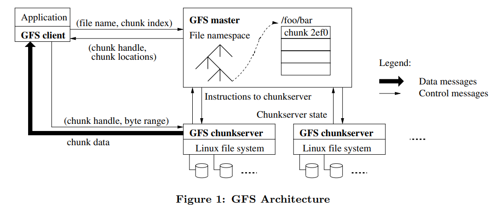
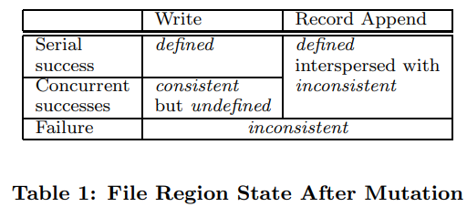
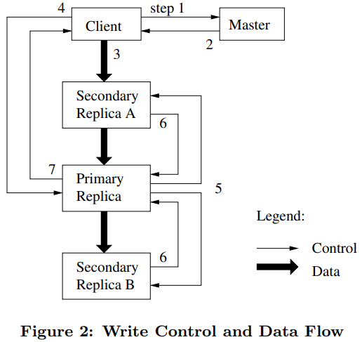

<h1 align="center">The Google File System</h1>

Sanjay Ghemawat, Howard Gobioff, and Shun-Tak Leung

## ABSTRACT

We have designed and implemented the Google File System, a scalable distributed file system for large distributed data-intensive applications. It provides fault tolerance while running on inexpensive commodity hardware, and it delivers high aggregate performance to a large number of clients.

While sharing many of the same goals as previous distributed file systems, our design has been driven by observations of our application workloads and technological environment, both current and anticipated, that reflect a marked departure from some earlier file system assumptions. This has led us to reexamine traditional choices and explore radically different design points.

The file system has successfully met our storage needs. It is widely deployed within Google as the storage platform for the generation and processing of data used by our service as well as research and development efforts that require large data sets. The largest cluster to date provides hundreds of terabytes of storage across thousands of disks on over a thousand machines, and it is concurrently accessed by hundreds of clients.

In this paper, we present file system interface extensions designed to support distributed applications, discuss many aspects of our design, and report measurements from both micro-benchmarks and real world use.

## 1. INTRODUCTION

We have designed and implemented the Google File System (GFS) to meet the rapidly growing demands of Google’s data processing needs. GFS shares many of the same goals as previous distributed file systems such as performance, scalability, reliability, and availability. However, its design has been driven by key observations of our application workloads and technological environment, both current and anticipated, that reflect a marked departure from some earlier file system design assumptions. We have reexamined traditional choices and explored radically different points in the design space. 

First, component failures are the norm rather than the exception. The file system consists of hundreds or even thousands of storage machines built from inexpensive commodity parts and is accessed by a comparable number of client machines. The quantity and quality of the components virtually guarantee that some are not functional at any given time and some will not recover from their current failures. We have seen problems caused by application bugs, operating system bugs, human errors, and the failures of disks, memory, connectors, networking, and power supplies. Therefore, constant monitoring, error detection, fault tolerance, and automatic recovery must be integral to the system. 

Second, files are huge by traditional standards. Multi-GB files are common. Each file typically contains many application objects such as web documents. When we are regularly working with fast growing data sets of many TBs comprising billions of objects, it is unwieldy to manage billions of approximately KB-sized files even when the file system could support it. As a result, design assumptions and parameters such as I/O operation and block sizes have to be revisited. 

Third, most files are mutated by appending new data rather than overwriting existing data. Random writes within a file are practically non-existent. Once written, the files are only read, and often only sequentially. A variety of data share these characteristics. Some may constitute large repositories that data analysis programs scan through. Some may be data streams continuously generated by running applications. Some may be archival data. Some may be intermediate results produced on one machine and processed on another, whether simultaneously or later in time. Given this access pattern on huge files, appending becomes the focus of performance optimization and atomicity guarantees, while caching data blocks in the client loses its appeal.

Fourth, co-designing the applications and the file system API benefits the overall system by increasing our flexibility. For example, we have relaxed GFS’s consistency model to vastly simplify the file system without imposing an onerous burden on the applications. We have also introduced an atomic append operation so that multiple clients can append concurrently to a file without extra synchronization between them. These will be discussed in more details later in the paper.

Multiple GFS clusters are currently deployed for different purposes. The largest ones have over 1000 storage nodes, over 300 TB of disk storage, and are heavily accessed by hundreds of clients on distinct machines on a continuous basis.

## 2. DESIGN OVERVIEW

### 2.1 Assumptions

In designing a file system for our needs, we have been guided by assumptions that offer both challenges and opportunities. We alluded to some key observations earlier and now lay out our assumptions in more details.

* The system is built from many inexpensive commodity components that often fail. It must constantly monitor itself and detect, tolerate, and recover promptly from component failures on a routine basis.
* The system stores a modest number of large files. We expect a few million files, each typically 100 MB or larger in size. Multi-GB files are the common case and should be managed efficiently. Small files must be supported, but we need not optimize for them.
* The workloads primarily consist of two kinds of reads: large streaming reads and small random reads. In large streaming reads, individual operations typically read hundreds of KBs, more commonly 1 MB or more. Successive operations from the same client often read through a contiguous region of a file. A small random read typically reads a few KBs at some arbitrary offset. Performance-conscious applications often batch and sort their small reads to advance steadily through the file rather than go back and forth.
* The workloads also have many large, sequential writes that append data to files. Typical operation sizes are similar to those for reads. Once written, files are seldom modified again. Small writes at arbitrary positions in a file are supported but do not have to be efficient.
* The system must efficiently implement well-defined semantics for multiple clients that concurrently append to the same file. Our files are often used as producerconsumer queues or for many-way merging. Hundreds of producers, running one per machine, will concurrently append to a file. Atomicity with minimal synchronization overhead is essential. The file may be read later, or a consumer may be reading through the file simultaneously.
* High sustained bandwidth is more important than low latency. Most of our target applications place a premium on processing data in bulk at a high rate, while few have stringent response time requirements for an individual read or write.

### 2.2 Interface

GFS provides a familiar file system interface, though it does not implement a standard API such as POSIX. Files are organized hierarchically in directories and identified by pathnames. We support the usual operations to create, delete, open, close, read, and write files.

Moreover, GFS has snapshot and record append operations. Snapshot creates a copy of a file or a directory tree at low cost. Record append allows multiple clients to append data to the same file concurrently while guaranteeing the atomicity of each individual client’s append. It is useful for implementing multi-way merge results and producerconsumer queues that many clients can simultaneously append to without additional locking. We have found these types of files to be invaluable in building large distributed applications. Snapshot and record append are discussed further in Sections 3.4 and 3.3 respectively.

### 2.3  Architecture

A GFS cluster consists of a single master and multiple chunkservers and is accessed by multiple clients, as shown in Figure 1. Each of these is typically a commodity Linux machine running a user-level server process. It is easy to run both a chunkserver and a client on the same machine, as long as machine resources permit and the lower reliability caused by running possibly flaky application code is acceptable.

Files are divided into fixed-size chunks. Each chunk is identified by an immutable and globally unique 64 bit chunk handle assigned by the master at the time of chunk creation. Chunkservers store chunks on local disks as Linux files and read or write chunk data specified by a chunk handle and byte range. For reliability, each chunk is replicated on multiple chunkservers. By default, we store three replicas, though users can designate different replication levels for different regions of the file namespace.

The master maintains all file system metadata. This includes the namespace, access control information, the mapping from files to chunks, and the current locations of chunks. It also controls system-wide activities such as chunk lease management, garbage collection of orphaned chunks, and chunk migration between chunkservers. The master periodically communicates with each chunkserver in HeartBeat messages to give it instructions and collect its state.

GFS client code linked into each application implements the file system API and communicates with the master and chunkservers to read or write data on behalf of the application. Clients interact with the master for metadata operations, but all data-bearing communication goes directly to the chunkservers. We do not provide the POSIX API and therefore need not hook into the Linux vnode layer.

Neither the client nor the chunkserver caches file data. Client caches offer little benefit because most applications stream through huge files or have working sets too large to be cached. Not having them simplifies the client and the overall system by eliminating cache coherence issues. (Clients do cache metadata, however.) Chunkservers need not cache file data because chunks are stored as local files and so Linux’s buffer cache already keeps frequently accessed data in memory.

### 2.4 Single Master

Having a single master vastly simplifies our design and enables the master to make sophisticated chunk placement and replication decisions using global knowledge. However, we must minimize its involvement in reads and writes so that it does not become a bottleneck. Clients never read and write file data through the master. Instead, a client asks the master which chunkservers it should contact. It caches this information for a limited time and interacts with the chunkservers directly for many subsequent operations.

Let us explain the interactions for a simple read with reference to Figure 1. First, using the fixed chunk size, the client translates the file name and byte offset specified by the application into a chunk index within the file. Then, it sends the master a request containing the file name and chunk index. The master replies with the corresponding chunk handle and locations of the replicas. The client caches this information using the file name and chunk index as the key.

The client then sends a request to one of the replicas, most likely the closest one. The request specifies the chunk handle and a byte range within that chunk. Further reads of the same chunk require no more client-master interaction until the cached information expires or the file is reopened. In fact, the client typically asks for multiple chunks in the same request and the master can also include the information for chunks immediately following those requested. This extra information sidesteps several future client-master interactions at practically no extra cost.

### 2.5 Chunk Size

Chunk size is one of the key design parameters. We have chosen 64 MB, which is much larger than typical file system block sizes. Each chunk replica is stored as a plain Linux file on a chunkserver and is extended only as needed. Lazy space allocation avoids wasting space due to internal fragmentation, perhaps the greatest objection against such a large chunk size.

A large chunk size offers several important advantages. First, it reduces clients’ need to interact with the master because reads and writes on the same chunk require only one initial request to the master for chunk location information. The reduction is especially significant for our workloads because applications mostly read and write large files sequentially. Even for small random reads, the client can comfortably cache all the chunk location information for a multi-TB working set. Second, since on a large chunk, a client is more likely to perform many operations on a given chunk, it can reduce network overhead by keeping a persistent TCP connection to the chunkserver over an extended period of time. Third, it reduces the size of the metadata stored on the master. This allows us to keep the metadata in memory, which in turn brings other advantages that we will discuss in Section 2.6.1.

On the other hand, a large chunk size, even with lazy space allocation, has its disadvantages. A small file consists of a small number of chunks, perhaps just one. The chunkservers storing those chunks may become hot spots if many clients are accessing the same file. In practice, hot spots have not been a major issue because our applications mostly read large multi-chunk files sequentially

However, hot spots did develop when GFS was first used by a batch-queue system: an executable was written to GFS as a single-chunk file and then started on hundreds of machines at the same time. The few chunkservers storing this executable were overloaded by hundreds of simultaneous requests. We fixed this problem by storing such executables with a higher replication factor and by making the batchqueue system stagger application start times. A potential long-term solution is to allow clients to read data from other clients in such situations.

### 2.6 Metadata

The master stores three major types of metadata: the file and chunk namespaces, the mapping from files to chunks, and the locations of each chunk’s replicas. All metadata is kept in the master’s memory. The first two types (namespaces and file-to-chunk mapping) are also kept persistent by logging mutations to an operation log stored on the master’s local disk and replicated on remote machines. Using a log allows us to update the master state simply, reliably, and without risking inconsistencies in the event of a master crash. The master does not store chunk location information persistently. Instead, it asks each chunkserver about its chunks at master startup and whenever a chunkserver joins the cluster.

#### 2.6.1  In-Memory Data Structures

Since metadata is stored in memory, master operations are fast. Furthermore, it is easy and efficient for the master to periodically scan through its entire state in the background. This periodic scanning is used to implement chunk garbage collection, re-replication in the presence of chunkserver failures, and chunk migration to balance load and disk space usage across chunkservers. Sections 4.3 and 4.4 will discuss these activities further.

One potential concern for this memory-only approach is that the number of chunks and hence the capacity of the whole system is limited by how much memory the master has. This is not a serious limitation in practice. The master maintains less than 64 bytes of metadata for each 64 MB chunk. Most chunks are full because most files contain many chunks, only the last of which may be partially filled. Similarly, the file namespace data typically requires less then 64 bytes per file because it stores file names compactly using prefix compression.

If necessary to support even larger file systems, the cost of adding extra memory to the master is a small price to pay for the simplicity, reliability, performance, and flexibility we gain by storing the metadata in memory.

#### 2.6.2 Chunk Locations

The master does not keep a persistent record of which chunkservers have a replica of a given chunk. It simply polls chunkservers for that information at startup. The master can keep itself up-to-date thereafter because it controls all chunk placement and monitors chunkserver status with regular HeartBeat messages.

We initially attempted to keep chunk location information persistently at the master, but we decided that it was much simpler to request the data from chunkservers at startup, and periodically thereafter. This eliminated the problem of keeping the master and chunkservers in sync as chunkservers join and leave the cluster, change names, fail, restart, and so on. In a cluster with hundreds of servers, these events happen all too often.

Another way to understand this design decision is to realize that a chunkserver has the final word over what chunks it does or does not have on its own disks. There is no point in trying to maintain a consistent view of this information on the master because errors on a chunkserver may cause chunks to vanish spontaneously (e.g., a disk may go bad and be disabled) or an operator may rename a chunkserver.

#### 2.6.3 Operation Log

The operation log contains a historical record of critical metadata changes. It is central to GFS. Not only is it the only persistent record of metadata, but it also serves as a logical time line that defines the order of concurrent operations. Files and chunks, as well as their versions (see Section 4.5), are all uniquely and eternally identified by the logical times at which they were created.

Since the operation log is critical, we must store it reliably and not make changes visible to clients until metadata changes are made persistent. Otherwise, we effectively lose the whole file system or recent client operations even if the chunks themselves survive. Therefore, we replicate it on multiple remote machines and respond to a client operation only after flushing the corresponding log record to disk both locally and remotely. The master batches several log records together before flushing thereby reducing the impact of flushing and replication on overall system throughput.

The master recovers its file system state by replaying the operation log. To minimize startup time, we must keep the log small. The master checkpoints its state whenever the log grows beyond a certain size so that it can recover by loading the latest checkpoint from local disk and replaying only the limited number of log records after that. The checkpoint is in a compact B-tree like form that can be directly mapped into memory and used for namespace lookup without extra parsing. This further speeds up recovery and improves availability.

Because building a checkpoint can take a while, the master’s internal state is structured in such a way that a new checkpoint can be created without delaying incoming mutations. The master switches to a new log file and creates the new checkpoint in a separate thread. The new checkpoint includes all mutations before the switch. It can be created in a minute or so for a cluster with a few million files. When completed, it is written to disk both locally and remotely.

Recovery needs only the latest complete checkpoint and subsequent log files. Older checkpoints and log files can be freely deleted, though we keep a few around to guard against catastrophes. A failure during checkpointing does not affect correctness because the recovery code detects and skips incomplete checkpoints.

### 2.7 Consistency Model

GFS has a relaxed consistency model that supports our highly distributed applications well but remains relatively simple and efficient to implement. We now discuss GFS’s guarantees and what they mean to applications. We also highlight how GFS maintains these guarantees but leave the details to other parts of the paper.

#### 2.7.1 Guarantees by GFS

File namespace mutations (e.g., file creation) are atomic. They are handled exclusively by the master: namespace locking guarantees atomicity and correctness (Section 4.1); the master’s operation log defines a global total order of these operations (Section 2.6.3).

The state of a file region after a data mutation depends on the type of mutation, whether it succeeds or fails, and whether there are concurrent mutations. Table 1 summarizes the result. A file region is consistent if all clients will always see the same data, regardless of which replicas they read from. A region is defined after a file data mutation if it is consistent and clients will see what the mutation writes in its entirety. When a mutation succeeds without interference from concurrent writers, the affected region is defined (and by implication consistent): all clients will always see what the mutation has written. Concurrent successful mutations leave the region undefined but consistent: all clients see the same data, but it may not reflect what any one mutation has written. Typically, it consists of mingled fragments from multiple mutations. A failed mutation makes the region inconsistent (hence also undefined): different clients may see different data at different times. We describe below how our applications can distinguish defined regions from undefined regions. The applications do not need to further distinguish between different kinds of undefined regions.

Data mutations may be writes or record appends. A write causes data to be written at an application-specified file offset. A record append causes data (the “record”) to be appended atomically at least once even in the presence of concurrent mutations, but at an offset of GFS’s choosing (Section 3.3). (In contrast, a “regular” append is merely a write at an offset that the client believes to be the current end of file.) The offset is returned to the client and marks the beginning of a defined region that contains the record. In addition, GFS may insert padding or record duplicates in between. They occupy regions considered to be inconsistent and are typically dwarfed by the amount of user data.

After a sequence of successful mutations, the mutated file region is guaranteed to be defined and contain the data written by the last mutation. GFS achieves this by (a) applying mutations to a chunk in the same order on all its replicas (Section 3.1), and (b) using chunk version numbers to detect any replica that has become stale because it has missed mutations while its chunkserver was down (Section 4.5). Stale replicas will never be involved in a mutation or given to clients asking the master for chunk locations. They are garbage collected at the earliest opportunity.

Since clients cache chunk locations, they may read from a stale replica before that information is refreshed. This window is limited by the cache entry’s timeout and the next open of the file, which purges from the cache all chunk information for that file. Moreover, as most of our files are append-only, a stale replica usually returns a premature end of chunk rather than outdated data. When a reader retries and contacts the master, it will immediately get current chunk locations.

Long after a successful mutation, component failures can of course still corrupt or destroy data. GFS identifies failed chunkservers by regular handshakes between master and all chunkservers and detects data corruption by checksumming (Section 5.2). Once a problem surfaces, the data is restored from valid replicas as soon as possible (Section 4.3). A chunk is lost irreversibly only if all its replicas are lost before GFS can react, typically within minutes. Even in this case, it becomes unavailable, not corrupted: applications receive clear errors rather than corrupt data.

#### 2.7.2 Implications for Applications

GFS applications can accommodate the relaxed consistency model with a few simple techniques already needed for other purposes: relying on appends rather than overwrites, checkpointing, and writing self-validating, self-identifying records.

Practically all our applications mutate files by appending rather than overwriting. In one typical use, a writer generates a file from beginning to end. It atomically renames the file to a permanent name after writing all the data, or periodically checkpoints how much has been successfully written. Checkpoints may also include application-level checksums. Readers verify and process only the file region up to the last checkpoint, which is known to be in the defined state. Regardless of consistency and concurrency issues, this approach has served us well. Appending is far more efficient and more resilient to application failures than random writes. Checkpointing allows writers to restart incrementally and keeps readers from processing successfully written file data that is still incomplete from the application’s perspective.

In the other typical use, many writers concurrently append to a file for merged results or as a producer-consumer queue. Record append’s append-at-least-once semantics preserves each writer’s output. Readers deal with the occasional padding and duplicates as follows. Each record prepared by the writer contains extra information like checksums so that its validity can be verified. A reader can identify and discard extra padding and record fragments using the checksums. If it cannot tolerate the occasional duplicates (e.g., if they would trigger non-idempotent operations), it can filter them out using unique identifiers in the records, which are often needed anyway to name corresponding application entities such as web documents. These functionalities for record I/O (except duplicate removal) are in library code shared by our applications and applicable to other file interface implementations at Google. With that, the same sequence of records, plus rare duplicates, is always delivered to the record reader.

## 3. SYSTEM INTERACTIONS

We designed the system to minimize the master’s involvement in all operations. With that background, we now describe how the client, master, and chunkservers interact to implement data mutations, atomic record append, and snapshot.

### 3.1 Leases and Mutation Order

A mutation is an operation that changes the contents or metadata of a chunk such as a write or an append operation. Each mutation is performed at all the chunk’s replicas. We use leases to maintain a consistent mutation order across replicas. The master grants a chunk lease to one of the replicas, which we call the primary. The primary picks a serial order for all mutations to the chunk. All replicas follow this order when applying mutations. Thus, the global mutation order is defined first by the lease grant order chosen by the master, and within a lease by the serial numbers assigned by the primary.

The lease mechanism is designed to minimize management overhead at the master. A lease has an initial timeout of 60 seconds. However, as long as the chunk is being mutated, the primary can request and typically receive extensions from the master indefinitely. These extension requests and grants are piggybacked on the HeartBeat messages regularly exchanged between the master and all chunkservers. The master may sometimes try to revoke a lease before it expires (e.g., when the master wants to disable mutations on a file that is being renamed). Even if the master loses communication with a primary, it can safely grant a new lease to another replica after the old lease expires.

In Figure 2, we illustrate this process by following the control flow of a write through these numbered steps.

1. The client asks the master which chunkserver holds the current lease for the chunk and the locations of the other replicas. If no one has a lease, the master grants one to a replica it chooses (not shown).
2. The master replies with the identity of the primary and the locations of the other (secondary) replicas. The client caches this data for future mutations. It needs to contact the master again only when the primary becomes unreachable or replies that it no longer holds a lease.
3. The client pushes the data to all the replicas. A client can do so in any order. Each chunkserver will store the data in an internal LRU buffer cache until the data is used or aged out. By decoupling the data flow from the control flow, we can improve performance by scheduling the expensive data flow based on the network topology regardless of which chunkserver is the primary. Section 3.2 discusses this further.
4. Once all the replicas have acknowledged receiving the data, the client sends a write request to the primary. The request identifies the data pushed earlier to all of the replicas. The primary assigns consecutive serial numbers to all the mutations it receives, possibly from multiple clients, which provides the necessary serialization. It applies the mutation to its own local state in serial number order.
5. The primary forwards the write request to all secondary replicas. Each secondary replica applies mutations in the same serial number order assigned by the primary.
6. The secondaries all reply to the primary indicating that they have completed the operation.
7.  The primary replies to the client. Any errors encountered at any of the replicas are reported to the client. In case of errors, the write may have succeeded at the primary and an arbitrary subset of the secondary replicas. (If it had failed at the primary, it would not have been assigned a serial number and forwarded.) The client request is considered to have failed, and the modified region is left in an inconsistent state. Our client code handles such errors by retrying the failed mutation. It will make a few attempts at steps (3) through (7) before falling back to a retry from the beginning of the write.

If a write by the application is large or straddles a chunk boundary, GFS client code breaks it down into multiple write operations. They all follow the control flow described above but may be interleaved with and overwritten by concurrent operations from other clients. Therefore, the shared file region may end up containing fragments from different clients, although the replicas will be identical because the individual operations are completed successfully in the same order on all replicas. This leaves the file region in consistent but undefined state as noted in Section 2.7.

### 3.2 Data Flow

We decouple the flow of data from the flow of control to use the network efficiently. While control flows from the client to the primary and then to all secondaries, data is pushed linearly along a carefully picked chain of chunkservers in a pipelined fashion. Our goals are to fully utilize each machine’s network bandwidth, avoid network bottlenecks and high-latency links, and minimize the latency to push through all the data.

To fully utilize each machine’s network bandwidth, the data is pushed linearly along a chain of chunkservers rather than distributed in some other topology (e.g., tree). Thus, each machine’s full outbound bandwidth is used to transfer the data as fast as possible rather than divided among multiple recipients.

To avoid network bottlenecks and high-latency links (e.g., inter-switch links are often both) as much as possible, each machine forwards the data to the “closest” machine in the network topology that has not received it. Suppose the client is pushing data to chunkservers S1 through S4. It sends the data to the closest chunkserver, say S1. S1 forwards it to the closest chunkserver S2 through S4 closest to S1, say S2. Similarly, S2 forwards it to S3 or S4, whichever is closer to S2, and so on. Our network topology is simple enough that “distances” can be accurately estimated from IP addresses.

Finally, we minimize latency by pipelining the data transfer over TCP connections. Once a chunkserver receives some data, it starts forwarding immediately. Pipelining is especially helpful to us because we use a switched network with full-duplex links. Sending the data immediately does not reduce the receive rate. Without network congestion, the ideal elapsed time for transferring B bytes to R replicas is B/T + RL where T is the network throughput and L is latency to transfer bytes between two machines. Our network links are typically 100 Mbps (T), and L is far below 1 ms. Therefore, 1 MB can ideally be distributed in about 80 ms.

### 3.3 Atomic Record Appends

GFS provides an atomic append operation called record append. In a traditional write, the client specifies the offset at which data is to be written. Concurrent writes to the same region are not serializable: the region may end up containing data fragments from multiple clients. In a record append, however, the client specifies only the data. GFS appends it to the file at least once atomically (i.e., as one continuous sequence of bytes) at an offset of GFS’s choosing and returns that offset to the client. This is similar to writing to a file opened in O APPEND mode in Unix without the race conditions when multiple writers do so concurrently.

Record append is heavily used by our distributed applications in which many clients on different machines append to the same file concurrently. Clients would need additional complicated and expensive synchronization, for example through a distributed lock manager, if they do so with traditional writes. In our workloads, such files often serve as multiple-producer/single-consumer queues or contain merged results from many different clients.

Record append is a kind of mutation and follows the control flow in Section 3.1 with only a little extra logic at the primary. The client pushes the data to all replicas of the last chunk of the file Then, it sends its request to the primary. The primary checks to see if appending the record to the current chunk would cause the chunk to exceed the maximum size (64 MB). If so, it pads the chunk to the maximum size, tells secondaries to do the same, and replies to the client indicating that the operation should be retried on the next chunk. (Record append is restricted to be at most one-fourth of the maximum chunk size to keep worstcase fragmentation at an acceptable level.) If the record fits within the maximum size, which is the common case, the primary appends the data to its replica, tells the secondaries to write the data at the exact offset where it has, and finally replies success to the client.

If a record append fails at any replica, the client retries the operation. As a result, replicas of the same chunk may contain different data possibly including duplicates of the same record in whole or in part. GFS does not guarantee that all replicas are bytewise identical. It only guarantees that the data is written at least once as an atomic unit. This property follows readily from the simple observation that for the operation to report success, the data must have been written at the same offset on all replicas of some chunk. Furthermore, after this, all replicas are at least as long as the end of record and therefore any future record will be assigned a higher offset or a different chunk even if a different replica later becomes the primary. In terms of our consistency guarantees, the regions in which successful record append operations have written their data are defined (hence consistent), whereas intervening regions are inconsistent (hence undefined). Our applications can deal with inconsistent regions as we discussed in Section 2.7.2.

### 3.4 Snapshot

The snapshot operation makes a copy of a file or a directory tree (the “source”) almost instantaneously, while minimizing any interruptions of ongoing mutations. Our users use it to quickly create branch copies of huge data sets (and often copies of those copies, recursively), or to checkpoint the current state before experimenting with changes that can later be committed or rolled back easily

Like AFS [5], we use standard copy-on-write techniques to implement snapshots. When the master receives a snapshot request, it first revokes any outstanding leases on the chunks in the files it is about to snapshot. This ensures that any subsequent writes to these chunks will require an interaction with the master to find the lease holder. This will give the master an opportunity to create a new copy of the chunk first.

After the leases have been revoked or have expired, the master logs the operation to disk. It then applies this log record to its in-memory state by duplicating the metadata for the source file or directory tree. The newly created snapshot files point to the same chunks as the source files.

The first time a client wants to write to a chunk C after the snapshot operation, it sends a request to the master to find the current lease holder. The master notices that the reference count for chunk C is greater than one. It defers replying to the client request and instead picks a new chunk handle C’. It then asks each chunkserver that has a current replica of C to create a new chunk called C’. By creating the new chunk on the same chunkservers as the original, we ensure that the data can be copied locally, not over the network (our disks are about three times as fast as our 100 Mb Ethernet links). From this point, request handling is no different from that for any chunk: the master grants one of the replicas a lease on the new chunk C’ and replies to the client, which can write the chunk normally, not knowing that it has just been created from an existing chunk.

## 4. MASTER OPERATION 

The master executes all namespace operations. In addition, it manages chunk replicas throughout the system: it makes placement decisions, creates new chunks and hence replicas, and coordinates various system-wide activities to keep chunks fully replicated, to balance load across all the chunkservers, and to reclaim unused storage. We now discuss each of these topics.

### 4.1 Namespace Management and Locking

Many master operations can take a long time: for example, a snapshot operation has to revoke chunkserver leases on all chunks covered by the snapshot. We do not want to delay other master operations while they are running. Therefore, we allow multiple operations to be active and use locks over regions of the namespace to ensure proper serialization.

Unlike many traditional file systems, GFS does not have a per-directory data structure that lists all the files in that directory. Nor does it support aliases for the same file or directory (i.e, hard or symbolic links in Unix terms). GFS logically represents its namespace as a lookup table mapping full pathnames to metadata. With prefix compression, this table can be efficiently represented in memory. Each node in the namespace tree (either an absolute file name or an absolute directory name) has an associated read-write lock.

Each master operation acquires a set of locks before it runs. Typically, if it involves /d1/d2/.../dn/leaf, it will acquire read-locks on the directory names /d1, /d1/d2, ..., /d1/d2/.../dn, and either a read lock or a write lock on the full pathname /d1/d2/.../dn/leaf. Note that leaf may be a file or directory depending on the operation.

We now illustrate how this locking mechanism can prevent a file /home/user/foo from being created while /home/user is being snapshotted to /save/user. The snapshot operation acquires read locks on /home and /save, and write locks on /home/user and /save/user. The file creation acquires read locks on /home and /home/user, and a write lock on /home/user/foo. The two operations will be serialized properly because they try to obtain conflicting locks on /home/user. File creation does not require a write lock on the parent directory because there is no “directory”, or inode-like, data structure to be protected from modification. The read lock on the name is sufficient to protect the parent directory from deletion.

One nice property of this locking scheme is that it allows concurrent mutations in the same directory. For example, multiple file creations can be executed concurrently in the same directory: each acquires a read lock on the directory name and a write lock on the file name. The read lock on the directory name suffices to prevent the directory from being deleted, renamed, or snapshotted. The write locks on file names serialize attempts to create a file with the same name twice.

Since the namespace can have many nodes, read-write lock objects are allocated lazily and deleted once they are not in use. Also, locks are acquired in a consistent total order to prevent deadlock: they are first ordered by level in the namespace tree and lexicographically within the same level.

### 4.2 Replica Placement

A GFS cluster is highly distributed at more levels than one. It typically has hundreds of chunkservers spread across many machine racks. These chunkservers in turn may be accessed from hundreds of clients from the same or different racks. Communication between two machines on different racks may cross one or more network switches. Additionally, bandwidth into or out of a rack may be less than the aggregate bandwidth of all the machines within the rack. Multi-level distribution presents a unique challenge to distribute data for scalability, reliability, and availability.

The chunk replica placement policy serves two purposes: maximize data reliability and availability, and maximize network bandwidth utilization. For both, it is not enough to spread replicas across machines, which only guards against disk or machine failures and fully utilizes each machine’s network bandwidth. We must also spread chunk replicas across racks. This ensures that some replicas of a chunk will survive and remain available even if an entire rack is damaged or offline (for example, due to failure of a shared resource like a network switch or power circuit). It also means that traffic, especially reads, for a chunk can exploit the aggregate bandwidth of multiple racks. On the other hand, write traffic has to flow through multiple racks, a tradeoff we make willingly.

### 4.3 Creation, Re-replication, Rebalancing

Chunk replicas are created for three reasons: chunk creation, re-replication, and rebalancing.

When the master creates a chunk, it chooses where to place the initially empty replicas. It considers several factors. (1) We want to place new replicas on chunkservers with below-average disk space utilization. Over time this will equalize disk utilization across chunkservers. (2) We want to limit the number of “recent” creations on each chunkserver. Although creation itself is cheap, it reliably predicts imminent heavy write traffic because chunks are created when demanded by writes, and in our append-once-read-many workload they typically become practically read-only once they have been completely written. (3) As discussed above, we want to spread replicas of a chunk across racks.

The master re-replicates a chunk as soon as the number of available replicas falls below a user-specified goal. This could happen for various reasons: a chunkserver becomes unavailable, it reports that its replica may be corrupted, one of its disks is disabled because of errors, or the replication goal is increased. Each chunk that needs to be re-replicated is prioritized based on several factors. One is how far it is from its replication goal. For example, we give higher priority to a chunk that has lost two replicas than to a chunk that has lost only one. In addition, we prefer to first re-replicate chunks for live files as opposed to chunks that belong to recently deleted files (see Section 4.4). Finally, to minimize the impact of failures on running applications, we boost the priority of any chunk that is blocking client progress.

The master picks the highest priority chunk and “clones” it by instructing some chunkserver to copy the chunk data directly from an existing valid replica. The new replica is placed with goals similar to those for creation: equalizing disk space utilization, limiting active clone operations on any single chunkserver, and spreading replicas across racks. To keep cloning traffic from overwhelming client traffic, the master limits the numbers of active clone operations both for the cluster and for each chunkserver. Additionally, each chunkserver limits the amount of bandwidth it spends on each clone operation by throttling its read requests to the source chunkserver.

Finally, the master rebalances replicas periodically: it examines the current replica distribution and moves replicas for better disk space and load balancing. Also through this process, the master gradually fills up a new chunkserver rather than instantly swamps it with new chunks and the heavy write traffic that comes with them. The placement criteria for the new replica are similar to those discussed above. In addition, the master must also choose which existing replica to remove. In general, it prefers to remove those on chunkservers with below-average free space so as to equalize disk space usage.

### 4.4 Garbage Collection

After a file is deleted, GFS does not immediately reclaim the available physical storage. It does so only lazily during regular garbage collection at both the file and chunk levels. We find that this approach makes the system much simpler and more reliable.

#### 4.4.1 Mechanism

When a file is deleted by the application, the master logs the deletion immediately just like other changes. However instead of reclaiming resources immediately, the file is just renamed to a hidden name that includes the deletion timestamp. During the master’s regular scan of the file system namespace, it removes any such hidden files if they have existed for more than three days (the interval is configurable). Until then, the file can still be read under the new, special name and can be undeleted by renaming it back to normal. When the hidden file is removed from the namespace, its inmemory metadata is erased. This effectively severs its links to all its chunks.

In a similar regular scan of the chunk namespace, the master identifies orphaned chunks (i.e., those not reachable from any file) and erases the metadata for those chunks. In a HeartBeat message regularly exchanged with the master, each chunkserver reports a subset of the chunks it has, and the master replies with the identity of all chunks that are no longer present in the master’s metadata. The chunkserver is free to delete its replicas of such chunks.

#### 4.4.2 Discussion

Although distributed garbage collection is a hard problem that demands complicated solutions in the context of programming languages, it is quite simple in our case. We can easily identify all references to chunks: they are in the fileto-chunk mappings maintained exclusively by the master. We can also easily identify all the chunk replicas: they are Linux files under designated directories on each chunkserver. Any such replica not known to the master is “garbage.”

The garbage collection approach to storage reclamation offers several advantages over eager deletion. First, it is simple and reliable in a large-scale distributed system where component failures are common. Chunk creation may succeed on some chunkservers but not others, leaving replicas that the master does not know exist. Replica deletion messages may be lost, and the master has to remember to resend them across failures, both its own and the chunkserver’s. Garbage collection provides a uniform and dependable way to clean up any replicas not known to be useful. Second, it merges storage reclamation into the regular background activities of the master, such as the regular scans of namespaces and handshakes with chunkservers. Thus, it is done in batches and the cost is amortized. Moreover, it is done only when the master is relatively free. The master can respond more promptly to client requests that demand timely attention. Third, the delay in reclaiming storage provides a safety net against accidental, irreversible deletion.

In our experience, the main disadvantage is that the delay sometimes hinders user effort to fine tune usage when storage is tight. Applications that repeatedly create and delete temporary files may not be able to reuse the storage right away. We address these issues by expediting storage reclamation if a deleted file is explicitly deleted again. We also allow users to apply different replication and reclamation policies to different parts of the namespace. For example, users can specify that all the chunks in the files within some directory tree are to be stored without replication, and any deleted files are immediately and irrevocably removed from the file system state.

### 4.5 Stale Replica Detection

Chunk replicas may become stale if a chunkserver fails and misses mutations to the chunk while it is down. For each chunk, the master maintains a chunk version number to distinguish between up-to-date and stale replicas.

Whenever the master grants a new lease on a chunk, it increases the chunk version number and informs the up-todate replicas. The master and these replicas all record the new version number in their persistent state. This occurs before any client is notified and therefore before it can start writing to the chunk. If another replica is currently unavailable, its chunk version number will not be advanced. The master will detect that this chunkserver has a stale replica when the chunkserver restarts and reports its set of chunks and their associated version numbers. If the master sees a version number greater than the one in its records, the master assumes that it failed when granting the lease and so takes the higher version to be up-to-date.

The master removes stale replicas in its regular garbage collection. Before that, it effectively considers a stale replica not to exist at all when it replies to client requests for chunk information. As another safeguard, the master includes the chunk version number when it informs clients which chunkserver holds a lease on a chunk or when it instructs a chunkserver to read the chunk from another chunkserver in a cloning operation. The client or the chunkserver verifies the version number when it performs the operation so that it is always accessing up-to-date data.

## 5. FAULT TOLERANCE AND DIAGNOSIS

One of our greatest challenges in designing the system is dealing with frequent component failures. The quality and quantity of components together make these problems more the norm than the exception: we cannot completely trust the machines, nor can we completely trust the disks. Component failures can result in an unavailable system or, worse, corrupted data. We discuss how we meet these challenges and the tools we have built into the system to diagnose problems when they inevitably occur.

### 5.1 High Availability

Among hundreds of servers in a GFS cluster, some are bound to be unavailable at any given time. We keep the overall system highly available with two simple yet effective strategies: fast recovery and replication.

#### 5.1.1 Fast Recovery

Both the master and the chunkserver are designed to restore their state and start in seconds no matter how they terminated. In fact, we do not distinguish between normal and abnormal termination; servers are routinely shut down just by killing the process. Clients and other servers experience a minor hiccup as they time out on their outstanding requests, reconnect to the restarted server, and retry. Section 6.2.2 reports observed startup times.

#### 5.1.2 Chunk Replication

As discussed earlier, each chunk is replicated on multiple chunkservers on different racks. Users can specify different replication levels for different parts of the file namespace. The default is three. The master clones existing replicas as needed to keep each chunk fully replicated as chunkservers go offline or detect corrupted replicas through checksum verification (see Section 5.2). Although replication has served us well, we are exploring other forms of cross-server redundancy such as parity or erasure codes for our increasing readonly storage requirements. We expect that it is challenging but manageable to implement these more complicated redundancy schemes in our very loosely coupled system because our traffic is dominated by appends and reads rather than small random writes.

#### 5.1.3 Master Replication

The master state is replicated for reliability. Its operation log and checkpoints are replicated on multiple machines. A mutation to the state is considered committed only after its log record has been flushed to disk locally and on all master replicas. For simplicity, one master process remains in charge of all mutations as well as background activities such as garbage collection that change the system internally. When it fails, it can restart almost instantly. If its machine or disk fails, monitoring infrastructure outside GFS starts a new master process elsewhere with the replicated operation log. Clients use only the canonical name of the master (e.g. gfs-test), which is a DNS alias that can be changed if the master is relocated to another machine.

Moreover, “shadow” masters provide read-only access to the file system even when the primary master is down. They are shadows, not mirrors, in that they may lag the primary slightly, typically fractions of a second. They enhance read availability for files that are not being actively mutated or applications that do not mind getting slightly stale results. In fact, since file content is read from chunkservers, applications do not observe stale file content. What could be stale within short windows is file metadata, like directory contents or access control information.

To keep itself informed, a shadow master reads a replica of the growing operation log and applies the same sequence of changes to its data structures exactly as the primary does. Like the primary, it polls chunkservers at startup (and infrequently thereafter) to locate chunk replicas and exchanges frequent handshake messages with them to monitor their status. It depends on the primary master only for replica location updates resulting from the primary’s decisions to create and delete replicas.

### 5.2 Data Integrity

Each chunkserver uses checksumming to detect corruption of stored data. Given that a GFS cluster often has thousands of disks on hundreds of machines, it regularly experiences disk failures that cause data corruption or loss on both the read and write paths. (See Section 7 for one cause.) We can recover from corruption using other chunk replicas, but it would be impractical to detect corruption by comparing replicas across chunkservers. Moreover, divergent replicas may be legal: the semantics of GFS mutations, in particular atomic record append as discussed earlier, does not guarantee identical replicas. Therefore, each chunkserver must independently verify the integrity of its own copy by maintaining checksums.

A chunk is broken up into 64 KB blocks. Each has a corresponding 32 bit checksum. Like other metadata, checksums are kept in memory and stored persistently with logging, separate from user data.

For reads, the chunkserver verifies the checksum of data blocks that overlap the read range before returning any data to the requester, whether a client or another chunkserver. Therefore chunkservers will not propagate corruptions to other machines. If a block does not match the recorded checksum, the chunkserver returns an error to the requestor and reports the mismatch to the master. In response, the requestor will read from other replicas, while the master will clone the chunk from another replica. After a valid new replica is in place, the master instructs the chunkserver that reported the mismatch to delete its replica.

Checksumming has little effect on read performance for several reasons. Since most of our reads span at least a few blocks, we need to read and checksum only a relatively small amount of extra data for verification. GFS client code further reduces this overhead by trying to align reads at checksum block boundaries. Moreover, checksum lookups and comparison on the chunkserver are done without any I/O, and checksum calculation can often be overlapped with I/Os.

Checksum computation is heavily optimized for writes that append to the end of a chunk (as opposed to writes that overwrite existing data) because they are dominant in our workloads. We just incrementally update the checksum for the last partial checksum block, and compute new checksums for any brand new checksum blocks filled by the append. Even if the last partial checksum block is already corrupted and we fail to detect it now, the new checksum value will not match the stored data, and the corruption will be detected as usual when the block is next read.

In contrast, if a write overwrites an existing range of the chunk, we must read and verify the first and last blocks of the range being overwritten, then perform the write, and finally compute and record the new checksums. If we do not verify the first and last blocks before overwriting them partially, the new checksums may hide corruption that exists in the regions not being overwritten.

During idle periods, chunkservers can scan and verify the contents of inactive chunks. This allows us to detect corruption in chunks that are rarely read. Once the corruption is detected, the master can create a new uncorrupted replica and delete the corrupted replica. This prevents an inactive but corrupted chunk replica from fooling the master into thinking that it has enough valid replicas of a chunk.

### 5.3 Diagnostic Tools

Extensive and detailed diagnostic logging has helped immeasurably in problem isolation, debugging, and performance analysis, while incurring only a minimal cost. Without logs, it is hard to understand transient, non-repeatable interactions between machines. GFS servers generate diagnostic logs that record many significant events (such as chunkservers going up and down) and all RPC requests and replies. These diagnostic logs can be freely deleted without affecting the correctness of the system. However, we try to keep these logs around as far as space permits.

The RPC logs include the exact requests and responses sent on the wire, except for the file data being read or written. By matching requests with replies and collating RPC records on different machines, we can reconstruct the entire interaction history to diagnose a problem. The logs also serve as traces for load testing and performance analysis.

The performance impact of logging is minimal (and far outweighed by the benefits) because these logs are written sequentially and asynchronously. The most recent events are also kept in memory and available for continuous online monitoring.

## 6. MEASUREMENTS

In this section we present a few micro-benchmarks to illustrate the bottlenecks inherent in the GFS architecture and implementation, and also some numbers from real clusters in use at Google.

### 6.1 Micro-benchmarks

Omit

#### 6.1.1 Reads

Omit

#### 6.1.2 Writes

Omit

#### 6.1.3 Record Appends

Omit

### 6.2 Real World Clusters

Omit

#### 6.2.1 Storage

Omit

#### 6.2.2 Metadata

Omit

#### 6.2.3 Read and Write Rates

Omit

#### 6.2.4 Master Load

Omit

#### 6.2.5 Recovery Time

Omit

### 6.3 Workload Breakdown

Omit

#### 6.3.1 Methodology and Caveats

Omit

#### 6.3.2 Chunkserver Workload

Omit

#### 6.3.3 Appends versus Writes

Omit

#### 6.3.4 Master Workload

Omit

## 7. EXPERIENCES

In the process of building and deploying GFS, we have experienced a variety of issues, some operational and some technical.

Initially, GFS was conceived as the backend file system for our production systems. Over time, the usage evolved to include research and development tasks. It started with little support for things like permissions and quotas but now includes rudimentary forms of these. While production systems are well disciplined and controlled, users sometimes are not. More infrastructure is required to keep users from interfering with one another.

Some of our biggest problems were disk and Linux related. Many of our disks claimed to the Linux driver that they supported a range of IDE protocol versions but in fact responded reliably only to the more recent ones. Since the protocol versions are very similar, these drives mostly worked, but occasionally the mismatches would cause the drive and the kernel to disagree about the drive’s state. This would corrupt data silently due to problems in the kernel. This problem motivated our use of checksums to detect data corruption, while concurrently we modified the kernel to handle these protocol mismatches

Earlier we had some problems with Linux 2.2 kernels due to the cost of fsync(). Its cost is proportional to the size of the file rather than the size of the modified portion. This was a problem for our large operation logs especially before we implemented checkpointing. We worked around this for a time by using synchronous writes and eventually migrated to Linux 2.4.

Another Linux problem was a single reader-writer lock which any thread in an address space must hold when it pages in from disk (reader lock) or modifies the address space in an mmap() call (writer lock). We saw transient timeouts in our system under light load and looked hard for resource bottlenecks or sporadic hardware failures. Eventually, we found that this single lock blocked the primary network thread from mapping new data into memory while the disk threads were paging in previously mapped data. Since we are mainly limited by the network interface rather than by memory copy bandwidth, we worked around this by replacing mmap() with pread() at the cost of an extra copy. Despite occasional problems, the availability of Linux code has helped us time and again to explore and understand system behavior. When appropriate, we improve the kernel and share the changes with the open source community

## 8. RELATED WORK

Like other large distributed file systems such as AFS [5], GFS provides a location independent namespace which enables data to be moved transparently for load balance or fault tolerance. Unlike AFS, GFS spreads a file’s data across storage servers in a way more akin to xFS [1] and Swift [3] in order to deliver aggregate performance and increased fault tolerance.

As disks are relatively cheap and replication is simpler than more sophisticated RAID [9] approaches, GFS currently uses only replication for redundancy and so consumes more raw storage than xFS or Swift.

In contrast to systems like AFS, xFS, Frangipani [12], and Intermezzo [6], GFS does not provide any caching below the file system interface. Our target workloads have little reuse within a single application run because they either stream through a large data set or randomly seek within it and read small amounts of data each time.

Some distributed file systems like Frangipani, xFS, Minnesota’s GFS[11] and GPFS [10] remove the centralized server and rely on distributed algorithms for consistency and management. We opt for the centralized approach in order to simplify the design, increase its reliability, and gain flexibility. In particular, a centralized master makes it much easier to implement sophisticated chunk placement and replication policies since the master already has most of the relevant information and controls how it changes. We address fault tolerance by keeping the master state small and fully replicated on other machines. Scalability and high availability (for reads) are currently provided by our shadow master mechanism. Updates to the master state are made persistent by appending to a write-ahead log. Therefore we could adapt a primary-copy scheme like the one in Harp [7] to provide high availability with stronger consistency guarantees than our current scheme.

We are addressing a problem similar to Lustre [8] in terms of delivering aggregate performance to a large number of clients. However, we have simplified the problem significantly by focusing on the needs of our applications rather than building a POSIX-compliant file system. Additionally, GFS assumes large number of unreliable components and so fault tolerance is central to our design.

GFS most closely resembles the NASD architecture [4]. While the NASD architecture is based on network-attached disk drives, GFS uses commodity machines as chunkservers, as done in the NASD prototype. Unlike the NASD work, our chunkservers use lazily allocated fixed-size chunks rather than variable-length objects. Additionally, GFS implements features such as rebalancing, replication, and recovery that are required in a production environment.

Unlike Minnesota’s GFS and NASD, we do not seek to alter the model of the storage device. We focus on addressing day-to-day data processing needs for complicated distributed systems with existing commodity components.

The producer-consumer queues enabled by atomic record appends address a similar problem as the distributed queues in River [2]. While River uses memory-based queues distributed across machines and careful data flow control, GFS uses a persistent file that can be appended to concurrently by many producers. The River model supports m-to-n distributed queues but lacks the fault tolerance that comes with persistent storage, while GFS only supports m-to-1 queues efficiently. Multiple consumers can read the same file, but they must coordinate to partition the incoming load.

## 9. CONCLUSIONS

The Google File System demonstrates the qualities essential for supporting large-scale data processing workloads on commodity hardware. While some design decisions are specific to our unique setting, many may apply to data processing tasks of a similar magnitude and cost consciousness.

We started by reexamining traditional file system assumptions in light of our current and anticipated application workloads and technological environment. Our observations have led to radically different points in the design space. We treat component failures as the norm rather than the exception, optimize for huge files that are mostly appended to (perhaps concurrently) and then read (usually sequentially), and both extend and relax the standard file system interface to improve the overall system.

Our system provides fault tolerance by constant monitoring, replicating crucial data, and fast and automatic recovery. Chunk replication allows us to tolerate chunkserver failures. The frequency of these failures motivated a novel online repair mechanism that regularly and transparently repairs the damage and compensates for lost replicas as soon as possible. Additionally, we use checksumming to detect data corruption at the disk or IDE subsystem level, which becomes all too common given the number of disks in the system.

Our design delivers high aggregate throughput to many concurrent readers and writers performing a variety of tasks. We achieve this by separating file system control, which passes through the master, from data transfer, which passes directly between chunkservers and clients. Master involvement in common operations is minimized by a large chunk size and by chunk leases, which delegates authority to primary replicas in data mutations. This makes possible a simple, centralized master that does not become a bottleneck. We believe that improvements in our networking stack will lift the current limitation on the write throughput seen by an individual client.

GFS has successfully met our storage needs and is widely used within Google as the storage platform for research and development as well as production data processing. It is an important tool that enables us to continue to innovate and attack problems on the scale of the entire web.

## ACKNOWLEDGMENTS

Omit

## REFERENCES

[1] Thomas Anderson, Michael Dahlin, Jeanna Neefe, David Patterson, Drew Roselli, and Randolph Wang. Serverless network file systems. In Proceedings of the 15th ACM Symposium on Operating System Principles, pages 109–126, Copper Mountain Resort, Colorado, December 1995. 

[2] Remzi H. Arpaci-Dusseau, Eric Anderson, Noah Treuhaft, David E. Culler, Joseph M. Hellerstein, David Patterson, and Kathy Yelick. Cluster I/O with River: Making the fast case common. In Proceedings of the Sixth Workshop on Input/Output in Parallel and Distributed Systems (IOPADS ’99), pages 10–22, Atlanta, Georgia, May 1999. 

[3] Luis-Felipe Cabrera and Darrell D. E. Long. Swift: Using distributed disk striping to provide high I/O data rates. Computer Systems, 4(4):405–436, 1991. 

[4] Garth A. Gibson, David F. Nagle, Khalil Amiri, Jeff Butler, Fay W. Chang, Howard Gobioff, Charles Hardin, Erik Riedel, David Rochberg, and Jim Zelenka. A cost-effective, high-bandwidth storage architecture. In Proceedings of the 8th Architectural Support for Programming Languages and Operating Systems, pages 92–103, San Jose, California, October 1998.

[5] John Howard, Michael Kazar, Sherri Menees, David Nichols, Mahadev Satyanarayanan, Robert Sidebotham, and Michael West. Scale and performance in a distributed file system. ACM Transactions on Computer Systems, 6(1):51–81, February 1988. 

[6] InterMezzo. http://www.inter-mezzo.org, 2003. 

[7] Barbara Liskov, Sanjay Ghemawat, Robert Gruber, Paul Johnson, Liuba Shrira, and Michael Williams. Replication in the Harp file system. In 13th Symposium on Operating System Principles, pages 226–238, Pacific Grove, CA, October 1991. 

[8] Lustre. http://www.lustreorg, 2003. 

[9] David A. Patterson, Garth A. Gibson, and Randy H. Katz. A case for redundant arrays of inexpensive disks (RAID). In Proceedings of the 1988 ACM SIGMOD International Conference on Management of Data, pages 109–116, Chicago, Illinois, September 1988. 

[10] Frank Schmuck and Roger Haskin. GPFS: A shared-disk file system for large computing clusters. In Proceedings of the First USENIX Conference on File and Storage Technologies, pages 231–244, Monterey, California, January 2002. 

[11] Steven R. Soltis, Thomas M. Ruwart, and Matthew T. O’Keefe. The Gobal File System. In Proceedings of the Fifth NASA Goddard Space Flight Center Conference on Mass Storage Systems and Technologies, College Park, Maryland, September 1996. 

[12] Chandramohan A. Thekkath, Timothy Mann, and Edward K. Lee. Frangipani: A scalable distributed file system. In Proceedings of the 16th ACM Symposium on Operating System Principles, pages 224–237, Saint-Malo, France, October 1997.