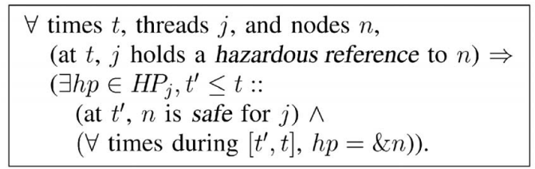

<h1 align="center">Hazard Pointers</h1>
<h2 align="center">Safe Memory Reclamation for
Lock-Free Objects</h2>
<p align="center">Maged M. Michael</p>

## Abstract

Lock-free objects offer significant performance and reliability advantages over conventional lock-based objects. However, the lack of an efficient portable lock-free method for the reclamation of the memory occupied by dynamic nodes removed from such objects is a major obstacle to their wide use in practice. This paper presents hazard pointers, a memory management methodology that allows memory reclamation for arbitrary reuse. It is very efficient, as demonstrated by our experimental results. It is suitable for user-level applications—as well as system programs—without dependence on special kernel or scheduler support. It is wait-free. It requires only single-word reads and writes for memory access in its core operations. It allows reclaimed memory to be returned to the operating system. In addition, it offers a lock-free solution for the ABA problem using only practical single-word instructions. Our experimental results on a multiprocessor system show that the new methodology offers equal and, more often, significantly better performance than other memory management methods, in addition to its qualitative advantages regarding memory reclamation and independence of special hardware support. We also show that lock-free implementations of important object types, using hazard pointers, offer comparable performance to that of efficient lock-based implementations under no contention and no multiprogramming, and outperform them by significant margins under moderate multiprogramming and/or contention, in addition to guaranteeing continuous progress and availability, even in the presence of thread failures and arbitrary delays.

无锁（Lock-free）对象比传统的基于锁的对象提供了显著的性能和可靠性等优点。然而，由于缺乏一个有效可移植的无锁方法来回收这些对象中删除掉的动态节点所占用的内存，成为了在实践中广泛应用该方法的一个主要障碍。本文介绍了风险指针（Hazard Pointers），这是一种内存管理方法，允许内存被回收后任意重用。我们的实验结果证明，这是非常有效的。它适用于用户级应用程序，也适用于系统程序，不依赖于特殊的内核调度的支持。它是无等待的（wait-free）。其核心操作仅需要单字的内存读取和写入访问。它允许被回收的内存被返还给操作系统。此外，仅仅使用实际的单字指令，它还提供了 ABA 问题的一个无锁解决方案。除了其在内存回收和独立于特殊硬件支持这些质量优势之外，我们在多处理器系统中的实验结果还显示，相比其他内存管理方法，该新方法提供了同等的，在更多的时候，甚至明显更好的性能。我们还表明，使用风险指针（Hazard Pointers）的重要对象类型的无锁实现与高效的基于锁的实现相比，提供了在无争用无多道程序的情况下同等的性能，在中等多道程序和中等争用情况下显著优于它们，此外，甚至在存在的线程失败和任意延迟的情况下，也能保证持续进展和其可用性。

## 1. Introduction

A shared object is lock-free (also called nonblocking) if it guarantees that whenever a thread executes some finite number of steps toward an operation on the object, some thread (possibly a different one) must have made progress toward completing an operation on the object, during the execution of these steps. Thus, unlike conventional lock-based objects, lock-free objects are immune to deadlock when faced with thread failures, and offer robust performance, even when faced with arbitrary thread delays.

共享对象是无锁的（lock-free）（也称为非阻塞的，nonblocking），如果它能保证当一个线程在对象上执行一些有限次数的操作步骤，在执行这些步骤期间，某个线程（可能是不同的线程），必须能朝着完成在该对象上的操作的方向上取得进展。因此，它不同于传统的基于锁的对象，在面临线程失败的时候，无锁对象是死锁免疫的；即使面对任意的线程延迟，也提供了稳健的性能。

Many algorithms for lock-free dynamic objects have been developed, e.g., [^11], [^9], [^23], [^21], [^4], [^5], [^16], [^7], [^25], [^18]. However, a major concern regarding these objects is the reclamation of the memory occupied by removed nodes. In the case of a lock-based object, when a thread removes a node from the object, it is easy to guarantee that no other thread will subsequently access the memory of that node, before it is reused or reallocated. Consequently, it is usually safe for the removing thread to reclaim the memory occupied by the removed node (e.g., using free) for arbitrary future reuse by the same or other threads (e.g., using malloc)

已经开发出了许多无锁动态对象的算法，例如 [^11],[^9], [^23], [^21], [^4], [^5], [^16], [^7], [^25], [^18] 。但是，关于这些对象的一个主要关注的问题是，如何回收已经删除掉的节点所占用的内存。在基于锁的对象的情形下，当线程从对象中删除一个节点时，在它被重用或者重新分配之前，很容易保证没有其他线程会在此后访问该节点的内存。因此，删除线程通常可以安全地回收被删除节点占用的内存（例如，使用 free），以便将来由相同或其他线程（例如，利用malloc）任意重用。

This is not the case for a typical lock-free dynamic object, when running in programming environments without support for automatic garbage collection. In order to guarantee lock-free progress, each thread must have unrestricted opportunity to operate on the object, at any time. When a thread removes a node, it is possible that some other contending thread—in the course of its lock-free operation—has earlier read a reference to that node, and is about to access its contents. If the removing thread were to reclaim the removed node for arbitrary reuse, the contending thread might corrupt the object or some other object that happens to occupy the space of the freed node, return the wrong result, or suffer an access error by dereferencing an invalid pointer value. Furthermore, if reclaimed memory is returned to the operating system (e.g., using munmap), access to such memory locations can result in fatal access violation errors. Simply put, the memory reclamation problem is how to allow the memory of removed nodes to be freed (i.e., reused arbitrarily or returned to the OS), while guaranteeing that no thread accesses free memory, and how to do so in a lock-free manner.

对于典型的无锁动态对象，当在没有自动垃圾回收机制的环境中运行时，就不再是如此了。为了保证无锁的进展，每个线程必须要有无限制的机会在任意时间去操作该对象。当线程删除一个节点时，可能某个其他线程——在其无锁操作期间——已经在预先读取了该对象的一个引用，且正要访问其内容。如果删除线程真的回收了被删除节点的内存用以任意重用，那么争用线程就可能破坏该对象或者恰好占用已释放节点空间的其他对象，从而会返回错误结果，或者因为解引用无效指针而导致访问错误。进一步，如果被回收的内存被返还给了操作系统（例如使用 munmap），访问这样的内存位置就会导致致命的访问违例错误。简单点说，内存回收问题是如何允许被删除节点的内存被释放（即，被任意重用或者返还给 OS），同时还保证没有线程访问被释放的内存，以及如何以一种无锁的方式做到这一点。

Prior methods for allowing node reuse in dynamic lockfree objects fall into three main categories. 1) The IBM tag (update counter) method [^11], which hinders memory reclamation for arbitrary reuse and requires double-width instructions that are not available on 64-bit processors. 2) Lock-free reference counting methods [^29], [^3], which are inefficient and use unavailable strong multiaddress atomic primitives in order to allow memory reclamation. 3) Methods that depend on aggregate reference counters or per-thread timestamps [^13], [^4], [^5]. Without special scheduler support, these methods are blocking. That is, the failure or delay of even one thread can prevent an aggregate reference counter from reaching zero or a timestamp from advancing and, hence, preventing the reuse of unbounded memory.

之前的用以允许动态无锁对象的节点重用的方法主要可以分为3类。1）IBM 标记（更新计数器）法[^11]，它阻碍了内存回收以供任意重用，并且需要在 64 位处理器上不可用的双字宽度指令。2）无锁引用计数法 [^29], [^3]，这种方法效率不佳，且为了允许内存回收还使用了不可用的强多地址原子原语。3）基于总体引用计数或者每个线程（per-thread）的时间戳的方法 [^13], [^4], [^5]。如果没有特殊的调度器支持，这些方法都是阻塞的。也就是说，即使一个线程的失败或者延迟都会阻止总体引用计数到达零值，或者阻止时间戳被更新，从而阻止不定界的内存重用。

This paper presents hazard pointers, a methodology for memory reclamation for lock-free dynamic objects. It is efficient; it takes constant expected amortized time per retired node (i.e., a removed node that is no longer needed by the removing thread). It offers an upper bound on the total number of retired nodes that are not yet eligible for reuse, regardless of thread failures or delays. That is, the failure or delay of any number of threads can prevent only a bounded number of retired nodes from being reused. The methodology does not require the use of double-width or strong multiaddress atomic primitives. It uses only singleword reads and writes for memory access in its core operations. It is wait-free [^8], i.e., progress is guaranteed for active threads individually, not just collectively; thus, it is also applicable to wait-free algorithms without weakening their progress guarantee. It allows reclaimed memory to be returned to the operating system. It does not require any special support from the kernel or the scheduler.

本论文介绍风险指针（hazard pointers），一种用以无锁动态对象的内存回收方法。它是高效的；它对每个退休节点（例如一个被删除的不再被删除线程需要的节点）的分摊时间是预期的常量。无论线程是失败还是延迟，它都能对不可重用的退休节点的总数保持一个上界。也就是说，任意数量的线程失败或者延迟都只能阻碍有限数量的退休节点不能被重用。该方法不要求使用双字或者更强大的多地址原子原语。在其核心操作中，它只使用单字内存读写访问。它是无等待的[^8]，即，能保证每个活跃线程的进展，而不仅仅是总体的进展。因此，它也适用于无等待算法，而不会减弱他们对进展的保证性。它允许被回收的内存被返还给操作系统。它不要求内核或者调度器提供任何特殊支持。

The core idea is to associate a number (typically one or two) of single-writer multireader shared pointers, called hazard pointers, with each thread that intends to access lockfree dynamic objects. A hazard pointer either has a null value or points to a node that may be accessed later by that thread without further validation that the reference to the node is still valid. Each hazard pointer can be written only by its owner thread, but can be read by other threads.

核心思想是，将一些（通常是一个或两个）被称为风险指针（hazard pointers）的单写者多读者（single-writer multi-reader）的共享指针，与每一个想要访问无锁对象的线程关联起来。一个风险指针要么是 NULL，要么指向一个节点，该节点之后可能会被该线程访问，而不需要验证对该节点的这个引用是否有效。每个风险指针只能被其拥有者线程写入，但是可以被别的线程读取。

The methodology requires lock-free algorithms to guarantee that no thread can access a dynamic node at a time when it is possibly removed from the object, unless at least one of the thread’s associated hazard pointers has been pointing to that node continuously, from a time when the node was guaranteed to be reachable from the object’s roots. The methodology prevents the freeing of any retired node continuously pointed to by one or more hazard pointers of one or more threads from a point prior to its removal.

该方法要求无锁算法保证，当动态节点可能已经被从对象中删除掉的时候，没有任何线程可以访问该动态节点，除非该线程的至少一个关联的风险指针从该节点还可以保证能够从对象的根到达开始已经连续指向该节点。该方法防止释放任何已经在其被删除之前已经被一个或多个线程的一个或者多个风险指针指向的节点。

Whenever a thread retires a node, it keeps the node in a private list. After accumulating some number R of retired nodes, the thread scans the hazard pointers of other threads for matches for the addresses of the accumulated nodes. If a retired node is not matched by any of the hazard pointers, then it is safe for this node to be reclaimed. Otherwise, the thread keeps the node until its next scan of the hazard pointers.

每当一个线程退休一个节点，它就将其保持在一个私有列表中。在累积了一定数量 R 个退休节点之后，该线程就扫描其它线程的风险指针，匹配累积节点的地址。如果退休节点没有与任何风险指针匹配，那么释放该节点就是安全的。否则，该线程继续保留该节点，直到它下次扫描这些风险指针。

By organizing a private list of snapshots of nonnull hazard pointers in a hash table that can be searched in constant expected time, and if the value of R is set such that R = H + Ω(H), where H is the total number of hazard pointers, then the methodology is guaranteed in every scan of the hazard pointers to identify Θ(R) nodes as eligible for arbitrary reuse, in O(R) expected time. Thus, the expected amortized time complexity of processing each retired node until it is eligible for reuse is constant.

通过组织一个私有的非空风险指针的快照的的列表到一个可以以常量预期时间搜索的哈希表中，且如果R设置为满足 R = H + Ω(H)，其中 H 是风险指针的总数，那么该方法可以保证在每次扫描风险指针的过程中能识别 Θ(R) 个可任意重用的节点，且能够在 O(R) 预期时间内完成。因此，处理每个退休节点直到它可以被重用的期望分摊时间复杂度是一个常量。

Note that a small number of hazard pointers per thread can be used to support an arbitrary number of objects as long as that number is sufficient for supporting each object individually. For example, in a program where each thread may operate arbitrarily on hundreds of shared objects that each requires up to two hazard pointers per thread (e.g., hash tables, FIFO queues, LIFO stacks, linked lists, work queues, and priority queues), only a total of two hazard pointers are needed per thread.

注意，每个线程用很小数量的风险指针就可以用来支持任意数量的对象，只要该数量的风险指针足以能够单独支持每个对象。例如，在一个程序中每个线程可以在数百个共享对象上任意操作，每个对象要求最多每个线程有两个风险指针（例如，哈希表[^25]，FIFO队列[^21]，LIFO栈[^11]，链表[^16]，工作队列[^7]，以及优先级队列[^9]），那么每个线程总共就只需要两个风险指针。

Experimental results on an IBM RS/6000 multiprocessor system show that the new methodology, applied to lock-free implementations of important object types, offers equal and, more often, significantly better performance than other memory management methods, in addition to its qualitative advantages regarding memory reclamation and independence of special hardware support. We also show that lockfree implementations of important object types, using hazard pointers, offer comparable performance to that of efficient lock-based implementations under no contention and no multiprogramming, and outperform them by significant margins under moderate multiprogramming and/or contention, in addition to guaranteeing continuous progress and availability even in the presence of thread failures and arbitrary delays.

在 IBM RS/6000 多处理器系统上的实验结果表明，该新方法当被应用于重要的对象类型的无锁实现时，除了其在内存回收和独立于特殊硬件支持这些质量优势之外，相比于其他内存管理方法，还提供了等同的，或者在更多时候显著更好的性能。我们还表明，使用风险指针（Hazard Pointers）的重要对象类型的无锁实现与高效的基于锁的实现相比，提供了在无争用无多道程序的情况下同等的性能，在中等多道程序和中等争用情况下显著超越他们，此外，甚至在存在的线程失败和任意延迟的情况下，也能保证持续进展和其可用性。

The rest of this paper is organized as follows: In Section 2, we discuss the computational model for our methodology and memory management issues for lock-free objects. In Section 3, we present the hazard pointer methodology. In Section 4, we discuss applying hazard pointers to lock-free algorithms. In Section 5, we present our experimental performance results. In Section 6, we discuss related work and summarize our results.

本文的其余部分组织如下：在第 2 节中，我们讨论了方法的计算模型和无锁对象的内存管理问题。在第 3 节中，我们介绍了 hazard pointers 方法。在第 4 节中，我们讨论了将 hazard pointers 应用于无锁算法。在第 5 节中，我们介绍了我们的实验性能结果。在第 6 节中，我们讨论了相关工作并总结了我们的结果。

## 2.  Preliminaries

### 2.1 The Model

The basic computational model for our methodology is the asynchronous shared memory model. Formal descriptions of this model appeared in the literature, e.g., [^8]. Informally, in this model, a set of threads communicate through primitive memory access operations on a set of shared memory locations. Threads run at arbitrary speeds and are subject to arbitrary delays. A thread makes no assumptions about the speed or status of any other thread. That is, it makes no assumptions about whether another thread is active, delayed, or crashed, and the time or duration of its suspension, resumption, or failure. If a thread crashes, it halts execution instantaneously.

我们的方法的基本计算模型是异步共享内存模型。这个模型的正式描述出现在例如[^8]的文献中。通俗地说，在这个模型中，一组线程通过一组共享内存位置上的原始内存访问操作进行通信。线程以任意速度运行，并受到任意延迟的影响。线程对任何其他线程的速度或状态不作任何假设。也就是说，它不假设另一个线程是活动的、延迟的还是崩溃的，以及其暂停、恢复或失败的时间和长短。如果一个线程崩溃，它会立即停止执行。

A shared object occupies a set of shared memory locations. An object is an instance of an implementation of an abstract object type, that defines the semantics of allowable operations on the object.

共享对象占用一组共享内存位置。对象是抽象对象类型的实现的实例，它定义了对象上允许的操作的语义。

### 2.2 Atomic Primitives

In addition to atomic reads and writes, primitive operations on shared memory locations may include stronger atomic primitives such as compare-and-swap (CAS) and the pair load-linked/store-conditional (LL/SC). CAS takes three arguments: the address of a memory location, an expected value, and a new value. If and only if the memory location holds the expected value, the new value is written to it, atomically. A Boolean return value indicates whether the write occurred. That is,  CAS(addr, exp, new) performs the following atomically:

```
{ if (*addr != exp) return false; &addr <- new; return true; }
```

除了原子读取和写入之外，共享内存位置上的原语操作还可能包括更强的原子原语，例如 compare-and-swap（CAS）和成对的 load-linked/store -conditional（LL/SC）。CAS 有三个参数：内存位置的地址、期望值和新值。当且仅当内存位置保持预期值时，新值将以原子方式写入。布尔返回值指示是否发生写入。即 CAS(addr, exp, new) 原子地执行以下操作：

除了原子读取和写入，共享内存位置上的基本操作可能包括更强的原子原语，比如 compare-and-swap（CAS）以及 load-linked/store-conditional（LL/ SC）。CAS 有三个参数：内存位置的地址，预期值和新值。当且仅当内存位置保存的是预期值时，新值将以原子方式写入。布尔返回值表示是否发生写入。即 CAS(addr, exp, new) 原子地执行以下操作：

```
 if (*addr != exp) return false; &addr <- new; return true; }
```

LL takes one argument: the address of a memory location, and returns its contents. SC takes two arguments: the address of a memory location and a new value. Only if no other thread has written the memory location since the current thread last read it using LL, the new value is written to the memory location, atomically. A Boolean return value indicates whether the write occurred. An associated instruction, Validate (VL), takes one argument: the address of a memory location, and returns a Boolean value that indicates whether any other thread has written the memory location since the current thread last read it using LL.

LL 接收一个参数：内存位置的地址，并返回其内容。SC 接受两个参数：内存位置的地址和新值。仅当自当前线程上次使用 LL 读取内存位置以来没有其他线程写入内存位置时，新值才会原子地写入该内存位置。布尔返回值表示是否发生写入。一个相关的指令， Validate（VL）接收一个参数：内存位置的地址，并返回一个布尔值，该值表示自当前线程上次使用 LL 读取内存位置以来，是否有其他线程写入了该内存位置。

For practical architectural reasons, none of the architectures that support LL/SC (Alpha, MIPS, PowerPC) support VL or the ideal semantics of LL/SC as defined above. None allow nesting or interleaving of LL/SC pairs, and most prohibit any memory access between LL and SC. Also, all such architectures, occasionally—but not infinitely often—allow SC to fail spuriously; i.e., return false even when the memory location was not written by other threads since it was last read by the current thread using LL. For all the algorithms presented in this paper, CASðaddr; exp; newÞ can be implemented using restricted LL/SC as follows:

```
{ do { if (LL(addr) != exp) return false; } 
   until SC(addr, new); return truel; }
```

出于实际的架构原因，支持 LL/SC 的架构（Alpha、MIPS、PowerPC）都不支持 VL 或上面定义的 LL/SC 的理想语义。 没有一个架构允许 LL/SC 对的嵌套或交织，并且大多数禁止 LL 和 SC 之间的任何内存访问。 此外，所有这些架构偶尔——但不是无限频繁——允许 SC 意外的失败； 即，即使内存位置自上次由当前线程使用 LL 读取后未被其他线程写入，也返回 false。 对于本文提出的所有算法，CAS(addr, exp, new) 可以使用受限制的 LL/SC 实现，如下所示：

```
{ do { if (LL(addr) != exp) return false; } 
   until SC(addr, new); return truel; }
```

Most current mainstream processor architectures support either CAS or restricted LL/SC on aligned single words. Support for CAS and LL/SC on aligned doublewords is available on most 32-bit architectures (i.e., support for 64-bit instructions), but not on 64-bit architecture (i.e., no support for 128-bit instructions).

当前大多数主流处理器架构都支持对齐单个字的 CAS 或受限 LL/SC。 大多数 32 位架构（即支持 64 位指令）支持对齐双字上的 CAS 和 LL/SC，但不支持 64 位架构（即不支持 128 位指令）。

### 2.3 The ABA problem

A different but related problem to memory reclamation is the ABA problem. It affects almost all lock-free algorithms. It was first reported in the documentation of CAS on the IBM System 370. It occurs when a thread reads a value A from a shared location, and then other threads change the location to a different value, say B, and then back to A again. Later, when the original thread checks the location, e.g., using read or CAS, the comparison succeeds, and the thread erroneously proceeds under the assumption that the location has not changed since the thread read it earlier. As a result, the thread may corrupt the object or return a wrong result.

一个与内存回收不同但相关的问题是 ABA 问题。它影响几乎所有的无锁算法。它首先在 IBM System 370 上的 CAS 文档中被报道。当一个线程从共享位置读取值 A，然后其他线程将该位置更改为不同的值 B，然后再回到 A 时，就会发生这种情况。例如，使用 read 或 CAS，比较结果会成功，线程假设该位置自从线程之前读取它以后并没有改变，从而错误地执行。因此，线程可能会损坏对象或返回错误的结果。

The ABA problem is a fundamental problem that must be prevented regardless of memory reclamation. Its relation to memory reclamation is that solutions of the latter problem, such as automatic garbage collection (GC) and the new methodology, often prevent the ABA problem as a side-effect with little or no additional overhead.

ABA 问题是无论内存回收如何都必须防止的基本问题。它与内存回收的关系是内存回收的解决方案，例如自动垃圾收集 (GC) 和这里描述的新方法，通常可以防止 ABA 问题作为副作用而几乎没有额外的开销。

This is true for most lock-free dynamic objects. But, it should be noted that a common misconception is that GC inherently prevents the ABA problem in all cases. However, consider a program that moves dynamic nodes back and forth between two lists (e.g., LIFO stacks[^11]). The ABA problem is possible in such a case, even with perfect GC.

大多数无锁动态对象都是如此。 但是，应该注意的是，一个常见的误解是 GC 在所有情况下都能从本质上防止 ABA 问题。 然而，考虑一个在两个列表之间来回移动动态节点的程序（例如，LIFO栈[^11]）。 ABA 问题在这种情况下是可能存在的，即使是完美的 GC。

The new methodology is as powerful as GC with respect to ABA prevention in lock-free algorithms. That is, if a lockfree algorithm is ABA-safe under GC, then applying hazard pointers to it makes it ABA-safe without GC. As we discuss in a recent report(M.M. Michael, “ABA Prevention Using Single-Word Instructions”), lock-free algorithms can always be made ABA-safe under GC, as well as using hazard pointers in the absence of GC. In the rest of this paper, when discussing the use of hazard pointers for ABA prevention in the absence of support for GC, we assume that lock-free algorithms are already ABA-safe under GC.

在无锁算法的 ABA 问题的防止方面，新方法与 GC 一样强大。也就是说，如果一个无锁算法在 GC 下是 ABA 安全的，那么在没有 GC 的情况下对该算法应用风险指针也会使它是 ABA 安全的。正如我们在最近的一份报告[^19]中讨论的，无锁算法始终可以在 GC 下实现 ABA 安全，以及在没有 GC 的情况下使用风险指针实现 ABA 安全。在本论文的其余部分，当我们讨论在没有 GC 支持的情况下使用风险指针作为 ABA 防止措施的时候，我们假设该无锁算法在 GC 下已经是 ABA 安全的。

## 3. The Methodlogy

The new methodology is primarily based on the observation that, in the vast majority of algorithms for lock-free dynamic objects, a thread holds only a small number of references that may later be used without further validation for accessing the contents of dynamic nodes, or as targets or expected values of ABA-prone atomic comparison operations.

该新方法主要是根据观察发现，在绝大多数无锁动态对象算法中，线程只会持有少量的引用，这些引用稍后可能会在没有进一步验证访问动态节点的内容的情况下使用，或者作为易于发生ABA问题（ABA-prone）的原子比较操作的目标或期望值。

The core idea of the new methodology is associating a number of single-writer multireader shared pointers, called hazard pointers, with each thread that may operate on the associated objects. The number of hazard pointers per thread depends on the algorithms for associated objects and may vary among threads depending on the types of objects they intend to access. Typically, this number is one or two. For simplicity of presentation, we assume that each thread has the same number K of hazard pointers.

新方法的核心思想是，将一些被称为风险指针（hazard pointers）的单写者多读者（single-writer multi-reader）的共享指针，与每一个想要访问相关对象的线程关联起来。每个线程的风险指针的数量取决于相关联的对象的算法，且根据他们打算访问的对象的类型不同可能会有所不同。通常情况下，这个数目是 1 个或 2 个。为简单起见，我们假定每个线程都具有相同的 K 个风险指针（hazard pointers）。

The methodology communicates with the associated algorithms only through hazard pointers and a procedure RetireNode that is called by threads to pass the addresses of retired nodes. The methodology consists of two main parts: the algorithm for processing retired nodes, and the condition that lock-free algorithms must satisfy in order to guarantee the safety of memory reclamation and ABA prevention.

该方法只通过风险指针（hazard pointers）和一个被称为 RetireNode 的过程（线程通过它传递退休节点的地址）来与相关的算法通信。该方法包括两个主要部分：处理退休节点的算法，以及无锁算法为了保证内存回收的安全性和防止 ABA 问题所必须满足的条件。

### 3.1 The Algorithm


Fig. 1 shows the shared and private structures used by the algorithm. The main shared structure is the list of hazard pointer (HP) records. The list is initialized to contain one HP record for each of the N participating threads. The total number of hazard pointers is H = NK[^R]. Each thread uses two static private variables, rlist (retired list) and rcount (retired count), to maintain a private list of retired nodes.

图 1 显示出该算法所使用的共享和私有结构。主要的共享结构是风险指针（HP）记录的列表。该列表被初始化为给 N 个参与线程的每一个都包含一个HP 记录。风险指针的总数是 H=NK [^R]。每个线程使用了两个静态的私有变量，rlist（退休列表）和 rcount（退休计数），以保持私有的退休节点列表。


Fig. 2 shows the RetireNode routine, where the retired node is inserted into the thread’s list of retired nodes and the length of the list is updated. Whenever the size of a thread’s list of retired nodes reaches a threshold R, the thread scans the list of hazard pointers using the Scan routine. R can be chosen arbitrarily. However, in order to achieve a constant expected amortized processing time per retired node, R must satisfy R = H + Ω(H).

图 2 所示的 RetireNode 例程，其中退休节点插入线程的退休节点的列表，并更新列表的长度。每当线程的退休的节点列表的大小达到阈值 R，线程就使用 Scan 例程扫描风险指针（hazard pointers）列表。 R 可以是任意选择的。然而，为了每个退休节点达到一个常量的预期分摊处理时间，R 必须满足 R = H + Ω(H)。


Fig. 3 shows the Scan routine. A scan consists of two stages. The first stage involves scanning the HP list for nonnull values. Whenever a nonnull value is encountered, it is inserted in a local list plist, which can be implemented as a hash table. The second stage of Scan involves checking each node in rlist against the pointers in plist. If the lookup yields no match, the node is identified to be ready for arbitrary reuse. Otherwise, it is retained in rlist until the next scan by the current thread. Insertion and lookup in plist take constant expected time.

图 3 示出了 Scan 例程。扫描分为两个阶段。第一阶段包括扫描 HP 列表获得所有非空值。每当遇到非空值时，它被插入在一个本地列表 plist 中，这可以被实现为一个哈希表。扫描的第二阶段涉及检查 rlist 中的每个节点对比 plist 中的指针。如果查找返回不匹配，该节点就被确定为可以任意重用。否则，它被保留在 rlist 中，直到当前线程进行下一次扫描。在 plist 中的插入和查询需要常量的预期时间复杂度。

Alternatively, if a lower worst-case—instead of average— time complexity is desired, plist can be implemented as a balanced search tree with O(log p) insertion and lookup time complexities, where p is the number of nonnull hazard pointers encountered in Stage 1 of Scan. In such a case, the amortized time complexity per retired node is O(log p).

或者，如果期望更低的最坏情况时间复杂度，而不是平均时间复杂度，plist 可以被实现为一个平衡搜索树，这样插入和查找时间复杂度为 O(log p)，其中 p 是在阶段 1 扫描中所遇到的非空风险指针（hazard pointers）的数目。在这种情况下，每个退休节点的分摊时间复杂度是 O(log p)。

In practice, for simplicity and speed, we recommend implementing plist as an array and sorting it at the end of Stage 1 of Scan, and then using binary search in Stage 2. We use the latter implementation for our experiments in Section 5. We omit the algorithms for hash tables, balanced search trees, sorting, and binary search, as they are wellknown sequential algorithms [^2].

在实践中，为了简单性和速度，我们建议将 plist 实现为一个数组，且在扫描的第一阶段结束时排序，然后在第二阶段使用二分查找。在第 5 节中，我们使用后者来实现我们的实验。我们省略了哈希表、平衡搜索树、排序和二分查找算法，因为它们是知名的顺序算法[^2]。

The task of the memory reclamation method in the context of this paper is to determine when a retired node is eligible for reuse safely while allowing memory reclamation. Thus, the definition of the PrepareF orReuse routine is open for several implementation options and is not an integral part of this methodology. An obvious implementation of that routine is to reclaim the node immediately for arbitrary reuse using the standard library call for memory deallocation, e.g., free. Another possibility—in order to reduce the overhead of calling malloc and free for every node allocation and deallocation—is that each thread can maintain a limited size private list of free nodes. When a thread runs out of private free nodes, it allocates new nodes, and when it accumulates too many private free nodes, it deallocates the excess nodes.

在本论文的上下文中，内存回收方法的任务是，在允许内存回收时，确定一个退休节点何时可以安全地被重用。因此，PrepareForReuse 例程的定义是开放的，可以有几个备选实现方案，因此它就不是我们这里所提方法的一个不可分割的一部分。该例程的一个明显实现是立即使用标准库函数调用，例如 free，来释放内存回收节点，以作任意重用。另一种可能性，为了减少每个节点分配和释放都调用 malloc 和 free 的开销，每个线程都可以维持一个大小有限的私有的 free 节点列表。当线程用完了私有 free 节点，它就分配新节点，当它积累了太多的私有 free 节点时，它就释放多余的节点。

The algorithm is wait-free; it takes O(R) expected time—or O(R log p) worst-case time if a logarithmic search structure is used—to identify Θ(R) retired nodes as eligible for arbitrary reuse. It only uses single-word reads and writes. It offers an upper bound NR on the number of retired nodes that are not yet eligible for reuse, even if some or all threads are delayed or have crashed.

该算法是无等待的（wait-free），它需要 O(R) 的预期时间或 O(R log p) 的最坏情况下的时间（如果使用了对数搜索结构来识别  Θ(R) 个可以任意重用的退休节点)。它仅使用单字内存读取和写入操作。它提供了一个还不能重用的退休节点的上限个数 NR，即使部分或全部线程被延迟或已经崩溃。

### 3.2 Algorithm Extensions

The following are optional extensions to the core algorithm that enhance the methodology’s flexibility.

以下是核心算法的可选扩展，提高了该方法的灵活性。

If the maximum number N of participating threads is not known before hand, we can add new HP records to the HP list using a simple push routine [^11]. Note that such a routine is wait-free, as the maximum number of threads is finite. This can be useful also, if it is desirable for threads to be able to allocate additional hazard pointers dynamically.

如果事先不知道参与线程的最大数量 N，我们可以使用一个简单的 push 例程来添加新的 HP 记录到 HP 列表[^11]。需要注意的是，这样的程序是无等待的（wait-free），因为最大线程数是有限的。如果线程想要能够动态分配额外的风险指针（hazard pointers），这种方法也可能是有用的。

In some applications, threads are created and retired dynamically. In such cases, it is desirable to allow HP records to be reused. Adding a Boolean flag to each HP record can serve as an indicator if the HP record is in use or available for reuse. Before retiring, a thread can clear the flag, and when a new thread is created, it can search the HP list for an available HP record and acquire it using test-andset (TAS). If no HP records are available, a new one can be added as described above.

在某些应用程序中，线程是动态创建和退出的。 在这种情况下，允许重复使用 HP 记录是可取的。为每个 HP 记录添加一个布尔型标志（Boolean flag），可以作为说明是否 HP 记录正在使用或可以重用的指示器。线程退出之前，可以清除该标志，当创建一个新线程时，可以搜索 HP 记录列表，找到一个可用的 HP 记录，并 test-and-set(TAS) 获得它。如果没有 HP 记录是可用的，可以按如上所述的方法添加一个新的。

Since a thread may have leftover retired nodes not yet identified as eligible for reuse, two fields can be added to the HP record structure so that a retiring thread can pass the values of its rlist and rcount variables to the next thread that inherits the HP record.

由于线程可能有剩余的退休节点尚未被识别为可以被重用，可以添加两个字段到 HP 记录结构体中，使得退休线程可以传递 rlist 和 rcount 变量的值给下一个继承该 HP 记录的线程。

Furthermore, it may be desirable to guarantee that every node that is eligible for reuse is eventually freed, barring thread failures. To do so, after executing Scan, a thread executes a HelpScan, where it checks every HP record. If an HP record is inactive, the thread locks it using TAS and pops nodes from its rlist. Whenever, the thread accumulates R nodes, it performs a Scan. Therefore, even if a thread retires leaving behind an HP record with a nonempty rlist and its HP record happens not to be reused, the nodes in the rlist will still be processed by other threads performing HelpScan.

此外，可能需要保证每个可以被重用的节点最终都被释放，除非线程失败。要做到这一点，在执行 Scan 后，线程再执行一个 HelpScan，它会检查每个 HP 记录。如果有 HP 记录是不活动的（inactive），线程将其使用 TAS 锁定，并从其 rlist 中弹出（pop）节点。每当线程积累 R 个节点，就执行执行一次 Scan。因此，即使一个线程退出时留下了一个具有非空 rlist 的 HP 记录，而其 HP 记录恰巧没有被重用，rlist 中的节点仍然可以被其他执行  HelpScan 的线程处理。


Fig. 4 shows a version of the algorithm that incorporates the above mentioned extensions. The algorithm is still waitfree, and only single-word instructions are used.

图 4 显示了包含上述扩展的算法版本。 该算法仍然是无等待（wait-free）的，并且只使用单字指令。

### 3.3 The Condition

For a correct algorithm for a dynamic lock-free object to use the new methodology for memory reclamation and ABA prevention, it must satisfy a certain condition. When a thread assigns a reference (i.e., a node’s address) to one of its hazard pointers, it basically announces to other threads that it may use that reference in a hazardous manner (e.g., access the contents of the node without further validation of the reference), so that other threads will refrain from reclaiming or reusing the node until the reference is no longer hazardous. This announcement (i.e., setting the hazard pointer) must take place before the node is retired and the hazard pointer must continue to hold that reference until the reference is no longer hazardous.

对于一个正确的算法，为了动态无锁对象能使用新的方法来做内存回收和防止 ABA 问题，它必须满足一定的条件。当线程分配一个引用（即，一个节点的地址）到它的一个风险指针（hazard pointer）时，它基本上是在向其他线程宣布，它可能要以有风险的方式（hazardous manner）使用该引用（例如，访问节点的内容而没有进一步的验证该引用），这样，其他线程将避免回收或再重用该节点，直到该引用不再是有风险的（hazardous）。这一宣告（即设置风险指针，hazard pointer）必须在此节点退休之前，且风险指针（hazard pointer）必须持续持有该引用，直到引用不再是有风险的（hazardous）。

For a formal description of the condition, we first define some terms:

为正式描述该条件，我们先定义一些术语：

Node: We use the term node to describe a range of memory locations that at some time may be viewed as a logical entity either through its actual use in an object that uses hazard pointers, or from the point of view of a participating thread. Thus, it is possible for multiple nodes to overlap physically, but still be viewed as distinct logical entities.

节点（Node）：我们使用术语节点来描述一个内存位置范围，有时可以通过其在使用风险指针的对象中的实际使用，或从参与线程的角度将其视为逻辑实体。 因此，多个节点有可能在物理上重叠，但仍被视为不同的逻辑实体。

At any time t, each node n is in one of the following states:

1. Allocated: n is allocated by a participating thread, but not yet inserted in an associated object.
2. Reachable: n is reachable by following valid pointers starting from the roots of an associated object.
3. Removed: n is no longer reachable, but may still be in use by the removing thread.
4. Retired: n is already removed and consumed by the removing thread, but not yet free.
5. Free: n’s memory is available for allocation.
6. Unavailable: all or part of n’s memory is used by an unrelated object.
7. Undefined: n’s range of memory locations is not currently viewed as a node.

在任一时刻 t，每个节点 n 处于下列状态之一：

1. 已分配（Allocated）： n 被一个参与线程分配，但尚未插入到一个相关联的对象。
2. 可到达（Reachable）：n 可以通过跟踪从关联对象的根开始的有效指针到达。
3. 已删除（Removed）：n 不再可到达，但仍可能在删除线程（removing thread）中正被使用。
4. 已退休（Retired）： n 已经被删除线程删除并使用，但还没有释放。
5. 空闲（Free）：n 的内存可以被分配使用。
6. 不可用（Unavailable）：n 的部分或全部内存被一个不相干的对象在使用。
7. 未定义（Undefined）：n 的内存位置范围目前不被视为一个节点。

Own: A thread j owns a node n at time t, iff at t, n is allocated, removed, or retired by j. Each node can have at most one owner. The owner of an allocated node is the thread that allocated it (e.g., by calling malloc). The owner of a removed node is the thread that executed the step that removed it from the object (i.e., changed its state from reachable to removed). The owner of a retired node is the same one that removed it.

拥有（Own）：线程 j 在时间 t 拥有节点 n，当且仅当在 t，n 被 j 分配、删除或退休。 每个节点最多可以有一个所有者。被分配的（allocated）节点的拥有者（owner）是分配它的线程（例如，通过调用 malloc）。被删除的（removed）节点的拥有者（owner）是执行将它从对象中删除步骤的线程（也即，将其状态从可到达（reachable）改为已删除（removed））。已退休（retired）节点的拥有者（owner）与删除它的线程是同一个线程。

Safe: A node n is safe for a thread j at time t, iff at time t, either n is reachable, or j owns n.

安全的（safe）：节点 n 在时间 t 对线程 j 是安全的，当且仅当在时间 t，要么 n 可达，要么 j 拥有 n。

Possibly unsafe: A node is possibly unsafe at time t from the point of view of thread j, if it is impossible solely by examining j’s private variables and the semantics of the algorithm to determine definitely in the affirmative that at time t the node is safe for j.

可能不安全的（Possibly unsafe）：从线程 j 的角度来看，节点在时间 t 可能不安全，如果仅通过检查 j 的私有变量和算法的语义，对于线程 j，不可能肯定地确定节点在时间 t 是安全的。

Access hazard: A step s in thread j’s algorithm is an access hazard iff it may result in access to a node that is possibly unsafe for j at the time of its execution.

访问风险（Access hazard）：线程 j 算法中的步骤 s 是访问风险，当且仅当它可能导致访问在执行时对 j 来说可能不安全的节点。

ABA hazard: A step s in thread j’s algorithm is an ABA hazard iff it includes an ABA-prone comparison that involves a dynamic node that is possibly unsafe for j at the time of the execution of s, such that either 1) the node’s address—or an arithmetic variation of it—is an expected value of the ABA-prone comparison, or 2) a memory location contained in the dynamic node is the target of the ABA-prone comparison.

ABA 风险（ABA hazard）：线程 j 算法中的步骤 s 是一个 ABA 风险，当且仅当它包含一个 ABA 问题的比较（ABA-prone comparison）操作，该比较操作涉及一个在执行 s 时可能对 j 不安全的动态节点，例如 1) 节点的地址或其算术变体，是容易发生 ABA 问题的比较（ABA-prone comparison）操作的一个预期值，或 2) 动态节点中包含的内存位置是容易发生 ABA 问题的比较（ABA-prone comparison）操作的目标。

Access-hazardous reference: A thread j holds an accesshazardous reference to a node n at time t, iff at time t one or more of j’s private variables holds n’s address or an arithmetic variation of it, and j is guaranteed—unless it crashes—to reach an access hazard s that uses n’s address hazardously, i.e., accesses n when n is possibly unsafe for j.

有访问风险的引用（Access-hazardous reference）：线程 j 在时刻 t 持有对节点 n 的有访问风险的引用（accesshazardous reference），当且仅当在时刻 t，j 的一个或多个私有变量持有 n 的地址或其算术变体，并且保证 j（除非它崩溃）达到访问风险（access hazard）s，在那里风险地使用 n 的地址，即当 n 对 j 可能不安全（possibly unsafe）时访问 n。（存在一个引用，肯定能到达，但是一旦访问就有风险。）

ABA-hazardous reference: A thread j holds an ABAhazardous reference to a node n at time t, iff at time t, one or more of j’s private variables holds n’s address or a mathematical variation of it, and j is guaranteed—unless it crashes—to reach an ABA hazard s that uses n’s address hazardously.

有 ABA 风险的引用（ABA-hazardous reference）：线程 j 在时刻 t 包含对节点 n 的一个有 ABA 风险的引用（ABA-hazardousreference），当且仅当在时刻 t，j 的一个或者多个私有变量持有 n 的地址，或者其算数变体，并且 j 可以保证（除非它崩溃了）能够到达 ABA 风险（ABA hazard）s，在那里有风险地使用 n 的地址。

Hazardous reference: A reference is hazardous if it is accesshazardous and/or ABA-hazardous.

有风险的引用（Hazardous reference）：一个引用是有风险的，如果它有访问风险（access-hazardous），和/或者有ABA风险（ABA-hazardous）。

Informally, a hazardous reference is an address that without further validation of safety will be used later in a hazardous manner, i.e., to access possibly unsafe memory and/or as a target address or an expected value of an ABA-prone comparison.

非正式地，风险引用是一个地址，如果没有进一步的安全验证，以后将以存在风险的方式使用它，即访问可能不安全的内存和/或作为目标地址或容易发生 ABA 问题的比较（ABA-prone comparison）操作的预期值。

A thread that holds a reference to a node uses hazard pointers to announce to other threads that it may use the reference later without further validation in a hazardous step. However, this announcement is useless if it happens after the reference is already hazardous, or in other words, after the node is possibly unsafe, since another thread might have already removed the node, and then scanned the HP list and found no match for that node. Therefore, the condition that an associated algorithm must satisfy is that whenever a thread is holding a hazardous reference to a node, it must be the case that at least one of the thread’s hazard pointers has been continuously holding that reference from a time when the node was definitely safe for the thread. Note that this condition implies that no thread can create a new hazardous reference to a node while it is retired.

一个持有节点的引用的线程，使用风险指针（hazard pointers）来向其他线程宣告，之后在一个有风险的步骤中，它可以使用该引用，而不做进一步验证。然而，如果该宣告发生在该引用已经是有风险的之后，或者换句话说，在节点可能是不安全的（possibly unsafe）之后，那么此宣告是无用的，因为另一个线程可能已经删除了该节点，且接着扫描了 HP 列表，而没有找到与那个节点匹配的节点。因此，相关联的算法必须满足的条件是，每当线程持有到一个节点的存在风险的引用时，它的情况必须是，线程的风险指针中的至少一个，已经从该节点对线程绝对安全的时候开始，持续持有该引用。注意，这种情况意味着，没有任何线程能够在它退休后创建一个新的对一个节点的有风险的引用。

Formally, the condition is as follows, where HPj is the set of thread j’s hazard pointers:



正式地，条件如下，其中 HPj 是线程 j 的风险指针集：


### 3.4 Correctness

Omit

## 4. Applying Hazard Pointers

This section discusses the methodology for adapting existing lock-free algorithms to the condition in Section 3.3. The following is an outline:

本节讨论将现有的无锁算法适配到在 3.3 节中的条件的方法。以下是大纲：

1. Examine the target algorithm as follows:
   * Identify hazards and the hazardous references they use.
   * For each distinct hazardous reference, determine the point where it is created and the last hazard that uses it. The period between these two points is when a hazard pointer needs to be dedicated to that reference.
   * Compare the periods determined in the previous step for all hazardous references, and determine the maximum number of distinct references that can be hazardous—for the same thread—at the same time. This is the maximum number of hazard pointers needed per thread.
2. For each hazardous reference, insert the following steps in the target algorithm after the creation of the reference and before any of the hazards that use it:
   * Write the address of the node that is the target of the reference to an available hazard pointer.
   * Validate that the node is safe. If the validation succeeds, follow the normal flow of control of the target algorithm. Otherwise, skip over the hazards and follow the path of the target algorithm when conflict is detected, i.e., try again, backoff, exit loop, etc. This step is needed, as the node might have been already removed before the previous step was executed.

1. 按如下所示检查目标算法：
   * 识别它们涉及的风险（hazards）以及存在风险的引用（hazardous references）。
   * 对于每一个不同的存在风险的引用（hazardous reference），确定它是在何时被创建的，以及使用该引用的最后风险（last hazard）是在何时。这两点之间的间隔就是需要为该引用设定专用的风险指针（hazard pointer）的时间。
   * 对所有存在风险的引用（hazardous references），对比在前面的步骤中得到的间隔，并确定对相同线程同一时间可能有风险（hazardous）的不同引用的最大数目。这就是每个线程需要的风险指针（hazard pointers）的最大数目。

2. 对于每个有风险的引用（hazardous reference），在创建引用之后，并在任何使用到该引用的风险之前，将下面的步骤插入到目标算法中：
   * 将引用目标节点的地址写入一个可用的风险指针中。
   * 验证该节点是安全的。如果验证成功，按照目标算法的正常控制流程继续。否则，跳过风险（hazards），并按照目标算法在检测到冲突时的路径继续，即，重试，后退，退出循环，等等。这一步是必要的，因为节点可能在执行前一步之前已经删除。

We applied hazard pointers to many algorithms, e.g., [^11], [^9], [^23], [^28], [^21], [^26], [^4], [^16], [^7], [^6], [^18], for the purposes of allowing memory reclamation and ABA prevention. We use several algorithms for important object types to demonstrate the application of the steps described above.

我们应用了风险指针到很多算法中，例如 [^11], [^9], [^23], [^28], [^21], [^26], [^4], [^16], [^7], [^6], [^18]，用以允许内存回收和防止 ABA 问题。我们使用了几个重要的对象类型的算法，来展示上述步骤的应用。

Note that, while applying these steps is easy for algorithm designers, these steps are not readily applicable automatically (e.g., by a compiler). For example, it is not clear if a compiler can determine if a node is no longer reachable. Identifying ABA hazards is even more challenging for a compiler, as the ABA problem is a subtle problem that involves the implicit intentions of the algorithm designer.

请注意，虽然应用这些步骤对算法设计者来说很容易，这些步骤并不是很容易自动地适用（例如，编译器）。例如，目前尚不清楚，是否编译器可以判断是否一个节点不再可达。识别 ABA 风险对于编译器更具挑战性，因为 ABA 问题是一个微妙的问题，涉及算法设计者的隐含意图。

### 4.1 FIFO Queues

Omit

### 4.2 LIFO Stacks


Fig. 8 shows a lock-free stack based on the IBM freelist algorithm [^11] augmented with hazard pointers. In the push routine, the node accesses in lines 2 and 4 are not hazardous (as *node is owned by the thread at the time), and the CAS in line 5 is not ABA-prone (as the change of Top between lines 3 and 5 can never lead to corrupting the stack or any other object). Thus, no hazard pointers are needed for the push routine.

图 8 显示了一个基于 IBM freelist 算法 [^11] 的无锁栈，并使用了风险指针。 在 push 例程中，第 2 行和第 4 行中的节点访问没有风险（因为 *node 在那时候被该线程拥有），第 5 行中的 CAS 不是 ABA 易发的（因为在第 3 行和第 5 行之间改变 Top 永远不会导致破坏栈或任何其他对象）。 因此，push 例程不需要风险指针（hazard pointers）。

In the pop routine, the node access in line 10 is hazardous and the CAS in line 11 is ABA-prone. All hazards use the reference t. The technique employed in transforming the pop routine is the same as that used in the enqueue routine of Fig. 6.

在 pop 例程中，第 10 行的节点访问是存在风险（hazardous）的，第 11 行的 CAS 是 ABA 易发的。 所有的风险都使用引用 t。 用于转化 pop 例程的技术与图 6 的 enqueue 例程中使用的技术相同。

### 4.3 List-Based Sets and Hash Tables

Omit

### 4.4 Single-Writer Multireader Dynamic Structures

Omit

## 5. Experimental Performance Results

omit

## 6. Discussion

### 6.1 Related Work

#### 6.1.1 IBM ABA-Prevention Tags

Omit

#### 6.1.2 Lock-Free Reference Counting

Omit

#### 6.1.3 Scheduler-Dependent and Blocking Methods

Omit

#### 6.1.4 Recent Work

Omit

### 6.2 Conclusions

Omit

## Acknowledgements

Omit


## References

[^R]: As discussed in Section 3.2, the algorithm can be extended such that the values of N and H do not need to be known in advance, and threads can join and leave the system dynamically and allocate and deallocate hazard pointers dynamically.
[^2]: T.H. Cormen, C.E. Leiserson, and R.L. Rivest, Introduction to Algorithms. MIT Press, 1990.
[^3]: D.L. Detlefs, P.A. Martin, M. Moir, and G.L. Steele Jr., “Lock-Free Reference Counting,” Proc. 20th Ann. ACM Symp. Principles of Distributed Computing, pp. 190-199, Aug. 2001.
[^4]: M.B. Greenwald, “Non-Blocking Synchronization and System Design,” PhD thesis, Stanford Univ., Aug. 1999.
[^5]: T.L. Harris, “A Pragmatic Implementation of Non-Blocking Linked Lists,” Proc. 15th Int’l Symp. Distributed Computing, pp.*nbsp;300-314, Oct. 2001.
[^6]: T.L. Harris, K. Fraser, and I.A. Pratt, “A Practical Multi-Word Compare-and-Swap Operation,” Proc. 16th Int’l Symp. Distributed Computing, pp. 265-279, Oct. 2002.
[^7]: D. Hendler and N. Shavit, “Work Dealing,” Proc. 14th Ann. ACM Symp. Parallel Algorithms and Architectures, pp. 164-172, Aug. 2002.
[^8]: M.P. Herlihy, “Wait-Free Synchronization,” ACM Trans. Programming Languages and Systems, vol. 13, no. 1, pp. 124-149, Jan. 1991.
[^9]: M.P. Herlihy, “A Methodology for Implementing Highly Concurrent Objects,” ACM Trans. Programming Languages and Systems, vol. 15, no. 5, pp. 745-770, Nov. 1993.
[^10]: M.P. Herlihy, V. Luchangco, and M. Moir, “The Repeat Offender Problem: A Mechanism for Supporting Dynamic-Sized Lock-Free Data Structures,” Proc. 16th Int’l Symp. Distributed Computing, pp. 339-353, Oct. 2002.
[^11]: IBM, IBM System/370 Extended Architecture, Principles of Operation, publication no. SA22-7085, 1983.
[^13]: P.E. McKenney and J.D. Slingwine, “Read-Copy Update: Using Execution History to Solve Concurrency Problems,” Proc. 10th IASTED Int’l Conf. Parallel and Distributed Computing and Systems, Oct. 1998.
[^16]: M.M. Michael, “High Performance Dynamic Lock-Free Hash Tables and List-Based Sets,” Proc. 14th Ann. ACM Symp. Parallel Algorithms and Architectures, pp. 73-82, Aug. 2002.
[^18]: M.M. Michael, “CAS-Based Lock-Free Algorithm for Shared Deques,” Proc. Ninth Euro-Par Conf. Parallel Processing, pp. 651- 660, Aug. 2003.
[^19]: M.M. Michael, “ABA Prevention Using Single-Word Instructions,” Technical Report RC 23089, IBM T.J. Watson Research Center, Jan. 2004.
[^21]: M.M. Michael and M.L. Scott, “Simple, Fast, and Practical NonBlocking and Blocking Concurrent Queue Algorithms,” Proc. 15th Ann. ACM Symp. Principles of Distributed Computing, pp. 267-275, May 1996.
[^23]: S. Prakash, Y.-H. Lee, and T. Johnson, “A Nonblocking Algorithm for Shared Queues Using Compare-and-Swap,” IEEE Trans. Computers, vol. 43, no. 5, pp. 548-559, May 1994.
[^25]: O. Shalev and N. Shavit, “Split-Ordered Lists: Lock-Free Extensible Hash Tables,” Proc. 22nd Ann. ACM Symp. Principles of Distributed Computing, pp. 102-111, July 2003.
[^26]: N. Shavit and D. Touitou, “Software Transactional Memory,” Distributed Computing, vol. 10, no. 2, pp. 99-116, 1997.
[^28]: J. Turek, D. Shasha, and S. Prakash, “Locking Without Blocking: Making Lock Based Concurrent Data Structure Algorithms Nonblocking,” Proc. 11th ACM Symp. Principles of Database Systems, pp. 212-222, June 1992.
[^29]: J.D. Valois, “Lock-Free Linked Lists Using Compare-and-Swap,” Proc. 14th Ann. ACM Symp. Principles of Distributed Computing, pp. 214-222, Aug. 1995.
