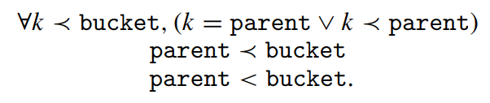

<h1 align="center">Split-Ordered Lists</h1>
<h2 align="center">Lock-Free Extensible Hash Tables</h2>

Ori Shalev and Nir Shavit

## Abstract

We present the first lock-free implementation of an extensible hash table running on current architectures. Our algorithm provides concurrent insert, delete, and find operations with an expected O(1) cost. It consists of very simple code, easily implementable using only load, store, and compare-and-swap operations. The new mathematical structure at the core of our algorithm is recursive split ordering, a way of ordering elements in a linked list so that they can be repeatedly “split” using a single compare-and-swap operation. Metaphorically speaking, our algorithm differs from prior known algorithms in that extensibility is derived by “moving the buckets among the items” rather than “the items among the buckets.” Though lock-free algorithms are expected to work best in multiprogrammed environments, empirical tests we conducted on a large shared memory multiprocessor show that even in non-multiprogrammed environments, the new algorithm performs as well as the most efficient known lock-based resizable hash-table algorithm, and in high load cases it significantly outperforms it.

我们提出了可在当前架构上运行的可扩展哈希表的第一个无锁实现。 我们的算法支持并发插入、删除和查找操作，并且时间复杂度均为 O(1)。 它由非常简单的代码组成，仅使用 load、store 和 compare-and-swap 操作即可轻松实现。 我们算法核心的新数学结构是 recursive split ordering，这是一种对链表中的元素进行排序的方法，以便可以使用单个 compare-and-swap 操作重复 "split" 它们。 打个比方，我们的算法不同于之前已知的算法，因为可扩展性是通过“在 items 之间移动 buckets”而不是“在 buckets 之间移 items”获得的。 尽管无锁算法有望在多道程序环境中发挥最佳效果，但我们在大型共享内存多处理器上进行的经验测试表明，即使在非多道程序环境中，新算法的性能也与已知的最高效的基于锁的可调整大小的 hash-table 算法一样好。 并且在高负载情况下明显优于基于锁的实现。

## 1. Introduction

Hash tables, and specifically extensible hash tables, serve as a key building block of many high performance systems. A typical extensible hash table is a continuously resized array of buckets, each holding an expected constant number of elements, and thus requiring an expected constant time for insert, delete and find operations [Cormen et al. 2001]. The cost of resizing, the redistribution of items between old and new buckets, is amortized over all table operations, thus keeping the average complexity of any one operation constant. As this is an extensible hash table, “resizing” means extending the table. It is interesting to note, as argued elsewhere [Hsu and Yang 1986; Lea (e-mail communication 2005)], that many of the standard concurrent applications using hash tables require tables to only increase in size.”

哈希表，特别是可扩展的哈希表，是许多高性能系统的关键构建模块。 一个典型的可扩展哈希表是一个可持续调整大小的 buckets 数组，每个 bucket 包含预期的常量数量的元素，因此需要预期的常量时间来执行插入、删除和查找操作 [Cormen et al. 2001]。 调整大小的成本，即 items 在新旧 buckets 之间的重新分配，在所有表操作中分摊，使得任何一个操作的平均复杂度保持不变。 由于这是一个可扩展的哈希表，“调整大小”意味着扩展该表。 值得注意的是，正如其他地方所争论的那样 [Hsu and Yang 1986; Lea (e-mail communication 2005)]，许多使用哈希表的标准并发应用程序只需要增加表的大小。”

We are concerned in implementing the hash table data structure on multiprocessor machines, where efficient synchronization of concurrent access to data structures is essential. Lock-free algorithms have been proposed in the past as an appealing alternative to lock-based schemes, as they utilize strong primitives such as CAS (compare-and-swap) to achieve fine grained synchronization. However, lockfree algorithms typically require greater design efforts, being conceptually more complex.

我们关注在多处理器机器上实现哈希表数据结构，其中对数据结构的并发访问的高效同步是必不可少的。 过去曾提出无锁算法作为基于锁方案的有吸引力的替代方案，因为它们利用 CAS (compare-and-swap) 等强大的原语来实现细粒度同步。 然而，无锁算法通常需要更多的设计工作，在概念上更复杂。

This article presents the first lock-free extensible hash table that works on current architectures, that is, uses only loads, stores and CAS (or LL/SC [Moir 1997]) operations. In a manner similar to sequential linear hashing [Litwin 1980] and fitting real-time applications, resizing costs are split incrementally to achieve expected O(1) operations per insert, delete and find. The proposed algorithm is simple to implement, leading us to hope it will be of interest to practitioners as well as researchers. As we explain shortly, it is based on a novel recursively split-ordered list structure. Our empirical testing shows that in a concurrent environment, even without multiprogramming, our lock-free algorithm performs as well as the most efficient known lock-based extensible hash-table algorithm due to Lea [2003], and in high-load cases, it significantly outperforms it.

本文介绍了第一个适用于当前架构的无锁可扩展哈希表，即仅使用 load、store 和 CAS (or LL/SC [Moir 1997]) 操作。 以类似于 sequential linear hashing [Litwin 1980] 和 fitting real-time applications 的方式，调整大小的成本被逐步拆分，以实现 O(1) 复杂度的插入、删除和查找操作。 所提出的算法易于实现，我们希望它能引起从业者和研究人员的兴趣。 正如我们稍后解释的那样，它基于一种新颖的 recursively split-ordered list  结构。 我们的经验测试表明，在并发环境中，即使没有多道程序，我们的无锁算法的性能与 Lea [2003] 提出的已知最有效的基于锁的可扩展哈希表算法一样好，并且在高负载情况下，明显优于它。

### 1.1 Background

There are several lock-based concurrent hash table implementations in the literature. In the early eighties, Ellis [1983, 1987] proposed an extensible concurrent hash table for distributed data based on a two level locking scheme, first locking a table directory and then the individual buckets. Michael [2002a] has recently shown that on shared memory multiprocessors, simple algorithms using a reader-writer lock [Mellor-Crummey and Scott 1991] per bucket have reasonable performance for non-extensible tables. However, to resize one would have to hold the locks on all buckets simultaneously, leading to significant overheads. A recent algorithm by Lea [2003], proposed for java.util.concurrent, the JavaTM Concurrency Package, is probably the most efficient known concurrent extensible hash algorithm. It is based on a more sophisticated locking scheme that involves a small number of high level locks rather than a lock per bucket, and allows concurrent searches while resizing the table, but not concurrent inserts or deletes. In general, lock-based hash-table algorithms are expected to suffer from the typical drawbacks of blocking synchronization: deadlocks, long delays, and priority inversions [Greenwald 1999]. These drawbacks become more acute when performing a resize operation, an elaborate “global” process of redistributing the elements in all the hash table’s buckets among newly added buckets. Designing a lock-free extensible hash table is thus a matter of both practical and theoretical interest.

文献中有几种基于锁的并发哈希表实现。 八十年代初期，Ellis [1983, 1987] 提出了一种基于两级锁定方案的分布式数据可扩展并发哈希表，首先锁定 table directory，然后锁定各个 bucket。 Michael [2002a] 最近表明，在共享内存多处理器上，使用每个 bucket 的读写锁 [Mellor-Crummey and Scott 1991] 的简单算法对于不可扩展的哈希表具有合理的性能。 但是，要调整大小，必须同时持有所有 buckets 的锁，从而导致大量开销。 Lea [2003] 最近为 JavaTM 并发包 java.util.concurrent 提出的算法可能是已知最有效的并发可扩展哈希表算法。 它基于更复杂的锁定方案，涉及少量高级锁而不是每个 bucket 一个锁，并允许在调整表大小时执行并发查找，但不允许并发插入或删除。 一般来说，基于锁的哈希表算法会遇到阻塞同步的典型缺点：deadlocks, long delays, and priority inversions [Greenwald 1999]。 这些缺点在执行调整大小的操作时变得更加严重，在新添加的 buckets 中重新分配所有哈希表 buckets 中的元素是一个耗时的 “全局” 过程。 因此，设计一个无锁的可扩展哈希表既有实际意义又有理论意义。

Michael [2002a], builds on the work of Harris [2001] to provide an effective compare-and-swap (CAS) based lock-free linked-list algorithm (which we will elaborate upon in the following section). He then uses this algorithm to design a lock-free hash structure: a fixed size array of hash buckets with lock-free insertion and deletion into each. He presents empirical evidence that shows a significant advantage of this hash structure over lock-based implementations in multiprogrammed environments. However, this structure is not extensible: if the number of elements grows beyond the predetermined size, the time complexity of operations will no longer be constant.

Michael [2002a] 以 Harris [2001] 的工作为基础，提供了一种有效的基于 compare-and-swap (CAS) 的无锁链表算法（我们将在下一节中详细介绍）。 然后他使用这个算法设计了一个无锁哈希结构：一个固定大小的哈希 buckets 数组，每个 bucket 都可以执行无锁的插入和删除。 他提供的经验证据，表明这种 hash 结构在多程序环境中比基于锁的实现具有显著优势。 然而，这种结构是不可扩展的：如果元素的数量增长超过预定的大小，操作的时间复杂度将不再是常量。

As part of his “two-handed emulation” approach, Greenwald [2002] provides a lock-free hash table that can be resized based on a double-compare-and-swap (DCAS) operation. However, DCAS, an operation that performs a CAS atomically on two non-adjacent memory locations, is not available on current architectures. Moreover, although Greenwald’s hash table is extensible, it is not a true extensible hash table. The average number of steps per operation is not constant: it involves a helping scheme where that under certain scheduling scenario would lead to a time complexity linearly dependant on the number of processes.

作为 Greenwald 的 "two-handed emulation" 方法的一部分，Greenwald [2002] 提出了一个无锁哈希表，可以根据 double-compare-and-swap (DCAS) 操作调整大小。 但是，DCAS 是一种在两个不相邻的内存位置上以原子方式执行 CAS 的操作，在当前的架构上不可用。 而且，Greenwald 的哈希表虽然是可扩展的，但并不是真正的可扩展哈希表。 每个操作的平均步骤数不是常量的：它包括一个 helping scheme，在某些调度场景下，该方案会导致时间复杂度与进程数线性相关。

Independently of our work, Gao et al. [2004] have developed a extensible and “almost wait-free” hashing algorithm based on an open addressing hashing scheme and using only CAS operations. Their algorithm maintains the dynamic size by periodically switching to a global resize state in which multiple processes collectively perform the migration of items to new buckets. They suggest performing migration using a write-all algorithm [Hesselink et al. 2001]. Theoretically, each operation in their algorithm requires more than constant time on average because of the complexity of performing the write-all [Hesselink et al. 2001], and so it is not a true extensible hash-table. However, the nonconstant factor is small, and the performance of their algorithm in practice will depend on the yet-untested realworld performance of algorithms for the write-all problem [Hesselink et al. 2001; Kanellakis and Shvartsman 1997].

独立于我们的工作，Gao et al. [2004] 开发了一种基于开放寻址哈希方案并仅使用 CAS 操作的可扩展且 "almost wait-free" 的哈希算法。 他们的算法通过定期切换到 global resize state 来维持动态大小，在该状态中，多个进程共同执行 items 到新 buckets的迁移。 他们建议使用 write-all 算法执行迁移 [Hesselink et al. 2001]。 从理论上讲，由于执行 write-all 算法的复杂度，他们算法中的每个操作平均需要超过常量时间 [Hesselink et al. 2001]，所以它不是真正的可扩展哈希表。 然而，非常量因素很小，其算法在实践中的性能将取决于针对全写问题的算法的未经测试的现实性能 [Hesselink et al. 2001; Kanellakis and Shvartsman 1997]。

### 1.2 The lock-free resizing problem

What is it that makes lock-free extensible hashing hard to achieve? The core problem is that even if individual buckets are lock-free, when resizing the table, several items from each of the “old” buckets must be relocated to a bucket among “new” ones. However, in a single CAS operation, it seems impossible to atomically move even a single item, as this requires one to remove the item from one linked list and insert it in another. If this move is not done atomically, elements might be lost, or to prevent loss, will have to be replicated, introducing the overhead of “replication management”. The lock-free techniques for providing the broader atomicity required to overcome these difficulties imply that processes will have to “help” others complete their operations. Unfortunately, “helping” requires processes to store state and repeatedly monitor other processes’ progress, leading to redundancies and overheads that are unacceptable if one wants to maintain the constant time performance of hashing algorithms.

是什么让无锁可扩展哈希难以实现？ 核心问题是，即使单个 bucket 是无锁的，在调整表大小时，每个“旧” bucket 中的几个 items 也必须重新定位到“新” buckets 中的一个 bucket 中。 然而，在单个 CAS 操作中，似乎不可能以原子方式移动甚至单个 item，因为这需要从一个链表中删除该 item 并将其插入另一个链表。 如果此移动不是以原子方式完成，则 item 可能会丢失，或者为了防止丢失，将必须复制元素，从而引入“复制管理”的开销。 提供克服这些困难所需的更广泛原子性的无锁技术意味着进程将不得不“帮助”其他人完成他们的操作。 不幸的是，"helping" 需要进程存储状态并反复监视其他进程的进度，如果想要保持哈希算法的常量时间性能，就会导致冗余和开销，这是不可接受的。

### 1.3 Split-ordered lists

To implement our algorithm, we thus had to overcome the difficulty of atomically moving items from old to new buckets when resizing. To do so, we decided to, metaphorically speaking, flip the linear hashing algorithm on its head: our algorithm will not move the items among the buckets, rather, it will move the buckets among the items. More specifically, as shown in Figure 1, the algorithm keeps all the items in one lock-free linked list, and gradually assigns the bucket pointers to the places in the list where a sublist of “correct” items can be found. A bucket is initialized upon first access by assigning it to a new “dummy” node (dashed contour) in the list, preceding all items that should be in that bucket. A newly created bucket splits an older bucket’s chain, reducing the access cost to its items. Our table uses a modulo 2^i hash (there are known techniques for “pre-hashing” before a modulo 2^i hash to overcome possible binary correlations among values Lea [2003]). The table starts at size 2 and repeatedly doubles in size.

因此，为了实现我们的算法，我们必须克服在调整大小时将 items 从旧 buckets 原子地移动到新 buckets 的困难。 为此，我们决定，翻转线性哈希算法：我们的算法不会在 buckets 之间移动 items，而是在 items 之间移动 buckets。 更具体地说，如图 1 所示，该算法将所有 items 保存在一个无锁链表中，并将 buckets 指针分配给链表中可以找到“正确” items 子链表的位置。 buckets 在第一次访问时通过将其分配给链表中的新 "dummy" 节点（虚线轮廓）来初始化，位于该 bucket 中应包含的所有 items 之前。 新创建的 bucket 会拆分旧 buckets 的链，从而降低对其 items 的访问成本。 我们的表使用模 2^i 哈希（在模 2^i 哈希之前有已知的 "pre-hashing" 技术，以克服值 Lea [2003] 之间可能存在的二进制相关性）。 哈希表从大小 2 开始，然后大小不断加倍。

Unlike moving an item, the operation of directing a bucket pointer can be done in a single CAS operation, and since items are not moved, they are never “lost”. However, to make this approach work, one must be able to keep the items in the list sorted in such a way that any bucket’s sublist can be “split” by directing a new bucket pointer within it. This operation must be recursively repeatable, as every split bucket may be split again and again as the hash table grows. To achieve this goal we introduced recursive split-ordering, a new ordering on keys that keeps items in a given bucket adjacent in the list throughout the repeated splitting process.

与移动 items 不同，指向 bucket 指针的操作可以在单个 CAS 操作中完成，并且由于 items 没有移动，它们永远不会“丢失”。 然而，为了使这种方法起作用，必须能够使链表中的 items 保持排序，这样任何 buckets 的子链表都可以通过在其中指向一个新的 bucket 指针来 "split"。 此操作必须是 recursively repeatable，因为随着哈希表的增长，每个 split bucket可能会一次又一次地拆分。 为了实现这一目标，我们引入了 recursive split-ordering，这是一种新的基于 key 的 ordering，可在整个重复拆分过程中使给定 bucket 中的 items 在链表中保持相邻。

Magically, yet perhaps not surprisingly, recursive split-ordering is achieved by simple binary reversal: reversing the bits of the hash key so that the new key’s most significant bits (MSB) are those that were originally its least significant. As detailed below and in the next section, some additional bit-wise modifications must be made to make things work properly. In Figure 1, the split-order key values are written above the nodes (the reader should disregard the rightmost binary digit at this point). For instance, the split-order value of 3 is the bit-reverse of its binary representation, which is 11000000. The dashed-line nodes are the special dummy nodes corresponding to buckets with original keys that are 0,1,2, and 3 modulo 4. The split-order keys of regular (nondashed) nodes are exactly the bit-reverse image of the original keys after turning on their MSB (in the example we used 8-bit words). For example, items 9 and 13 are in the “1 mod 4” bucket, which can be recursively split in two by inserting a new node between them.

recursive split-ordering 是通过简单的二进制反转实现的：反转哈希 key 的位，以便新 key 的最高有效位（MSB）是最初最低有效位。如下文和下一节所述，必须进行一些额外的逐位修改，以使其正常工作。在图 1 中，split-order key 值被写在节点上方（此时读者应该忽略最右边的二进制数字）。例如，3 的 split-order 值是其二进制表示的位反转，即 11000000。虚线节点是与具有 0,1,2, and 3 modulo 4 的原始 key 的 bucket 对应的特殊 dummy 节点。regular（非虚线）节点的 split-order key 是原始 key 的位反转。例如，item 9 和 13 位于 "1 mod 4" bucket 中，通过在它们之间插入新节点，可以递归地将它们一分为二。

To insert (respectively delete or find) an item in the hash table, hash its key to the appropriate bucket using recursive split-ordering, follow the pointer to the appropriate location in the sorted items list, and traverse the list until the key’s proper location in the split-ordering (respectively, until the key or a key indicating the item is not in the list) is found. The solution depends on the property that the items’ position is “encoded” in their binary representation, and therefore cannot be generalized to bases other than 2.

要在哈希表中插入（删除或查找）一个 item，使用 recursive split-ordering 将其 key 哈希到对应的 bucket 中，跟随指向已排序链表中对应位置的指针，并遍历链表，直到找到 split-ordering 中该 key 的对应位置。只有 key % 2^i 等于 key 的低 i 位，因此不能推广到 2 以外的基。

As we show, because of the combinatorial structure induced by the split-ordering, this will require traversal of no more than an expected constant number of items. A detailed proof appears in Section 3.

正如我们所展示的，由于 split-ordering 导致的组合结构，这将需要遍历不超过预期的常量数量的 items。 详细的证明出现在第 3 节中。

We note that our design is modular: to implement the ordered items list, one can use one of several non-blocking list-based set algorithms in the literature. Potential candidates are the lock-free algorithms of Harris [2001] or Michael [2002a], or the obstruction-free algorithms of Valois[1995] or Luchangco et al. [2003]. We chose to base our presentation on the algorithm of Michael [2002a], an extension of the Harris algorithm [Harris 2001] that fits well with memory management schemes [Herlihy et al. 2002; Michael 2002b] and performs well in practice.

我们的设计是模块化的：要实现有序 items 链表，可以使用文献中几种基于非阻塞链表的集合算法之一。 潜在候选者是 Harris [2001] 或 Michael [2002a] 的无锁算法，或 Valois[1995] or Luchangco et al. [2003] 的 obstruction-free 算法。 我们的演示基于 Michael [2002a] 的算法，它是 Harris 算法 [Harris 2001] 的扩展，非常适合内存管理方案 [Herlihy et al. 2002; Michael 2002b] 并在实践中表现良好。

### 1.4 Complexity

Omit

### 1.5 Performance

Omit

## 2. The algorithm in detail

Our hash table data structure consists of two interconnected substructures (see Figure 1): A linked list of nodes containing the stored items and keys, and an expanding array of pointers into the list. The array entries are the logical “buckets” typical of most hash tables. Any item in the hash table can be reached by traversing down the list from its head, while the bucket pointers provide shortcuts into the list in order to minimize the search cost per item.

我们的哈希表数据结构由两个子结构组成（见图 1）：一个包含 items 和 keys 的节点链表，以及一个指向链表节点的可扩展的指针数组。数组条目是大多数哈希表的典型逻辑 "buckets"。哈希表中的任何 items 都可以通过从链表的头节点向后遍历来访问，而 bucket 指针提供了进入链表的快捷方式，以最小化每个 item 的查找成本。

The main difficulty in maintaining this structure is in managing the continuous coverage of the full length of the list by bucket pointers as the number of items in the list grows. The distribution of bucket pointers among the list items must remain dense enough to allow constant time access to any item. Therefore, new buckets need to be created and assigned to sparsely covered regions in the list.

维护此结构的主要困难在于，随着链表中 item 的数量增加，管理 buckets 指针对整个链表持续覆盖。bucket 指针在链表 items 之间的分布必须保持足够密集，以允许对任何 item 进行常量的时间访问。因此，需要创建新的 buckets，并将其分配给链表中覆盖稀疏的区域。

The bucket array initially has size 2, and is doubled every time the number of items in the table exceeds size · L, where L is a small integer denoting the load factor, the maximum number of items one would expect to find in each logical bucket of the hash table. The initial state of all buckets is uninitialized, except for the bucket of index 0, which points to an empty list, and is effectively the head pointer of the main list structure. Each bucket goes through an initialization procedure when first accessed, after which it points to some node in the list.

bucket 数组最初的大小为 2，每当表中的 items 数量超过 size * L时，它就会加倍，其中 L 是一个表示负载因子的小整数，即哈希表的每个逻辑 bucket 中可以找到的最大 items 数量。所有 buckets 的初始状态都是未初始化，但索引 0 的存储桶除外，它指向一个空的链表，实际上是主链表结构的头指针。每个 bucket 在第一次访问时都会经历一个初始化过程，然后指向链表中的某个节点。

When an item of key k is inserted, deleted, or searched for in the table, a hash function modulo the table size is used, that is, the bucket chosen for item k is k mod size. The table size is always equal to some power 2^i , i ≥ 1, so that the bucket index is exactly the integer represented by the key’s i least significant bits (LSBs). The hash function’s dependency on the table size makes it necessary to take special care as this size changes: an item that was inserted to the hash table’s list before the resize must be accessible, after the resize, from both the buckets it already belonged to and from the new bucket it will logically belong to given the new hash function.

当在表中插入、删除或查找 key 等于 k 的 item 时，使用与 table size 取模的哈希函数，即，为 item k 选择的 bucket 是 k mod size。table size 始终等于某个幂 2^i，i≥1，因此 bucket 索引正好是由 key 的 i 个最低有效位（LSB）表示的整数。哈希函数对 table size 的依赖性使得在 size 发生变化时需要特别注意：在调整大小之前插入到哈希表的链表中的 item 在调整大小之后必须可以从它已经属于的就 bucket 和通过哈希函数计算得到的新 bucket 访问。

### 2.1 Recursive Split-ordering

The combination of a modulo-size hash function and a 2^i table size is not new. It was the basis of the well known sequential extensible Linear Hashing scheme proposed by Litwin [1980], was the basis of the two-level locking hash scheme of Ellis [1983], and was recently used by Lea [2003] in his concurrent extensible hashing scheme. The novelty here is that we use it as a basis for a combinatorial structure that allows us to repeatedly “split” all the items among the buckets without actually changing their position in the main list.

mudulo-size 哈希函数和 2^i table size 的组合并不新鲜。 它是 Litwin [1980] 提出的众所周知的顺序可扩展线性哈希方案的基础，是 Ellis [1983] 的二级锁定哈希方案的基础，最近被 Lea [2003] 在他的并发可扩展哈希方案所使用。 这里的新颖之处在于，我们将它用作组合结构的基础，该组合结构允许我们重复 "split" buckets 中的所有 items，而无需实际改变它们在主链表中的位置。

When the table size is 2^i , a logical table bucket b contains items whose keys k maintain k mod 2^i = b. When the size becomes 2^i+1, the items of this bucket are split into two buckets: some remain in the bucket b, and others, for which k mod 2^i+1 = b + 2^i , migrate to the bucket b + 2^i . If these two groups of items were to be positioned one after the other in the list, splitting the bucket b would be achieved by simply pointing bucket b + 2^i after the first group of items and before the second. Such a manipulation would keep the items of the second group accessible from bucket b as desired.

当表大小为 2^i 时，逻辑表 bucket b 包含的 items 的键 k 保持 k mod 2^i = b。 当 table size 变为 2^i+1 时，这个 bucket 的 items 被拆分到两个 bucket 中：一部分留在 b bucket 中，剩下的迁移到 bucket b+2^i 中，其中 k mod 2^i+1 = b+2^i。 如果这两组 items 在链表中一个接一个地放置，则只需将 bucket b + 2^i 指向第一组 items 之后和第二组 items 之前，即可拆分bucket b。 这样的操作将使第二组的 items 可以根据需要从 bucket b 中访问。

Looking at their keys, the items in the two groups are differentiated by the i’th binary digit (counting from right, starting at 0) of their items’ key: those with 0 belong to the first group, and those with 1 to the second. The next table doubling will cause each of these groups to split again into two groups differentiated by bit i + 1, and so on. For example, the elements 9 (1001(2)) and 13 (1101(2)) share the same two least significant bits (01). When the table size is 2^2, they are both in the same bucket, but when it grows to 2^3, having a different third bit will cause to to be separated. This process induces recursive split-ordering, a complete order on keys, capturing how they will be repeatedly split among logical buckets. Given a key, its order is completely defined by its bit-reversed value.

查看他们的 key，两组中的 items 通过其 item key 的第 i 个二进制数字（从右开始计数，从 0 开始）区分：0 的属于第一组，1 的属于第二组。 下一次table size 加倍将导致这些组中的每一个再次分裂为由第 i + 1 位区分的两组，依此类推。 例如，元素 9 (1001(2)) 和 13 (1101(2)) 共享相同的两个最低有效位 (01)。 当表大小为 2^2 时，它们都在同一个桶中，但是当它增长到 2^3 时，第三位不同会导致 9 和 13 被分到不同的 bucket 中。 这个过程会导致 recursive split-ordering，即 key 的 complete order，表示它们将如何在逻辑 bucket 之间重复 split。 给定一个 key，其 split-order 等于 key 的位反转后的值。

Let us now return to the main picture: an exponentially growing array of (possibly uninitialized) buckets maps to a linked list ordered by the split-order values of inserted items’ keys, values that are derived by reversing the bits of the original keys. Buckets are initialized when they are accessed for the first time. List operations such as insert, delete or find are implemented via a linearizable lock-free linked list algorithm. However, having additional references to nodes from the bucket array introduces a new difficulty: it is nontrivial to manage deletion of nodes pointed to by bucket pointers. Our solution is to add an auxiliary dummy node per bucket, preceding the first item of the bucket, and to have the bucket pointer point to this dummy node. The dummy nodes are not deleted, which helps keep things simple.

现在让我们回到主图：一个指数增长的（可能未初始化的）bucket 数组映射到一个链表，该链表按插入 item key的 split-order 排序，这些值是通过反转原始 key 的比特位得到的。 bucket 在第一次被访问时被初始化。 插入、删除或查找等链表操作通过可线性化的无锁链表算法实现。 但是，从 bucket 数组中添加对节点的引用会带来一个新的困难：管理 bucket 指针指向的节点的删除并非易事。 我们的解决方案是在 bucket 的第一个 item 之前为每个 bucket 添加一个辅助 dummy 节点，并让 bucket 指针指向这个 dummy 节点。 dummy 节点不会被删除，这有助于保持简单。

In more detail, when the table size is 2^i+1, the first time bucket b+2^i is accessed, a dummy node is created, holding the key b+2^i . This node is inserted to the list via bucket b, the parent bucket of b +2^i . Under split-ordering, b +2^i precedes all keys of bucket b +2^i , since those keys must end with i +1 bits forming the value b +2^i . This value also succeeds all the keys of bucket b that do not belong to b + 2^i : they have identical i LSBs, but their bit numbered i is “0”. Therefore, the new dummy node is positioned in the exact location in the list that separates the items that belong to the new bucket from other items of bucket b. In the case where the parent bucket b is uninitialized, we apply the initialization procedure on it recursively before inserting the dummy node. In order to distinguish dummy keys from regular ones we set the most significant bit of regular keys to “1”, and leave the dummy keys with “0” at the MSB. Figure 2 defines the complete split-ordering transformation using the functions so regularkey and so dummykey. The former, reverses the bits after turning on the MSB, and the latter simply performs the bit reversal.

更详细地说，当表大小为 2^i+1 时，第一次访问 bucket b+2^i 时，会创建一个 dummy 节点，其中包含 key b+2^i 。 该节点通过 b +2^i 的父 bucket b 插入到链表中。 在拆 split-ordering 下，b+2^i 在 bucket b +2^i 的所有 key 之前，因为这些 key 必然以相同的 i +1 位结尾，形成值 b +2^i 。 该值也继承了 bucket b 中不属于 b + 2^i 的所有 key：它们具有相同的 i +1 个 LSB，但它们的第 i + 1 为 “0”。因此，新的 dummy 节点位于链表中的确切位置，该位置将属于新 bucket 的 items 与 bucket b 的 items 分开。 在父 bucket b 未初始化的情况下，我们在插入 dummy 节点之前递归地对其应用初始化过程。 为了区分 dummy jkey 和 regular key，我们将 regular key 的最高有效位设置为 “1”，并将 dummy key 的 MSB 保留为 “0”。 图 2 使用函数 so regularkey 和 so dummykey 定义了完整的 split-ordering 转换。 前者在设置 MSB 后再执行位反转，而后者直接执行位反转。

Figure 3 describes a bucket initialization caused by an insertion of a new key to the set. The insertion of key 10 is invoked when the table size is 4 and buckets 0,1 and 3 are already initialized.

图 3 描述了由向集合中插入新的 key 引起的 bucket 初始化。 当 table size 为 4 且 bucket 0, 1 和 3 已初始化时，key 10 的插入将会初始化 bucket 2。

Since the bucket array is growing, it is not guaranteed that the parent bucket of an uninitialized bucket is initialized. In this case, the parent has to be initialized (recursively) before proceeding. Though the total complexity in such a series of recursive calls is potentially logarithmic, our algorithm still works. This is because given a uniform distribution of items, the chances of a logarithmic-size series of recursive initialization calls are low, and in fact, the expected length of such a bad sequence of parent initializations is constant.

由于 bucket 数组在增长，因此不能保证未初始化 bucket 的父 bucket 被初始化。 在这种情况下，必须在继续之前（递归地）初始化父 bucket。 尽管这样一系列递归调用的总复杂度可能是对数的，但我们的算法仍然有效。 这是因为给定均匀分布的 items，对数大小的递归初始化调用序列的概率很低，事实上，这种糟糕的父 bucket 初始化序列的预期长度是常量的。

### 2.2 The continuously growing table

We can now complete the presentation of our algorithm. We use the lock-free ordered linked-list algorithm of Michael [2002a] to maintain the main linked list with items ordered based on the split-ordered keys. This algorithm is an improved variant, including improved memory management, of an algorithm by Harris [2001]. Our presentation will not discuss the various memory reclamation options of such linked-list schemes, and we refer the interested reader to Harris [2001], Herlihy et al. [2002], and Michael [2002a, 2002b]. To keep our presentation self contained, we provide in Appendix A the code of Michael’s linked list algorithm. This implementation is linearizable, implying that each of these operations can be viewed as happening atomically at some point within its execution interval.

我们现在可以完成我们算法的演示。 我们使用 Michael [2002a] 的无锁有序链表算法来维护主链表，其中的 items 基于 split-ordered key 排序。 该算法是 Harris [2001] 算法的改进变体，包括改进的内存管理。 我们的演示不会讨论此类链表方案的各种内存回收选项，我们建议感兴趣的读者参阅 Harris [2001], Herlihy et al. [2002], and Michael [2002a, 2002b]。 为了保持演示的独立性，我们在附录 A 中提供了 Michael 链表算法的代码。 此实现是可线性化的，这意味着这些操作中的每一个都可以被视为在其执行间隔内的某个时间点以原子地发生。

Our algorithm decides to double the table size based on the average bucket load. This load is determined by maintaining a shared counter that tracks the number of items in the table. The final detail we need to deal with is how the array of buckets is repeatedly extended. To simplify the presentation, we keep the table of buckets in one continuous memory segment as depicted in Figure 4. This approach is somewhat impractical, since table doubling requires one process to reallocate a very large memory segment while other processes may be waiting. The practical version of this algorithm, which we used for performance testing, actually employs an additional level of indirection in accessing buckets: a main array points to segments of buckets, each of which is a bucket array. A segment is allocated only upon the first access to some bucket within it. The code for this dynamic allocation scheme appears in Section 2.4.

我们的算法决定基于平均桶负载将 table size加倍。 此负载是通过维护一个跟踪链表中 items 数量的共享 counter 来确定的。 我们需要处理的最后一个细节是如何重复扩展 bucket 数组。 为了简化演示，我们将 bucket 数组保存在一个连续的内存段中，如图 4 所示。这种方法有些不切实际，因为 table size 加倍需要一个进程重新分配一个非常大的内存段，而其他进程可能正在等待。 我们用于性能测试的该算法的实用版本实际上在访问 bucket 时采用了额外的间接级别：主数组指向 buckets 的 segments，每个 buekt 都是一个buckets 数组。 只有在第一次访问其中的某个 bucke 时才会分配一个 segment。 该动态分配方案的代码出现在第 2.4 节中。

### 2.3 The code

We now provide the code of our algorithm. Figure 4 specifies some type definitions and global variables. The accessible shared data structures are the array of buckets T, a variable size storing the current table size, and a counter count denoting the number of regular keys currently inside the structure. The counter is initially 0, and the buckets are set as uninitialized, except the first one, which points to a node of key 0, whose next pointer is set to NULL. Each thread has three private variables prev, cur, and next, that point at a currently searched node in the list, its predecessor, and its successor. These variables have the same functionality as in Michael’s algorithm [Michael 2002a]: they are set by list find to point at the nodes around the searched key, and are subsequently used by the same thread to refer to these nodes in other functions. In Figure 5, we show the implementation of the insert, find and delete operations. The fetch-and-inc operation can be implemented in a lock-free manner via a simple repeated loop of CAS operations, which as we show, given the low access rates, has a negligible performance overhead.

我们现在提供我们算法的代码。 图 4 指定了一些类型定义和全局变量。 可访问的共享数据结构是 bucket 数组 T，一个存储当前 table size 的变量 size，以及一个表示链表中当前 regular key 数量的计数器 count。计数器初始为 0，bucket 设置为未初始化 ，bucket 设置为未初始化，但第一个 bucket 指向 key 为 0 的节点，其 next 指针设置为 NULL。 每个线程都有三个私有变量 prev、cur 和 next，它们指向链表中当前搜索的节点、它的前导节点和它的后继节点。 这些变量与 Michael 的算法 [Michael 2002a] 具有相同的功能：通过链表查找将它们设置为指向查找的 key 周围的节点，然后由同一线程用于在其他函数中引用这些节点。 在图 5 中，我们展示了 insert、find 和 delete 操作的实现。 fetch-and-inc 操作可以通过简单的 CAS 操作重复循环以无锁方式实现，正如我们所展示的，在低访问率的情况下，性能开销可以忽略不计。

The function insert creates a new node and assigns it a split-order key. Note that the keys are stored in the nodes in their split-order form. The bucket index is computed as key mod size. If the bucket has not been initialized yet, initialize bucket is called. Then, the node is inserted to the bucket by using list insert. If the insertion is successful, one can proceed to increment the item count using a fetch-and-inc operation. A check is then performed to test whether the load factor has been exceeded. If so, the table size is doubled, causing a new segment of uninitialized buckets to be appended.

函数 insert 创建一个新节点并为其分配一个 split-order key。 注意，key 以split- order 的形式存储在节点中。 buket 索引被计算为 key mod size。 如果 bucket 还没有初始化，则调用 initialize bucket。 然后，使用列表插入将节点插入到桶中。 如果插入成功，则可以继续使用 fetch-and-inc 操作来增加 items 计数。 然后检查 count 是否大于 load factor。 如果，table size 会加倍，从而导致追加一个新的未初始化 bucket 的 segment。

The function find ensures that the appropriate bucket is initialized, and then calls list find on key after marking it as regular and inverting its bits. list find ceases to traverse the chain when it encounters a node containing a higher or equal (split-ordered) key. Notice that this node may also be a dummy node marking the beginning of a different bucket.

函数 find 确保适当的 bucket 被初始化，然后将 key 标记为 regular 并反转其比特位后调用 list find。 list find 在遇到包含更高或等于（split-order）key 的节点时停止遍历链表。 注意，此节点也可能是标记不同 bucket 开始的 dummy 节点。

The function delete also makes sure that the key’s bucket is initialized. Then it calls list delete to delete key from its bucket after it is translated to its splitorder value. If the deletion succeeds, an atomic decrement of the total item count is performed.

函数 delete 也要确保 key 对应的 bucket 已初始化。 然后将 key 转化为 split-order，并调用 list delete 把 key 从它的 bucket 中删除。 如果删除成功，则执行总 item count 的原子递减。

The role of initialize bucket is to direct the pointer in the array cell of the index bucket. The value assigned is the address of a new dummy node containing the dummy key bucket. First, the dummy node is created and inserted to an existing bucket, parent. Then, the cell is assigned the node’s address. If the parent bucket is not initialized, the function is called recursively with parent. In order to control the recursion, we maintain the invariant that parent < bucket, where “<” is the regular order among keys. It is also wise to choose parent to be as close as possible to bucket in the list, but still preceding it. Formally, the following constraints define our the algorithm’s choice of parent uniquely, where “<” is the regular order and “≺” is the split-order among keys:

initialize bucket 的作用是初始化 bucket 指针，将 bucket 指针数组中某个 key 对应的数组单元指向链表中分配好的 dummy 节点。 分配的值是包含 dummy key bucket 的新 dummy 节点的地址。 首先，创建 dummy 节点并将其插入到现有的 bucket parent 节点中。 然后，单元被分配节点的地址。 如果 parent bucket 没有初始化，则递归初始化 parent bucket。 为了控制递归，我们保持 parent < bucket 的不变量，其中“<”是 key 之间的 regular order。 选择 parent 尽可能靠近链表中的 bucket 也是明智的，但仍然在它之前。 形式上，以下约束唯一地定义了我们的算法对 parent 节点的选择，其中“<”是 regular order，“≺”是 key 之间的 split-order：

This value is achieved by calling the GET PARENT macro that unsets bucket’s most significant turned-on bit. If the exact dummy key already exists in the list, it may be the case that some other process tried to initialize the same bucket, but for some reason has not completed the second step. In this case, list insert will fail, but the private variable cur will point to the node holding the dummy key. The newly created dummy node can be freed and the value of cur used. Note that when line B8 is executed concurrently by multiple threads, the value of dummy is the same for all of them.

该值是通过调用 GET PARENT 宏来实现的，该宏取消设置 bucket 的最高有效位。 如果链表中已经存在确切的 dummy key，则可能是其他进程尝试初始化同一个 bucket，但由于某种原因尚未完成第二步。 在这种情况下，链表插入将失败，但私有变量 cur 将指向拥有 dummy key 的节点。 可以释放新创建的dummy 节点并使用 cur 的值。 请注意，当 B8 行由多个线程并发执行时，dummy 的值对所有线程都是相同的。

As we will show in the proof, traversing the list through the appropriate bucket and dummy node will guarantee the node matching a given key will be found, or declared not-found in an expected constant number of steps.

正如我们将在证明中展示的那样，通过适当的 bucket 和 dummy 节点遍历链表将保证在预期的常量步数中找到或未找到与给定 key 匹配的节点。

### 2.4 Dynamic-sized array

Our presentation so far simplified the algorithm by keeping the buckets in one continuous memory segment. This approach is somewhat impractical, since table doubling requires one process to reallocate a very large memory segment while other processes may be waiting. In practice, we avoid this problem by introducing an additional level of indirection for accessing buckets: a “main” array points to segments of buckets, each of which is a bucket array. A segment is allocated only on the first access to some bucket within it. The structure of the dynamic-sized hash table is illustrated in Figure 6.

到目前为止，我们的演示通过将 bucket 保持在一个连续的内存段中来简化算法。 这种方法有点不切实际，因为 table size 加倍需要一个进程重新分配一个非常大的内存段，而其他进程可能正在等待。 在实践中，我们通过引入额外的间接级别来访问桶来避免这个问题："main" 数组指向 bucket 的 segment，每个 segment 都是一个 bucket 数组。 仅在第一次访问其中的某个 bucket 时才分配一个 segment。 动态大小哈希表的结构如图 6 所示。

Applying this variation is done by replacing the array of buckets T by ST, an array of bucket segments, and accessing the table via calls to get bucket and set bucket as defined in Figure 7. Referring to the code of Figure 5, the lines I3, S2, D2, D4, B2, and B5 will use get bucket to access the bucket, and in line B8 set bucket will be called instead of the assignment. Accessing a bucket involves calculating the segment index and then the bucket index within the segment. In get bucket, if the segment has not been allocated yet, it is guaranteed that the bucket was never accessed, and we can return UNINITIALIZED. When setting a bucket, in set bucket, if the segment does not exist we have to allocate it and set its pointer in the segment table.

应用此变体的方法是将 bucket 数组 T 替换为 bucket segment 数组 ST，并通过调用 get bucket 和 set bucket 来访问表，如图 7 中所定义。参考图 5 的代码，第 I3 、S2、D2、D4、B2 和 B5 行将使用 get bucket 来访问 bucket，而在 B8 行中将调用 set bucket 而不是赋值。 访问 bucket 先计算 segment 索引，然后计算 segment 内的 bucket 索引。 在 get bucket 中，如果 segment 还没有分配，则可以保证从未访问过该 segment，我们可以返回 UNINITIALIZED。 设置 bucket 时，在 set bucket 中，如果 segment 不存在，我们必须分配它并在 segment 表中设置它的指针。

Asymptotically, introducing additional levels of indirection makes the cost of a single access O(log n). However, one should view the asymptotic in the context of overall memory size, which is bounded. In our case, each level extends the range exponentially with a very high constant, reaching the maximum integer value using a very shallow hierarchy. A level-4 hirarchy can exhaust the memory of a 64-bit machine. Therefore, taking memory size into consideration, the overhead of our construction can be considered as constant.

渐进地，引入额外的间接级别使得单次访问的成本为 O(log n)。 但是，应该在有界的总内存大小的上下文中查看渐近性。 在我们的例子中，每个级别都以非常高的常数以指数方式扩展范围，使用非常浅的层次结构达到最大整数值。 4 级层次结构会耗尽 64 位计算机的内存。 因此，考虑到内存大小，我们构造的开销可以认为是常量的。

## 3. Correctness Proof

Omit

### 3.1 Correct set semantics

Omit

### 3.2 Lock freedom

Omit

### 3.3 Complexity

Omit

## 4. Performance

Omit

## 5. Conclusion

Omit

## Reference

Omit
