<h1 align="center">ZooKeeper: Wait-free coordination for Internet-scale systems</h1>

用于互联网规模系统的无等待协调服务

## Abstract

In this paper, we describe ZooKeeper, a service for coordinating processes of distributed applications. Since ZooKeeper is part of critical infrastructure, ZooKeeper aims to provide a simple and high performance kernel for building more complex coordination primitives at the client. It incorporates elements from group messaging, shared registers, and distributed lock services in a replicated, centralized service. The interface exposed by ZooKeeper has the wait-free aspects of shared registers with an event-driven mechanism similar to cache invalidations of distributed file systems to provide a simple, yet powerful coordination service.

在本文中，我们描述了ZooKeeper，这是一个用于协调分布式应用程序进程的服务。由于ZooKeeper是关键基础设施的一部分，ZooKeeper旨在为客户端构建更复杂的协调原语提供一个简单且高性能的内核。它将group messaging、shared register和分布式锁服务的元素融入到一个复制的、集中式服务中。ZooKeeper 暴露出的接口具有shared register的无等待属性，并具有类似于分布式文件系统缓存失效的事件驱动机制，以提供一个简单而强大的协调服务。

The ZooKeeper interface enables a high-performance service implementation. In addition to the wait-free property, ZooKeeper provides a per client guarantee of FIFO execution of requests and linearizability for all requests that change the ZooKeeper state. These design decisions enable the implementation of a high performance processing pipeline with read requests being satisfied by local servers. We show for the target workloads, 2:1 to 100:1 read to write ratio, that ZooKeeper can handle tens to hundreds of thousands of transactions per second. This performance allows ZooKeeper to be used extensively by client applications.

ZooKeeper接口使高性能服务实现成为可能。除了无等待属性外，ZooKeeper还为每个客户端提供FIFO执行请求的保证以及对所有更改ZooKeeper状态的请求的线性化。这些设计决策使得可以实现一个高性能处理pipeline，读取请求由本地服务器满足。我们展示了针对目标工作负载，2:1至100:1的读写比，ZooKeeper可以处理每秒数万到数十万的事务。这种性能使得ZooKeeper可以被客户端应用程序广泛使用。

## 1. Introduction

Large-scale distributed applications require different forms of coordination. Configuration is one of the most basic forms of coordination. In its simplest form, configuration is just a list of operational parameters for the system processes, whereas more sophisticated systems have dynamic configuration parameters. Group member ship and leader election are also common in distributed systems: often processes need to know which other processes are alive and what those processes are in charge of. Locks constitute a powerful coordination primitive that implement mutually exclusive access to critical resources.

大规模分布式应用程序需要不同形式的协调。配置是最基本的协调形式之一。在其最简单的形式中，配置只是系统进程的操作参数列表，而更复杂的系统具有动态配置参数。组成员关系和领导者选举也常见于分布式系统中：进程通常需要知道哪些其他进程是活动的以及这些进程负责什么。锁是一种强大的协调原语，实现对关键资源的互斥访问。

One approach to coordination is to develop services for each of the different coordination needs. For example, Amazon Simple Queue Service [3] focuses specifically on queuing. Other services have been developed specifically for leader election [25] and configuration [27]. Services that implement more powerful primitives can be used to implement less powerful ones. For example, Chubby [6] is a locking service with strong synchronization guarantees. Locks can then be used to implement leader election, group membership, etc.

一种协调方法是为不同的协调需求开发服务。例如，亚马逊简单队列服务[3]专注于排队。其他服务专门为领导者选举[25]和配置[27]而开发。另一种方法是实现更强大原语的服务可以用于实现较弱的原语。例如，Chubby[6]是具有强同步保证的锁服务。然后，锁可以用于实现领导者选举、组成员关系等。

When designing our coordination service, we moved away from implementing specific primitives on the server side, and instead we opted for exposing an API that enables application developers to implement their own primitives. Such a choice led to the implementation of a *coordination kernel* that enables new primitives without requiring changes to the service core. This approach enables multiple forms of coordination adapted to the requirements of applications, instead of constraining developers to a fixed set of primitives.

在设计我们的协调服务时，我们放弃了在服务器端实现特定原语，而是选择暴露一个API，使应用程序开发人员能够实现他们自己的原语。这样的选择导致了一个*协调内核*的实现，它能够在不需要更改服务核心的情况下实现新的原语。这种方法使得可以根据应用程序的需求实现多种形式的协调，而不是将开发人员限制在固定的原语集合中。（**所以说，ZooKeeper 是一种通用的协调服务**。）

When designing the API of ZooKeeper, we moved away from blocking primitives, such as locks. Blocking primitives for a coordination service can cause, among other problems, slow or faulty clients to impact negatively the performance of faster clients. The implementation of the service itself becomes more complicated if processing requests depends on responses and failure detection of other clients. Our system, Zookeeper, hence implements an API that manipulates simple *waitfree* data objects organized hierarchically as in file systems. In fact, the ZooKeeper API resembles the one of any other file system, and looking at just the API signatures, ZooKeeper seems to be Chubby without the lock methods, open, and close. Implementing wait-free data objects, however, differentiates ZooKeeper significantly from systems based on blocking primitives such as locks.

在设计ZooKeeper的API时，我们摒弃了阻塞原语，例如锁。对于协调服务来说，阻塞原语可能会导致其他问题，例如，缓慢或故障的客户端对更快客户端的性能产生负面影响。如果处理请求依赖于其他客户端的响应和故障检测，那么服务本身的实现就会变得更加复杂。因此，我们的系统ZooKeeper实现了一个API，该API操作简单的*无等待*数据对象（znode），这些对象按照文件系统的方式分层组织。实际上，ZooKeeper API类似于任何其他文件系统的API，从API签名来看，ZooKeeper似乎是没有lock方法、open和close的Chubby。然而，实现无等待数据对象使得ZooKeeper与基于阻塞原语（如锁）的系统有很大不同。

Although the wait-free property is important for performance and fault tolerance, it is not sufficient for coordination. We have also to provide order guarantees for operations. In particular, we have found that guaranteeing both *FIFO client ordering* of all operations and *linearizable writes* enables an efficient implementation of the service and it is sufficient to implement coordination primitives of interest to our applications. In fact, we can implement consensus for any number of processes with our API, and according to the hierarchy of Herlihy, ZooKeeper implements a universal object [14].

尽管无等待属性对于性能和容错非常重要，但它对于协调来说还不够。我们还需要为操作提供顺序保证。特别是，我们发现保证所有操作的*FIFO客户端顺序*和*线性化写入*可以实现服务的高效实现，并且足以实现我们应用程序感兴趣的协调原语。实际上，我们可以使用我们的API为任意数量的进程实现共识，并根据Herlihy的层次结构，ZooKeeper实现了通用对象[14]。

The ZooKeeper service comprises an ensemble of servers that use replication to achieve high availability and performance. Its high performance enables applications comprising a large number of processes to use such a coordination kernel to manage all aspects of coordination. We were able to implement ZooKeeper using a simple pipelined architecture that allows us to have hundreds or thousands of requests outstanding while still achieving low latency. Such a pipeline naturally enables the execution of operations from a single client in FIFO order. Guaranteeing FIFO client order enables clients to submit operations asynchronously. With asynchronous operations, a client is able to have multiple outstanding operations at a time. This feature is desirable, for example, when a new client becomes a leader and it has to manipulate metadata and update it accordingly. Without the possibility of multiple outstanding operations, the time of initialization can be of the order of seconds instead of sub-second.

ZooKeeper服务包括一个服务器集群，通过复制实现高可用性和性能。其高性能使得包含大量进程的应用程序可以使用这样一个协调内核来管理所有协调方面。我们能够使用简单的流水线架构实现ZooKeeper，这使我们可以在保持低延迟的同时处理数百或数千个请求。这样的流水线自然地使得来自单个客户端的操作按照FIFO顺序执行。保证FIFO客户端顺序使客户端能够异步提交操作。通过异步操作，客户端可以同时拥有多个未完成的操作。例如，当一个新客户端成为领导者并且需要操作元数据并相应地更新它时，这个功能是可取的。如果没有多个未完成操作的可能性，初始化时间可能会达到几秒钟，而不是亚秒级。

To guarantee that update operations satisfy linearizability, we implement a leader-based atomic broadcast protocol [23], called Zab [24]. A typical workload of a ZooKeeper application, however, is dominated by read operations and it becomes desirable to scale read throughput. In ZooKeeper, servers process read operations locally, and we do not use Zab to totally order them.

为了确保更新操作满足线性化，我们实现了一种基于领导者的原子广播协议[23]，称为Zab[24]。然而，ZooKeeper应用程序的典型工作负载主要是由读操作占据的，因此需要扩展读取吞吐量。在ZooKeeper中，服务器本地处理读操作，我们不使用Zab对它们进行完全排序。

Caching data on the client side is an important technique to increase the performance of reads. For example, it is useful for a process to cache the identifier of the current leader instead of probing ZooKeeper every time it needs to know the leader. ZooKeeper uses a watch mechanism to enable clients to cache data without managing the client cache directly. With this mechanism, a client can watch for an update to a given data object, and receive a notification upon an update. Chubby manages the client cache directly. It blocks updates to invalidate the caches of all clients caching the data being changed. Under this design, if any of these clients is slow or faulty, the update is delayed. Chubby uses leases to prevent a faulty client from blocking the system indefinitely. Leases, however, only bound the impact of slow or faulty clients, whereas ZooKeeper watches avoid the problem altogether.

在客户端缓存数据是提高读取性能的一种重要技术。例如，对于一个进程来说，缓存当前领导者的标识符而不是每次需要知道领导者时都探测ZooKeeper是很有用的。ZooKeeper使用一种监听机制，使客户端可以在不直接管理客户端缓存的情况下缓存数据。通过这种机制，客户端可以监听某个数据对象的更新，并在更新时收到通知。Chubby直接管理客户端缓存。它阻塞更新以使所有缓存正在更改的数据的客户端的缓存失效。在这种设计下，如果这些客户端中的任何一个速度慢或故障，更新将被延迟。Chubby使用租约来防止故障客户端无限期地阻塞系统。然而，租约只限制了慢速或故障客户端的影响，而ZooKeeper监听则完全避免了这个问题。

In this paper we discuss our design and implementation of ZooKeeper. With ZooKeeper, we are able to implement all coordination primitives that our applications require, even though only writes are linearizable. To validate our approach we show how we implement some coordination primitives with ZooKeeper.

在本文中，我们讨论了我们对ZooKeeper的设计和实现。通过ZooKeeper，即使只有写操作是线性化的，我们能够实现我们的应用程序所需的所有协调原语。为了验证我们的方法，我们展示了如何使用ZooKeeper实现一些协调原语。

To summarize, in this paper our main contributions are:

总之，在本文中，我们的主要贡献是：

**Coordination kernel:** We propose a wait-free coordination service with relaxed consistency guarantees for use in distributed systems. In particular, we describe our design and implementation of a *coordination kernel*, which we have used in many critical applications to implement various coordination techniques.

我们提出了一种无等待协调服务，用于分布式系统中的宽松一致性保证。特别是，我们描述了我们设计和实现的*协调内核*，我们已经在许多关键应用中使用它来实现各种协调技术。

**Coordination recipes:** We show how ZooKeeper can be used to build higher level coordination primitives, even blocking and strongly consistent primitives, that are often used in distributed applications. 

我们展示了如何使用ZooKeeper构建更高级别的协调原语，甚至是阻塞和强一致性原语，这些原语通常用于分布式应用程序。

**Experience with Coordination:** We share some of the ways that we use ZooKeeper and evaluate its performance.

我们分享了我们使用ZooKeeper的一些方法，并评估其性能。

## 2. The ZooKeeper service

Clients submit requests to ZooKeeper through a client API using a ZooKeeper client library. In addition to exposing the ZooKeeper service interface through the client API, the client library also manages the network connections between the client and ZooKeeper servers.

客户端通过使用ZooKeeper客户端库通过客户端API向ZooKeeper提交请求。除了通过客户端API暴露ZooKeeper服务接口外，客户端库还管理客户端与ZooKeeper服务器之间的网络连接。

In this section, we first provide a high-level view of the ZooKeeper service. We then discuss the API that clients use to interact with ZooKeeper.

在本节中，我们首先提供ZooKeeper服务的高层视图。然后我们讨论客户端用来与ZooKeeper互动的API。

**Terminology.** In this paper, we use *client* to denote a user of the ZooKeeper service, *server* to denote a process providing the ZooKeeper service, and *znode* to denote an in-memory data node in the ZooKeeper data, which is organized in a hierarchical namespace referred to as the *data tree*. We also use the terms update and write to refer to any operation that modifies the state of the data tree. Clients establish a *session* when they connect to ZooKeeper and obtain a session handle through which they issue requests.

**术语。**在本文中，我们使用*客户端*表示ZooKeeper服务的用户，*服务器*表示提供ZooKeeper服务的进程，*znode*表示ZooKeeper数据中的内存数据节点，该节点以称为*data tree*的分层命名空间组织。我们还使用术语update和write来指代修改data tree状态的任何操作。客户端在连接到ZooKeeper时建立*会话*，并通过session handle发出请求。

### 2.1 Service overview

ZooKeeper provides to its clients the abstraction of a set of data nodes (znodes), organized according to a hierarchical name space. The znodes in this hierarchy are data objects that clients manipulate through the ZooKeeper API. Hierarchical name spaces are commonly used in file systems. It is a desirable way of organizing data objects, since users are used to this abstraction and it enables better organization of application meta-data. To refer to a given znode, we use the standard UNIX notation for file system paths. For example, we use /A/B/C to denote the path to znode C, where C has B as its parent and B has A as its parent. All znodes store data, and all znodes, except for ephemeral znodes, can have children.

ZooKeeper为其客户端提供了一组数据节点（znodes）的抽象，这些节点按照分层的命名空间进行组织。这个层次结构中的znodes是客户端通过ZooKeeper API操作的数据对象。分层命名空间通常用于文件系统。这是组织数据对象的理想方式，因为用户习惯于这种抽象，而且它能更好地组织应用程序元数据。要引用给定的znode，我们使用标准的UNIX文件系统路径表示法。例如，我们使用/A/B/C表示到znode C的路径，其中C的父节点是B，B的父节点是A。所有znodes都存储数据，除了临时znodes之外，所有znodes都可以有子节点。

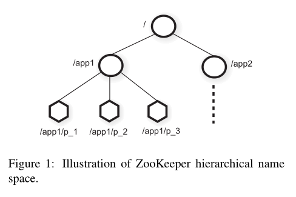

There are two types of znodes that a client can create:

有两种类型的znode客户端可以创建：

**Regular:** Clients manipulate regular znodes by creating and deleting them explicitly;

**常规：**客户端通过显式创建和删除regular znodes来操作它们；

**Ephemeral:** Clients create such znodes, and they either delete them explicitly, or let the system remove them automatically when the session that creates them terminates (deliberately or due to a failure).

**短暂的:** 客户端创建此类znodes，它们可以显式删除它们，或者在创建它们的会话终止时（有意或因故障）让系统自动删除它们。

Additionally, when creating a new znode, a client can set a *sequential* flag. Nodes created with the sequential flag set have the value of a monotonically increasing counter appended to its name. If *n* is the new znode and *p* is the parent znode, then the sequence value of *n* is never smaller than the value in the name of any other sequential znode ever created under p.

此外，在创建新的 znode 时，客户端可以设置一个*sequential*标志。使用sequential标志创建的节点会将单调递增计数器的值附加到其名称中。如果 *n* 是新的 znode，*p* 是父 znode，那么 *n* 的sequential值永远不会小于在 p 下创建的任何其他sequential znode 名称中的值。

ZooKeeper implements watches to allow clients to receive timely notifications of changes without requiring polling. When a client issues a read operation with a watch flag set, the operation completes as normal except that the server promises to notify the client when the information returned has changed. Watches are one-time triggers associated with a session; they are unregistered once triggered or the session closes. Watches indicate that a change has happened, but do not provide the change. For example, if a client issues a getData(‘‘/foo’’, true) before “/foo” is changed twice, the client will get one watch event telling the client that data for “/foo” has changed. Session events, such as connection loss events, are also sent to watch callbacks so that clients know that watch events may be delayed.

ZooKeeper实现了监听器，以便客户端在无需轮询的情况下接收到变更的及时通知。当客户端发出带有监听器标志的读取操作时，操作将按正常方式完成，但服务器承诺在返回的信息发生更改时通知客户端。监听器是与会话关联的一次性触发器；一旦触发或会话关闭，它们将被注销。监听器表明已发生更改，但不提供更改。例如，如果客户端在“/foo”更改两次之前发出getData(‘‘/foo’’, true)，客户端将获得一个监听器事件，告知客户端“/foo”的数据已更改。会话事件，如连接丢失事件，也会发送到监听器回调，以便客户端知道监听器事件可能会延迟。

**Data model.** The data model of ZooKeeper is essentially a file system with a simplified API and only full data reads and writes, or a key/value table with hierarchical keys. The hierarchal namespace is useful for allocating subtrees for the namespace of different applications and for setting access rights to those subtrees. We also exploit the concept of directories on the client side to build higher level primitives as we will see in section 2.4.

**数据模型。**ZooKeeper的数据模型本质上是一个具有简化API和完整数据读写的文件系统，或者是一个具有分层键的键/值表。分层命名空间对于分配不同应用程序的命名空间的子树和设置对这些子树的访问权限非常有用。我们还利用客户端的目录概念构建更高级别的原语，如我们将在2.4节中看到。

Unlike files in file systems, znodes are not designed for general data storage. Instead, znodes map to abstractions of the client application, typically corresponding to metadata used for coordination purposes. To illustrate, in Figure 1 we have two subtrees, one for Application 1 (/app1) and another for Application 2 (/app2). The subtree for Application 1 implements a simple group membership protocol: each client process *pi* creates a znode p i under /app1, which persists as long as the process is running.

与文件系统中的文件不同，znodes 不是为一般数据存储而设计的。相反，znodes 映射到客户端应用程序的抽象，通常对应于用于协调目的的元数据。为了说明，在图 1 中，我们有两个子树，一个用于应用程序 1（/app1），另一个用于应用程序 2（/app2）。应用程序 1 的子树实现了一个简单的组成员关系协议：每个客户端进程 *pi* 在 /app1 下创建一个 znode p i，只要进程运行，它就会一直存在。

Although znodes have not been designed for general data storage, ZooKeeper does allow clients to store some information that can be used for meta-data or configuration in a distributed computation. For example, in a leader-based application, it is useful for an application server that is just starting to learn which other server is currently the leader. To accomplish this goal, we can have the current leader write this information in a known location in the znode space. Znodes also have associated meta-data with time stamps and version counters, which allow clients to track changes to znodes and execute conditional updates based on the version of the znode.

尽管znodes没有为通用数据存储而设计，但ZooKeeper确实允许客户端存储一些可用于元数据或分布式计算中的配置的信息。例如，在基于领导者的应用程序中，对于刚刚启动的应用程序服务器来说，了解当前哪个服务器是领导者非常有用。为了实现这个目标，我们可以让当前的领导者将这些信息写入znode空间中的已知位置。Znodes还具有与时间戳和版本计数器相关联的元数据，这使得客户端能够跟踪对znodes的更改并根据znode的版本执行条件更新。

**Sessions.** A client connects to ZooKeeper and initiates a session. Sessions have an associated timeout. Zoo Keeper considers a client faulty if it does not receive anything from its session for more than that timeout. A session ends when clients explicitly close a session handle or ZooKeeper detects that a clients is faulty. Within a session, a client observes a succession of state changes that reflect the execution of its operations. Sessions enable a client to move transparently from one server to another within a ZooKeeper ensemble, and hence persist across ZooKeeper servers.

客户端连接到ZooKeeper并启动一个会话。会话有一个关联的超时时间。如果ZooKeeper在超过该超时时间内没有收到来自会话的任何内容，它会认为客户端有问题。当客户端显式关闭会话句柄或ZooKeeper检测到客户端有问题时，会话结束。在一个会话中，客户端观察到一系列状态变化，反映了其操作的执行。会话使客户端能够在ZooKeeper集群中从一个服务器透明地移动到另一个服务器，因此在ZooKeeper服务器之间持续存在。

### 2.2 Client API

We present below a relevant subset of the ZooKeeper API, and discuss the semantics of each request.

我们在下面展示了ZooKeeper API的一个相关子集，并讨论了每个请求的语义。

**create(path, data, flags):** Creates a znode with path name path, stores data[] in it, and returns the name of the new znode. flags enables a client to select the type of znode: regular, ephemeral, and set the sequential flag;

使用路径名创建一个znode，将数据[]存储在其中，并返回新znode的名称。标志使客户端能够选择znode的类型：常规，临时，并设置顺序标志;

**delete(path, version)** Deletes the znode path if that znode is at the expected version;

如果该znode处于预期版本，则删除znode路径;

**exists(path, watch):** Returns true if the znode with path name path exists, and returns false otherwise. The watch flag enables a client to set a watch on the znode;

如果路径名为path的znode存在，则返回true，否则返回false。观察标志使客户端能够在znode上设置watch;

**getData(path, watch):** Returns the data and meta-data, such as version information, associated with the znode. The watch flag works in the same way as it does for exists(), except that ZooKeeper does not set the watch if the znode does not exist;

返回与znode关联的数据和元数据，例如版本信息。监听标志的工作方式与exists()相同，只是如果znode不存在，ZooKeeper不会设置监听;

**setData(path, data, version):** Writes data[] to znode path if the version number is the current version of the znode;

如果版本号是znode当前版本，将数据[]写入znode路径;

**getChildren(path, watch):** Returns the set of names of the children of a znode;

返回znode子节点的名称集合;

**sync(path):** Waits for all updates pending at the start of the operation to propagate to the server that the client is connected to. The path is currently ignored.

等待在操作开始时挂起的所有更新传播到客户端连接的服务器。路径被忽略。

All methods have both a synchronous and an asynchronous version available through the API. An application uses the synchronous API when it needs to execute a single ZooKeeper operation and it has no concurrent tasks to execute, so it makes the necessary ZooKeeper call and blocks. The asynchronous API, however, enables an application to have both multiple outstanding ZooKeeper operations and other tasks executed in parallel. The ZooKeeper client guarantees that the corresponding callbacks for each operation are invoked in order.

所有方法都有同步和异步版本可通过API获得。当应用程序需要执行单个ZooKeeper操作且没有并发任务要执行时，它会使用同步API并阻塞。然而，异步API使应用程序能够同时执行多个未完成的ZooKeeper操作和其他任务。ZooKeeper客户端保证按顺序调用每个操作的相应回调。

Note that ZooKeeper does not use handles to access znodes. Each request instead includes the full path of the znode being operated on. Not only does this choice simplifies the API (no open() or close() methods), but it also eliminates extra state that the server would need to maintain.

请注意，ZooKeeper 不使用handles来访问 znodes。相反，每个请求都包括正在操作的 znode 的完整路径。这种选择不仅简化了 API（没有 open() 或 close() 方法），而且还消除了服务器需要维护的额外状态。

Each of the update methods take an expected version number, which enables the implementation of conditional updates. If the actual version number of the znode does not match the expected version number the update fails with an unexpected version error. If the version number is −1, it does not perform version checking.

每个更新方法都需要一个预期的版本号，这使得可以实现有条件的更新。如果znode的实际版本号与预期版本号不匹配，则更新失败，出现意外版本错误。如果版本号为-1，则不执行版本检查。

### 2.3 ZooKeeper guarantees

ZooKeeper has two basic ordering guarantees:

ZooKeeper 有两个基本顺序保证：

**Linearizable writes:** all requests that update the state of ZooKeeper are serializable and respect precedence;

所有更新ZooKeeper状态的请求都是可线性化的，并遵循优先级顺序;

**FIFO client order:** all requests from a given client are executed in the order that they were sent by the client.

来自给定客户端的所有请求都按照客户端发送的顺序执行。

Note that our definition of linearizability is different from the one originally proposed by Herlihy [15], and we call it *A-linearizability* (asynchronous linearizability). In the original definition of linearizability by Herlihy, a client is only able to have one outstanding operation at a time (a client is one thread). In ours, we allow a client to have multiple outstanding operations, and consequently we can choose to guarantee no specific order for outstanding operations of the same client or to guarantee FIFO order. We choose the latter for our property. It is important to observe that all results that hold for linearizable objects also hold for A-linearizable objects because a system that satisfies A-linearizability also satisfies linearizability. Because only update requests are A-linearizable, ZooKeeper processes read requests locally at each replica. This allows the service to scale linearly as servers are added to the system.

请注意，我们对线性化的定义与Herlihy [15]最初提出的定义不同，我们称之为*A-线性化*（异步线性化）。在Herlihy对线性化的原始定义中，客户端一次只能有一个未完成的操作（客户端是一个线程）。在我们的定义中，我们允许客户端有多个未完成的操作，并且因此我们可以选择不保证同一客户端的未完成操作的特定顺序，或者保证FIFO顺序。我们选择后者作为我们的属性。重要的是要注意到，对于线性化对象所成立的所有结果也适用于A-线性化对象，因为满足A-线性化的系统也满足线性化。由于只有更新请求是A-线性化的，ZooKeeper在每个副本上本地处理读取请求。这使得服务在系统中添加服务器时能够线性扩展。

To see how these two guarantees interact, consider the following scenario. A system comprising a number of processes elects a leader to command worker processes. When a new leader takes charge of the system, it must change a large number of configuration parameters and notify the other processes once it finishes. We then have two important requirements:

要了解这两个保证如何相互作用，请考虑以下情景。一个由多个进程组成的系统选举出一个领导者来指挥工作进程。当一个新领导接管系统时，它必须更改大量的配置参数，并在完成后通知其他进程。然后我们有两个重要的要求：

* As the new leader starts making changes, we do not want other processes to start using the configuration that is being changed;

* 随着新领导开始进行更新，我们不希望其他进程使用正在更改的配置；

* If the new leader dies before the configuration has been fully updated, we do not want the processes to use this partial configuration.

* 如果新领导在配置完全更新之前挂掉，我们不希望进程使用这个部分配置。

Observe that distributed locks, such as the locks provided by Chubby, would help with the first requirement but are insufficient for the second. With ZooKeeper, the new leader can designate a path as the *ready* znode; other processes will only use the configuration when that znode exists. The new leader makes the configuration change by deleting *ready*, updating the various configuration znodes, and creating *ready*. All of these changes can be pipelined and issued asynchronously to quickly update the configuration state. Although the latency of a change operation is of the order of 2 milliseconds, a new leader that must update 5000 different znodes will take 10 seconds if the requests are issued one after the other; by issuing the requests asynchronously the requests will take less than a second. Because of the ordering guarantees, if a process sees the *ready* znode, it must also see all the configuration changes made by the new leader. If the new leader dies before the *ready* znode is created, the other processes know that the configuration has not been finalized and do not use it.

请注意，分布式锁，如Chubby提供的锁，有助于满足第一个要求，但对于第二个要求则不满足。使用ZooKeeper，新领导者可以将一个路径指定为*ready* znode；其他进程只有在该znode存在时才会使用配置。新领导者通过删除*ready*，更新各种配置znodes，并创建*ready*来进行配置更改。所有这些更改都可以进行流水线处理，并异步发出以快速更新配置状态。尽管更改操作的延迟为2毫秒的数量级，但如果请求是一个接一个发出的，那么需要更新5000个不同znodes的新领导者将花费10秒钟；通过异步发出请求，请求将在不到一秒钟内完成。由于顺序保证，如果进程看到*ready* znode，它还必须看到新领导者所做的所有配置更改。如果新领导者在*ready* znode创建之前死亡，其他进程知道配置尚未最终确定，因此不会使用它。

The above scheme still has a problem: what happens if a process sees that *ready* exists before the new leader starts to make a change and then starts reading the configuration while the change is in progress. This problem is solved by the ordering guarantee for the notifications: if a client is watching for a change, the client will see the notification event before it sees the new state of the system after the change is made. Consequently, if the process that reads the *ready* znode requests to be notified of changes to that znode, it will see a notification informing the client of the change before it can read any of the new configuration.

上述方案仍然存在一个问题：如果一个进程在新领导者开始进行更改之前就看到 *ready* 存在，然后在更改过程中开始读取配置。这个问题通过通知的顺序保证得到解决：如果一个客户端正在监听更改，那么客户端会在看到系统更改后的新状态之前看到通知事件。因此，如果读取 *ready* znode 的进程请求被通知该 znode 的更改，它将在读取任何新配置之前看到通知客户端更改的通知。

Another problem can arise when clients have their own communication channels in addition to ZooKeeper. For example, consider two clients *A* and *B* that have a shared configuration in ZooKeeper and communicate through a shared communication channel. If *A* changes the shared configuration in ZooKeeper and tells *B* of the change through the shared communication channel, *B* would expect to see the change when it re-reads the configuration. If *B*’s ZooKeeper replica is slightly behind *A*’s, it may not see the new configuration. Using the above guarantees *B* can make sure that it sees the most up-to-date information by issuing a write before re-reading the configuration. To handle this scenario more efficiently ZooKeeper provides the sync request: when followed by a read, constitutes a *slow read*. sync causes a server to apply all pending write requests before processing the read without the overhead of a full write. This primitive is similar in idea to the flush primitive of ISIS [5].

另一个问题可能出现在客户端除了ZooKeeper之外还有自己的通信管道。例如，考虑两个客户端*A*和*B*，它们在ZooKeeper中有一个共享配置，并通过一个共享通信管道进行通信。如果*A*在ZooKeeper中更改共享配置，并通过共享通信管道告诉*B*更改，*B*会在重新读取配置时期望看到更改。如果*B*的ZooKeeper副本稍微落后于*A*，它可能看不到新配置。使用上述保证，*B*可以通过在重新读取配置之前发出写操作来确保看到最新数据。为了更有效地处理这种情况，ZooKeeper提供了同步请求：当后面跟着一个读取操作时，构成一个*slow read*。同步请求会导致服务器在处理读取操作之前执行所有待处理的写请求，没有完整写入的开销。这个原语在思想上类似于ISIS[5]的刷新原语。

ZooKeeper also has the following two liveness and durability guarantees: if a majority of ZooKeeper servers are active and communicating the service will be available; and if the ZooKeeper service responds successfully to a change request, that change persists across any number of failures as long as a quorum of servers is eventually able to recover.

ZooKeeper还提供以下两个活性和持久性保证：如果大多数ZooKeeper服务器处于活动状态并进行通信，服务将可用；如果ZooKeeper服务成功响应变更请求，只要有特定数量的服务器最终能够恢复，该变更将持久存在，即使发生任意数量的故障。

### 2.4 Examples of primitives

In this section, we show how to use the ZooKeeper API to implement more powerful primitives. The ZooKeeper service knows nothing about these more powerful primitives since they are entirely implemented at the client using the ZooKeeper client API. Some common primitives such as group membership and configuration management are also wait-free. For others, such as rendezvous, clients need to wait for an event. Even though ZooKeeper is wait-free, we can implement efficient blocking primitives with ZooKeeper. ZooKeeper’s ordering guarantees allow efficient reasoning about system state, and watches allow for efficient waiting.

在这个部分，我们展示如何使用ZooKeeper API来实现更强大的原语。ZooKeeper服务对这些更强大的原语一无所知，因为它们完全是在客户端使用ZooKeeper客户端API实现的。一些常见的原语，如组成员关系和配置管理，也是无等待的。对于其他的，如rendezvous，客户端需要等待一个事件。尽管ZooKeeper是无等待的，我们可以用ZooKeeper实现高效的阻塞原语。ZooKeeper的顺序保证允许对系统状态进行高效的推理，而监听器允许进行高效的等待。

**Configuration Management** ZooKeeper can be used to implement dynamic configuration in a distributed application. In its simplest form configuration is stored in a znode, *zc*. Processes start up with the full pathname of *zc*. Starting processes obtain their configuration by reading *zc* with the watch flag set to true. If the configuration in *zc* is ever updated, the processes are notified and read the new configuration, again setting the watch flag to true.

ZooKeeper 可用于在分布式应用程序中实现动态配置。在其最简单的形式中，配置存储在一个 znode 中：*zc*。进程启动时带有 *zc* 的完整路径名。启动进程通过将 watch 标志设置为 true 来读取 *zc* 以获取其配置。如果 *zc* 中的配置更新，进程会收到通知并读取新的配置，再次将 watch 标志设置为 true。

Note that in this scheme, as in most others that use watches, watches are used to make sure that a process has the most recent information. For example, if a process watching *zc* is notified of a change to *zc* and before it can issue a read for *zc* there are three more changes to *zc*, the process does not receive three more notification events. This does not affect the behavior of the process, since those three events would have simply notified the process of something it already knows: the information it has for *zc* is stale.

请注意，在这个方案中，就像在大多数其他使用watch的方案中一样，watch用于确保一个进程具有最新的信息。例如，如果一个正在观察*zc*的进程被通知*zc*发生了变化，在它可以发出对*zc*的读取请求之前，*zc*发生了三次更改，该进程不会收到三个更多的通知事件。这不影响进程的行为，因为这三个事件只是通知进程它已经知道的事情：它拥有的*zc*信息是陈旧的。

**Rendezvous** Sometimes in distributed systems, it is not always clear a priori what the final system configuration will look like. For example, a client may want to start a master process and several worker processes, but the starting processes is done by a scheduler, so the client does not know ahead of time information such as addresses and ports that it can give the worker processes to connect to the master. We handle this scenario with ZooKeeper using a rendezvous znode, *zr*, which is an node created by the client. The client passes the full pathname of *zr* as a startup parameter of the master and worker processes. When the master starts it fills in *zr* with information about addresses and ports it is using. When workers start, they read *zr* with watch set to true. If *zr* has not been filled in yet, the worker waits to be notified when *zr* is updated. If *zr* is an ephemeral node, master and worker processes can watch for *zr* to be deleted and clean themselves up when the client ends.

在分布式系统中，有时候不一定能预先清楚最终的系统配置会是怎样的。例如，一个客户端可能希望启动一个主进程和多个工作进程，但启动进程的工作由调度器完成，因此客户端无法提前知道给工作进程提供的用于连接到主进程的地址和端口等信息。我们使用ZooKeeper处理这种情况，使用一个称为"rendezvous znode"的节点*zr*，它是由客户端创建的。客户端将*zr*的完整路径名作为主进程和工作进程的启动参数传递。当主进程启动时，它会在*zr*中填写所使用的地址和端口的信息。当工作进程启动时，它们会读取*zr*并将watch设置为true。如果*zr*尚未填写完毕，工作进程将会等待并在*zr*更新时收到通知。如果*zr*是一个临时节点，主进程和工作进程可以监听*zr*是否被删除，并在客户端结束时进行清理。

**Group Membership** We take advantage of ephemeral nodes to implement group membership. Specifically, we use the fact that ephemeral nodes allow us to see the state of the session that created the node. We start by designating a znode, *zg* to represent the group. When a process member of the group starts, it creates an ephemeral child znode under *zg*. If each process has a unique name or identifier, then that name is used as the name of the child znode; otherwise, the process creates the znode with the SEQUENTIAL flag to obtain a unique name assignment. Processes may put process information in the data of the child znode, addresses and ports used by the process, for example.

我们利用临时节点来实现群组成员关系。具体而言，我们利用临时节点可以查看创建节点的session状态。我们首先指定一个名为*zg*的znode来表示群组。当群组的一个成员进程启动时，它会在*zg*下创建一个临时子节点。如果每个进程都有一个唯一的名称或标识符，那么该名称将被用作子节点的名称；否则，进程将使用SEQUENTIAL标志创建节点以获得唯一的名称分配。进程可以在子节点的数据中添加进程的信息，例如使用的地址和端口。

After the child znode is created under *zg* the process starts normally. It does not need to do anything else. If the process fails or ends, the znode that represents it under *zg* is automatically removed.

在*zg*下创建子znode后，进程正常启动。 它无需执行任何其他操作。 如果进程失败或结束，表示其在*zg*下的znode将自动删除。

Processes can obtain group information by simply listing the children of *zg*. If a process wants to monitor changes in group membership, the process can set the watch flag to true and refresh the group information (always setting the watch flag to true) when change notifications are received.

进程可以通过简单地列出*zg*的子节点来获取群组信息。如果进程想要监控组成员资格的变化，进程可以将watch标志设置为真，并在收到更改通知时刷新群组信息（始终将watch标志设置为真）。

**Simple Locks** Although ZooKeeper is not a lock service, it can be used to implement locks. Applications using ZooKeeper usually use synchronization primitives tailored to their needs, such as those shown above. Here we show how to implement locks with ZooKeeper to show that it can implement a wide variety of general synchronization primitives.

尽管ZooKeeper不是锁服务，但它可以用来实现锁。使用ZooKeeper的应用程序通常使用针对其需求的同步原语，例如上面所示的那些。在这里，我们展示了如何使用ZooKeeper实现锁，以表明它可以实现各种各样的通用同步原语。

The simplest lock implementation uses “lock files”. The lock is represented by a znode. To acquire a lock, a client tries to create the designated znode with the EPHEMERAL flag. If the create succeeds, the client holds the lock. Otherwise, the client can read the znode with the watch flag set to be notified if the current leader dies. A client releases the lock when it dies or explicitly deletes the znode. Other clients that are waiting for a lock try again to acquire a lock once they observe the znode being deleted.

最简单的锁实现使用“锁文件”。锁由znode表示。要获取锁，客户端尝试使用EPHEMERAL标志创建指定的znode。如果创建成功，客户端将持有锁。否则，客户端可以读取带有watch标志的znode，以便在当前领导者挂掉时得到通知。客户端在挂掉或显式删除znode时释放锁。其他正在等待锁的客户端在观察到znode被删除后再次尝试获取锁。

While this simple locking protocol works, it does have some problems. First, it suffers from the herd effect. If there are many clients waiting to acquire a lock, they will all vie for the lock when it is released even though only one client can acquire the lock. Second, it only implements exclusive locking. The following two primitives show how both of these problems can be overcome.

虽然这种简单的锁协议能够工作，但它也存在一些问题。首先，它会遭受惊群效应的影响。如果有很多客户端在等待获取锁，它们会在锁被释放时竞争获取锁，尽管只有一个客户端能够获取锁。其次，它只实现了互斥锁。下面的两个原语展示了如何克服这两个问题。

**Simple Locks without Herd Effect** We define a lock znode *l* to implement such locks. Intuitively we line up all the clients requesting the lock and each client obtains the lock in order of request arrival. Thus, clients wishing to obtain the lock do the following:

我们定义一个锁 znode 来实现这种锁。直观地说，我们将请求锁的所有客户端排成一行，每个客户端按请求到达的顺序获得锁定。因此，希望获得锁的客户端执行以下操作：

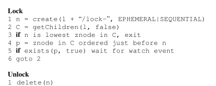

The use of the SEQUENTIAL flag in line 1 of Lock orders the client’s attempt to acquire the lock with respect to all other attempts. If the client’s znode has the lowest sequence number at line 3, the client holds the lock. Otherwise, the client waits for deletion of the znode that either has the lock or will receive the lock before this client’s znode. By only watching the znode that precedes the client’s znode, we avoid the herd effect by only waking up one process when a lock is released or a lock request is abandoned. Once the znode being watched by the client goes away, the client must check if it now holds the lock. (The previous lock request may have been abandoned and there is a znode with a lower sequence number still waiting for or holding the lock.)

在 Lock 的第 1 行中使用 SEQUENTIAL 标志，按顺序排列客户端尝试获取锁的顺序。如果客户端的 znode 在第 3 行具有最低序列号，则客户端持有锁。否则，客户端等待删除前驱 znode2，znode2 持有锁或之前的 node 接收锁。通过仅监听 znode2，我们避免了惊群效应，当锁被释放或锁请求被丢弃时，只唤醒一个进程。一旦客户端watch的 znode 消失，客户端必须检查它现在是否持有锁。（之前的锁请求可能已被丢弃，仍有一个具有较低序列号的 znode 在等待或持有锁。）

Releasing a lock is as simple as deleting the znode *n* that represents the lock request. By using the EPHEMERAL flag on creation, processes that crash will automatically cleanup any lock requests or release any locks that they may have.

释放锁和删除表示锁请求的 znode 节点。通过在创建时使用EPHEMERAL标志，崩溃的进程将自动清理任何锁请求或释放它们可能拥有的任何锁。

In summary, this locking scheme has the following advantages:

总之，这种锁定方案具有以下优点：

1.  The removal of a znode only causes one client to wake up, since each znode is watched by exactly one other client, so we do not have the herd effect;

1. 删除znode仅导致一个客户端唤醒，因为每个znode都被恰好一个其他客户端watch，所以我们没有惊群效应。

2.  There is no polling or timeouts;

2. 没有投票或超时;

3.  Because of the way we have implemented locking, we can see by browsing the ZooKeeper data the amount of lock contention, break locks, and debug locking problems.

3. 因为我们实现锁的方式，我们可以通过浏览ZooKeeper数据查看锁竞争的数量，打破锁，并调试锁问题。

**Read/Write Locks** To implement read/write locks we change the lock procedure slightly and have separate read lock and write lock procedures. The unlock procedure is the same as the global lock case.

**读/写锁** 为了实现读/写锁，我们稍微改变锁定过程，并拥有单独的读锁和写锁函数。释放锁与全局锁相同。

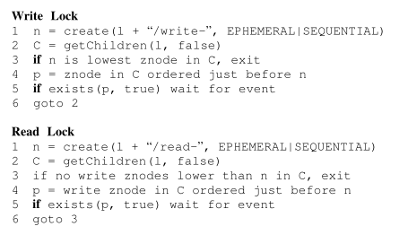

This lock procedure varies slightly from the previous locks. Write locks differ only in naming. Since read locks may be shared, lines 3 and 4 vary slightly because only earlier write lock znodes prevent the client from obtaining a read lock. It may appear that we have a “herd effect” when there are several clients waiting for a read lock and get notified when the “write-” znode with the lower sequence number is deleted; in fact, this is a desired behavior, all those read clients should be released since they may now have the lock.

这个锁定过程与之前的锁略有不同。写锁仅在命名上有所不同。由于读锁可以共享，因此第3行和第4行略有不同，因为只有较早的写锁znode阻止客户端获取读锁。当有多个客户端等待读锁并在具有较低序列号的“write-”znode被删除时得到通知时，虽然看起来具有“惊群效应”；但是实际上，这是一种期望的行为，所有这些获取读锁的客户端都应该得到通知，因为读锁是可以被同时获取的。

**Double Barrier** Double barriers enable clients to synchronize the beginning and the end of a computation. When enough processes, defined by the barrier threshold, have joined the barrier, processes start their computation and leave the barrier once they have finished. We represent a barrier in ZooKeeper with a znode, referred to as *b*. Every process *p* registers with *b* – by creating a znode as a child of *b* – on entry, and unregisters – removes the child when it is ready to leave. Processes can enter the barrier when the number of child znodes of *b* exceeds the barrier threshold. Processes can leave the barrier when all of the processes have removed their children. We use watches to efficiently wait for enter and exit conditions to be satisfied. To enter, processes watch for the existence of a ready child of *b* that will be created by the process that causes the number of children to exceed the barrier threshold. To leave, processes watch for a particular child to disappear and only check the exit condition once that znode has been removed.

**双重屏障** 双屏障使客户端能够同步计算的开始和结束。当足够多的进程（由屏障阈值定义）加入屏障时，进程开始计算并在完成后离开屏障。我们在ZooKeeper中用一个称为*b*的znode来表示屏障。每个进程*p*在进入时向*b*注册（通过创建*b*的子节点），并在准备离开时注销（删除子节点）。当*b*的子节点数量超过屏障阈值时，进程可以进入屏障。当所有进程都删除了子节点时，进程可以离开屏障。我们使用watch机制有效地等待进入和离开条件得到满足。为了进入，进程watch *b*的一个准备好的子节点的存在，这个子节点将由导致子节点数量超过屏障阈值的进程创建。为了离开，进程watch一个特定的子节点消失，并且只有在该子节点被删除后才检查离开条件。

## 3. ZooKeeper Applications

We now describe some applications that use ZooKeeper, and explain briefly how they use it. We show the primitives of each example in **bold**.

我们现在描述一些使用ZooKeeper的应用程序，并简要说明它们如何使用它。我们展示每个示例的**粗体**原语。

**The Fetching Service** Crawling is an important part of a search engine, and Yahoo! crawls billions of Web documents. The Fetching Service (FS) is part of the Yahoo! crawler and it is currently in production. Essentially, it has master processes that command page-fetching processes. The master provides the fetchers with configuration, and the fetchers write back informing of their status and health. The main advantages of using ZooKeeper for FS are recovering from failures of masters, guaranteeing availability despite failures, and decoupling the clients from the servers, allowing them to direct their request to healthy servers by just reading their status from ZooKeeper. Thus, FS uses ZooKeeper mainly to manage **configuration metadata**, although it also uses ZooKeeper to elect masters (**leader election**).

爬虫是搜索引擎的重要组成部分，雅虎搜索引擎每天爬取数十亿个网页文档。抓取服务（FS）是雅虎爬虫的一部分，目前已经投入生产。主要由主进程指挥页面抓取进程。主进程提供抓取进程的配置信息，抓取进程则会回写状态和健康信息。使用ZooKeeper作为FS的主要优势是能够从主进程的故障中恢复，即使发生故障也能保证可用性，并且使客户端与服务器解耦，只需从ZooKeeper中读取服务器的状态即可将请求转发给健康的服务器。因此，FS主要使用ZooKeeper来管理**配置元数据**，同时也用于选举主进程（**领导者选举**）。

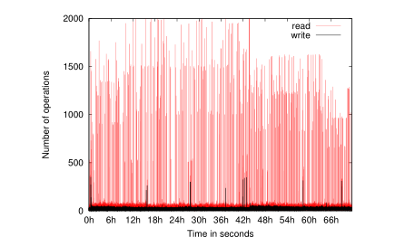

Figure 2: Workload for one ZK server with the Fetching Service. Each point represents a one-second sample.

图2：一个运行抓取服务的ZK服务器的工作负载。每个点代表一秒钟的样本。

Figure 2 shows the read and write traffic for a ZooKeeper server used by FS through a period of three days. To generate this graph, we count the number of operations for every second during the period, and each point corresponds to the number of operations in that second. We observe that the read traffic is much higher compared to the write traffic. During periods in which the rate is higher than 1*,* 000 operations per second, the read:write ratio varies between 10:1 and 100:1. The read operations in this workload are getData(), getChildren(), and exists(), in increasing order of prevalence.

图2显示了在一个为期三天的时间段内，FS使用的ZooKeeper服务器的读取和写入流量。为了生成这个图表，我们计算了在每秒内的操作次数，每个点对应于该秒内的操作次数。我们观察到相比写入流量，读取流量要高得多。在每秒操作数高于1,000的时期，读取和写入的比例在10:1到100:1之间变化。在这个工作负载中，读取操作的优先级逐渐增加，依次为getData()、getChildren()和exists()。

**Katta** Katta [17] is a distributed indexer that uses ZooKeeper for coordination, and it is an example of a non-Yahoo! application. Katta divides the work of indexing using shards. A master server assigns shards to slaves and tracks progress. Slaves can fail, so the master must redistribute load as slaves come and go. The master can also fail, so other servers must be ready to take over in case of failure. Katta uses ZooKeeper to track the status of slave servers and the master (**group membership**), and to handle master failover (**leader election**). Katta also uses ZooKeeper to track and propagate the assignments of shards to slaves (**configuration management**).

**Katta** 是一个分布式索引器，它使用ZooKeeper进行协调，是一个非雅虎的应用程序示例。Katta通过分片来进行索引工作。master服务器将分片分配给follower服务器并跟踪进度。follower服务器可能会失败，因此master服务器必须在follower服务器出现故障后重新分配负载。master服务器也可能会失败，因此其他服务器必须准备好在发生故障时接管工作。Katta使用ZooKeeper来跟踪follower服务器和master服务器的状态（**群组成员关系**），并处理master服务器的故障转移（**领导者选举**）。Katta还使用ZooKeeper来跟踪和传递分片分配给follower服务器的任务（**配置管理**）。

**Yahoo! Message Broker** Yahoo! Message Broker (YMB) is a distributed publish-subscribe system. The system manages thousands of topics that clients can publish messages to and receive messages from. The topics are distributed among a set of servers to provide scalability. Each topic is replicated using a primary-backup scheme that ensures messages are replicated to two machines to ensure reliable message delivery. The servers that makeup YMB use a shared-nothing distributed architecture which makes coordination essential for correct operation. YMB uses ZooKeeper to manage the distribution of topics (**configuration metadata**), deal with failures of machines in the system (**failure detection** and **group membership**), and control system operation.

雅虎消息代理（YMB）是一个分布式的发布-订阅系统。该系统管理着数千个主题，客户端可以向这些主题发布消息并接收消息。为了实现可扩展性，这些主题分布在一组服务器之间。每个主题都使用主备方案进行复制，确保消息被复制到两台机器上，以确保可靠的消息传递。组成YMB的服务器采用共享无状态的分布式架构，这使得协调对于正确的操作非常重要。YMB使用ZooKeeper来管理主题的分布（**配置元数据**），处理系统中的机器故障（**故障检测**和**群组成员关系**），以及控制系统的运行。

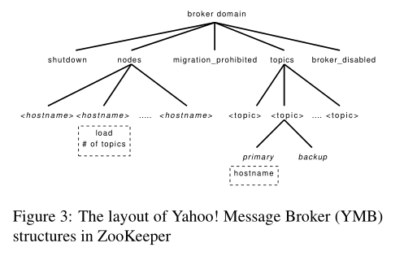

Figure 3 shows part of the znode data layout for YMB. Each broker domain has a znode called nodes that has an ephemeral znode for each of the active servers that compose the YMB service. Each YMB server creates an ephemeral znode under nodes with load and status information providing both group membership and status information through ZooKeeper. Nodes such as shutdown and migration prohibited are monitored by all of the servers that make up the service and allow centralized control of YMB. The topics directory has a child znode for each topic managed by YMB. These topic znodes have child znodes that indicate the primary and backup server for each topic along with the subscribers of that topic. The primary and backup server znodes not only allow servers to discover the servers in charge of a topic, but they also manage **leader election** and server crashes.

图3显示了YMB的部分znode数据布局。每个代理域都有一个名为nodes的znode，其中包含了组成YMB服务的活动服务器的临时znode。每个YMB服务器在nodes下创建一个临时znode，其中包含负载和状态信息，通过ZooKeeper提供群组成员和状态信息。诸如shutdown和migration prohibited之类的节点被所有组成服务的服务器监听，并允许对YMB进行集中控制。topics目录是YMB管理的每个主题对应的子节点。主题节点都有子节点，用于表示每个主题的主服务器和备份服务器，以及该主题的订阅者。主服务器和备份服务器的znode不仅允许服务器发现负责主题的服务器，还管理**领导者选举**和服务器崩溃。

## 4. ZooKeeper Implementation

ZooKeeper provides high availability by replicating the ZooKeeper data on each server that composes the service. We assume that servers fail by crashing, and such faulty servers may later recover. Figure 4 shows the highlevel components of the ZooKeeper service. Upon receiving a request, a server prepares it for execution (request processor). If such a request requires coordination among the servers (write requests), then they use an agreement protocol (an implementation of atomic broadcast), and finally servers commit changes to the ZooKeeper database fully replicated across all servers of the ensemble. In the case of read requests, a server simply reads the state of the local database and generates a response to the request.

ZooKeeper通过在组成服务的每台服务器上复制ZooKeeper数据来提供高可用性。我们假设服务器发生崩溃故障，这些故障的服务器可能会在之后恢复。图4显示了ZooKeeper服务的高级组件。在接收到请求后，服务器会准备执行该请求（请求处理器）。如果该请求需要在服务器之间进行协调（写入请求），则它们会使用协议达成一致（原子广播的实现），最终服务器会将更改提交到ZooKeeper数据库，该数据库在整个服务器集合中进行完全复制。对于读取请求，服务器只需读取本地数据库的状态并生成响应。

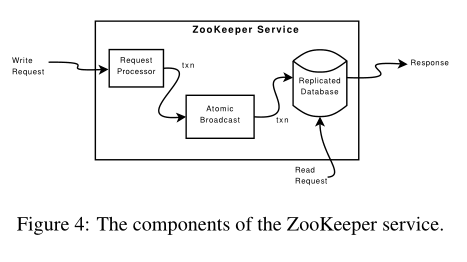

The replicated database is an *in-memory* database containing the entire data tree. Each znode in the tree stores a maximum of 1MB of data by default, but this maximum value is a configuration parameter that can be changed in specific cases. For recoverability, we efficiently log updates to disk, and we force writes to be on the disk media before they are applied to the in-memory database. In fact, as Chubby [8], we keep a replay log (a write-ahead log, in our case) of committed operations and generate periodic snapshots of the in-memory database.

复制数据库是一个*内存中*的数据库，它包含了整个数据树。树中的每个znode默认存储最多1MB的数据，但这个最大值是一个可以在特殊情况下更改的配置参数。为了实现可恢复性，我们会将更新有效地记录到磁盘上，并在应用到内存数据库之前强制将写入操作写入磁盘介质。实际上，就像Chubby[8]一样，我们会保存已提交操作的重放日志（在我们的情况下是预写日志），并定期生成内存数据库的快照（加速崩溃恢复）。

Every ZooKeeper server services clients. Clients connect to exactly one server to submit its requests. As we noted earlier, read requests are serviced from the local replica of each server database. Requests that change the state of the service, write requests, are processed by an agreement protocol.

每个ZooKeeper服务器都为客户端提供服务。客户端只连接一个服务器来提交其请求。正如我们之前提到的，读取请求是从每个服务器数据库的本地副本中提供服务的。改变服务状态的请求，即写请求，是通过原子广播协议来处理的。

As part of the agreement protocol write requests are forwarded to a single server, called the *leader*. The rest of the ZooKeeper servers, called *followers*, receive message proposals consisting of state changes from the leader and agree upon state changes.

作为协议一部分，写请求被转发到一个称为leader的服务器。其余的ZooKeeper服务器，称为follower，从leader接收包含状态更改的消息提案，并同意状态更改。

### 4.1 Request Processor

Since the messaging layer is atomic, we guarantee that the local replicas never diverge, although at any point in time some servers may have applied more transactions than others. Unlike the requests sent from clients, the transactions are idempotent. When the leader receives a write request, it calculates what the state of the system will be when the write is applied and transforms it into a transaction that captures this new state. The future state must be calculated because there may be outstanding transactions that have not yet been applied to the database. For example, if a client does a conditional setData and the version number in the request matches the future version number of the znode being updated, the service generates a setData TXN that contains the new data, the new version number, and updated time stamps. If an error occurs, such as mismatched version numbers or the znode to be updated does not exist, an error TXN is generated instead.

由于消息传递层是原子的，我们保证本地副本的状态永远不会偏离，尽管在任何时候，某些服务器可能已经应用了比其他服务器更多的事务。与来自客户端的请求不同，事务是幂等的。当领导者收到写入请求时，它计算执行写入后系统的状态，并将其转换为产生此新状态的事务（**这个事务将会是幂等的**）。future状态必须被计算，因为可能存在尚未应用到数据库的未完成事务。例如，如果客户端执行了一个有条件的setData操作，并且请求中的版本号与要更新的znode的future版本号匹配，服务将生成一个setData TXN，其中包含新数据、新版本号和更新时间戳。如果发生错误，比如版本号不匹配或要更新的znode不存在，将会生成一个error TXN。

### 4.2 Atomic Broadcast

All requests that update ZooKeeper state are forwarded to the leader. The leader executes the request and broadcasts the change to the ZooKeeper state through Zab [24], an atomic broadcast protocol. The server that receives the client request responds to the client when it delivers the corresponding state change. Zab uses by default simple majority quorums to decide on a proposal, so Zab and thus ZooKeeper can only work if a majority of servers are correct (*i.e.*, with 2*f* + 1 server we can tolerate *f* failures).

所有更新ZooKeeper状态的请求都会被转发给leader。leader执行请求并通过Zab[24]，即原子广播协议，广播ZooKeeper状态的更改。接收到客户端请求的服务器在传递相应的状态更改时向客户端作出响应。Zab默认使用简单多数原则来决定一个提案，因此Zab和ZooKeeper只能在大多数服务器正常的情况下工作（即，使用2*f* + 1个服务器，我们可以容忍*f*个故障）。

To achieve high throughput, ZooKeeper tries to keep the request processing pipeline full. It may have thousands of requests in different parts of the processing pipeline. Because state changes depend on the application of previous state changes, Zab provides stronger order guarantees than regular atomic broadcast. More specifically, Zab guarantees that changes broadcast by a leader are delivered in the order they were sent and all changes from previous leaders are delivered to an established leader before it broadcasts its own changes.

为了实现高吞吐量，ZooKeeper尽量保持请求处理管道处于满负荷状态。它可能在处理管道的不同部分有数千个请求。由于状态更改依赖于先前状态更改的应用，Zab提供比常规原子广播更强的顺序保证。具体而言，Zab保证由领导者广播的更改按发送顺序传递，并且在广播自己的更改之前，将所有先前领导者的更改传递给已建立的领导者（这里的的先前领导者的更改应该就是日志条目）。

There are a few implementation details that simplify our implementation and give us excellent performance. We use TCP for our transport so message order is maintained by the network, which allows us to simplify our implementation. We use the leader chosen by Zab as the ZooKeeper leader, so that the same process that creates transactions also proposes them. We use the log to keep track of proposals as the write-ahead log for the in-memory database, so that we do not have to write messages twice to disk.

有一些实现细节简化了我们的实现并提供了出色的性能。我们使用TCP作为传输协议，因此消息顺序由网络维护，这使得我们的实现更加简化。我们使用Zab选择的领导者作为ZooKeeper的领导者，这样同一个进程既能创建事务也能提议它们。我们使用日志作为内存数据库的预写日志来跟踪提议，这样我们就不需要将消息写入磁盘两次。

During normal operation Zab does deliver all messages in order and exactly once, but since Zab does not persistently record the id of every message delivered, Zab may redeliver a message during recovery. Because we use idempotent transactions, multiple delivery is acceptable as long as they are delivered in order. In fact, ZooKeeper requires Zab to redeliver at least all messages that were delivered after the start of the last snapshot.

在正常操作过程中，Zab确实按顺序准确地传递了所有消息，但由于Zab没有持久记录每个已传递消息的ID，因此Zab在恢复过程中可能会重新传递消息（**没看懂？为什么没有记录消息ID就必须重新传递消息，还有这个消息ID到底是什么？**）。由于我们使用幂等事务，只要按顺序传递，多次传递是可以接受的。实际上，ZooKeeper要求Zab至少重新传递自最后一个快照开始后传递的所有消息。

### 4.3 Replicated Database

Each replica has a copy in memory of the ZooKeeper state. When a ZooKeeper server recovers from a crash, it needs to recover this internal state. Replaying all delivered messages to recover state would take prohibitively long after running the server for a while, so ZooKeeper uses periodic snapshots and only requires redelivery of messages since the start of the snapshot. We call ZooKeeper snapshots *fuzzy snapshots* since we do not lock the ZooKeeper state to take the snapshot; instead, we do a depth first scan of the tree atomically reading each znode’s data and meta-data and writing them to disk. Since the resulting fuzzy snapshot may have applied some subset of the state changes delivered during the generation of the snapshot, the result may not correspond to the state of ZooKeeper at any point in time. However, since state changes are idempotent, we can apply them twice as long as we apply the state changes in order.

每个副本在内存中都有ZooKeeper状态的副本。当ZooKeeper服务器从崩溃中恢复时，需要恢复这个内部状态。重放所有已传递的消息以恢复状态在运行服务器一段时间后会花费过长的时间，因此ZooKeeper使用定期快照，并且只需要重新传递自快照开始后的消息。我们称ZooKeeper快照为“模糊快照”，因为我们不会锁定ZooKeeper状态以进行快照；相反，我们会对树进行深度优先扫描，原子地读取每个znode的数据和元数据，并将其写入磁盘。由于生成快照期间可能已经应用了一些状态更改的子集，因此生成的模糊快照可能与ZooKeeper在任何时间点的状态不一致。然而，由于状态更改是幂等的，只要按顺序应用状态更改，我们可以将它们应用两次。（**通过版本号保证状态更改是幂等的**）

For example, assume that in a ZooKeeper data tree two nodes /foo and /goo have values f1 and g1 respectively and both are at version 1 when the fuzzy snapshot begins, and the following stream of state changes arrive having the form ⟨transactionType, path, value, new-version⟩:

例如，假设在一个ZooKeeper数据树中，两个节点/foo和/goo的值分别为f1和g1，当模糊快照开始时，它们的版本都是1，然后接收到以下形式的状态更改流 ⟨transactionType, path, value, new-version⟩：

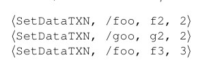

After processing these state changes, /foo and /goo have values f3 and g2 with versions 3 and 2 respectively. However, the fuzzy snapshot may have recorded that /foo and /goo have values f3 and g1 with versions 3 and 1 respectively, which was not a valid state of the ZooKeeper data tree. If the server crashes and recovers with this snapshot and Zab redelivers the state changes, the resulting state corresponds to the state of the service before the crash.

在处理这些状态更改之后，/foo 和 /goo 的值分别为 f3 和 g2，版本分别为 3 和 2。然而，模糊快照可能记录了 /foo 和 /goo 的值分别为 f3 和 g1，版本分别为 3 和 1，这不是 ZooKeeper 数据树的有效状态。如果服务器崩溃并使用此快照恢复，同时 Zab 重新传递状态更改，那么产生的状态将对应于崩溃前服务的状态。

### 4.4 Client-Server Interactions

When a server processes a write request, it also sends out and clears notifications relative to any watch that corresponds to that update. Servers process writes in order and do not process other writes or reads concurrently. This ensures strict succession of notifications. Note that servers handle notifications locally. Only the server that a client is connected to tracks and triggers notifications for that client.

当服务器处理写请求时，它还会发送并清除与该更新关联的任何watch的通知。服务器按顺序处理写操作，不会同时处理其他写操作或读操作。这确保了通知的严格顺序。请注意，服务器在本地处理通知。只有客户端连接的服务器会跟踪和触发该客户端的通知。

Read requests are handled locally at each server. Each read request is processed and tagged with a *zxid* that corresponds to the last transaction seen by the server. This *zxid* defines the partial order of the read requests with respect to the write requests. By processing reads locally, we obtain excellent read performance because it is just an in-memory operation on the local server, and there is no disk activity or agreement protocol to run. This design choice is key to achieving our goal of excellent performance with read-dominant workloads.

每个服务器都会在本地处理读请求。每个读请求都会被处理并标记一个与服务器看到的最后一个事务相对应的*zxid*。这个*zxid*定义了读请求相对于写请求的部分顺序。通过在本地处理读取操作，我们获得了出色的读取性能，因为它只是在本地服务器上进行的内存操作，并且没有磁盘活动或协议需要运行。这种设计选择对于实现出色的读取优势工作负载的目标至关重要。

One drawback of using fast reads is not guaranteeing precedence order for read operations. That is, a read operation may return a stale value, even though a more recent update to the same znode has been committed. Not all of our applications require precedence order, but for applications that do require it, we have implemented sync. This primitive executes asynchronously and is ordered by the leader after all pending writes to its local replica. To guarantee that a given read operation returns the latest updated value, a client calls sync followed by the read operation. The FIFO order guarantee of client operations together with the global guarantee of sync enables the result of the read operation to reflect any changes that happened before the sync was issued. In our implementation, we do not need to atomically broadcast sync as we use a leader-based algorithm, and we simply place the sync operation at the end of the queue of requests between the leader and the server executing the call to sync. In order for this to work, the follower must be sure that the leader is still the leader. If there are pending transactions that commit, then the server does not suspect the leader. If the pending queue is empty, the leader needs to issue a null transaction to commit and orders the sync after that transaction. This has the nice property that when the leader is under load, no extra broadcast traffic is generated. In our implementation, timeouts are set such that leaders realize they are not leaders before followers abandon them, so we do not issue the null transaction.

使用快速读取的一个缺点是无法保证读操作的优先顺序。也就是说，即使对同一个znode的更新已经提交，读操作可能仍然返回旧值。并不是所有的应用都需要优先顺序，但对于确实需要的应用，我们实现了同步操作。该原语以异步方式执行，并且在所有待处理写操作提交到其本地副本后由领导者进行排序。为了确保给定的读操作返回最新的更新值，客户端在读操作之前调用同步操作。客户端操作的FIFO顺序保证以及同步更改的全局保证使得读操作的结果能够反映在发出同步操作之前发生的所有更改。在我们的实现中，我们不需要原子地广播同步操作，因为我们使用基于领导者的算法，我们只需将同步操作放置在领导者和执行同步调用的服务器之间请求队列的末尾。（为了使这个工作正常，跟随者节点必须确信领导者仍然是领导者。如果有待处理的事务提交，那么服务器不会怀疑领导者的地位。如果待处理队列为空，领导者需要发出一个空事务以提交，并在该事务之后对同步操作进行排序。这样做的好处是，当领导者负载较重时，不会产生额外的广播流量）（**没看懂？**）。在我们的实现中，设置超时时间使得跟随者节点在放弃领导者之前让领导者意识到它们不再是领导者，因此我们不需要发出空事务。

ZooKeeper servers process requests from clients in FIFO order. Responses include the *zxid* that the response is relative to. Even heartbeat messages during intervals of no activity include the last *zxid* seen by the server that the client is connected to. If the client connects to a new server, that new server ensures that its view of the Zoo-Keeper data is at least as recent as the view of the client by checking the last *zxid* of the client against its last *zxid*. If the client has a more recent view than the server, th server does not reestablish the session with the client until the server has caught up. The client is guaranteed to be able to find another server that has a recent view of the system since the client only sees changes that have been replicated to a majority of the ZooKeeper servers. This behavior is important to guarantee durability.

ZooKeeper服务器按照FIFO的顺序处理客户端的请求。响应包括与响应关联 的zxid 。即使在没有活动的间隔期间的心跳消息中，也包含客户端连接的服务器所看到的最后一个 zxid 。如果客户端连接到一个新的服务器，该新服务器通过检查客户端的最后一个 zxid 与自己的最后一个 zxid 相比，确保其对ZooKeeper数据的视图至少与客户端的视图一样新。如果客户端的视图比服务器更新，服务器将在赶上之前不会重新与客户端建立会话。客户端保证能够找到另一个具有系统最新视图的服务器，因为客户端只能看到已经复制到大多数ZooKeeper服务器的更改。这种行为对于保证持久性非常重要。

To detect client session failures, ZooKeeper uses timeouts. The leader determines that there has been a failure if no other server receives anything from a client session within the session timeout. If the client sends requests frequently enough, then there is no need to send any other message. Otherwise, the client sends heartbeat messages during periods of low activity. If the client cannot communicate with a server to send a request or heartbeat, it connects to a different ZooKeeper server to re-establish its session. To prevent the session from timing out, the ZooKeeper client library sends a heartbeat after the session has been idle for *s/*3 ms and switch to a new server if it has not heard from a server for 2*s/*3 ms, where *s* is the session timeout in milliseconds.

为了检测客户端会话故障，ZooKeeper使用超时机制。如果在会话超时时间内，没有其他服务器从客户端会话接收到任何消息，领导者将确定发生了故障。如果客户端发送请求的频率足够高，则不需要发送任何其他消息。否则，在低活动期间，客户端会发送心跳消息。如果客户端无法与服务器通信以发送请求或心跳消息，则它会连接到另一个ZooKeeper服务器以重新建立会话。为了防止会话超时，ZooKeeper客户端库在会话空闲*s/3毫秒后发送心跳，并在2*s/3毫秒内未收到服务器的消息时切换到新服务器，其中*s*是会话超时时间（以毫秒为单位）。

## 5. Evaluation

We performed all of our evaluation on a cluster of 50 servers. Each server has one Xeon dual-core 2.1GHz processor, 4GB of RAM, gigabit ethernet, and two SATA hard drives. We split the following discussion into two parts: throughput and latency of requests.

我们在一个拥有50台服务器的集群上进行了所有评估。每台服务器都有一颗Xeon双核2.1GHz处理器，4GB的RAM，千兆以太网和两个SATA硬盘。我们将以下讨论分为两部分：请求的吞吐量和延迟。

### 5.1 Throughput

To evaluate our system, we benchmark throughput when the system is saturated and the changes in throughput for various injected failures. We varied the number of servers that make up the ZooKeeper service, but always kept the number of clients the same. To simulate a large number of clients, we used 35 machines to simulate 250 simultaneous clients.

要评估我们的系统，我们在系统饱和时对吞吐量进行基准测试，并对各种注入故障的吞吐量变化进行测试。我们改变了组成ZooKeeper服务的服务器数量，但始终保持客户端数量不变。为了模拟大量客户端，我们使用了35台机器来模拟250个同时在线的客户端。

We have a Java implementation of the ZooKeeper server, and both Java and C clients2. For these experiments, we used the Java server configured to log to one dedicated disk and take snapshots on another. Our benchmark client uses the asynchronous Java client API, and each client has at least 100 requests outstanding. Each request consists of a read or write of 1K of data. We do not show benchmarks for other operations since the performance of all the operations that modify state are approximately the same, and the performance of nonstate modifying operations, excluding sync, are approximately the same. (The performance of sync approximates that of a light-weight write, since the request must go to the leader, but does not get broadcast.) Clients send counts of the number of completed operations every 300*ms* and we sample every 6*s*. To prevent memory overflows, servers throttle the number of concurrent requests in the system. ZooKeeper uses request throttling to keep servers from being overwhelmed. For these experiments, we configured the ZooKeeper servers to have a maximum of 2*,* 000 total requests in process.

我们有一个Java实现的ZooKeeper服务器，以及Java和C客户端2。对于这些实验，我们使用配置为将日志记录到一个专用磁盘并在另一个磁盘上拍摄快照的Java服务器。我们的基准客户端使用异步Java客户端API，每个客户端至少有100个未完成的请求。每个请求包括读取或写入1K的数据。我们没有显示其他操作的基准测试，因为修改状态的所有操作的性能大致相同，而不修改状态的操作（排除同步）的性能大致相同。（同步的性能接近轻量级写入，因为请求必须发送到领导者，但不会广播。）客户端每300 * ms *发送已完成操作的计数，我们每6 * s *进行一次采样。为了防止内存溢出，服务器限制了系统中并发请求的数量。ZooKeeper使用请求限制来防止服务器被压倒。对于这些实验，我们将ZooKeeper服务器配置为最多有2 *，* 000个正在处理的请求。

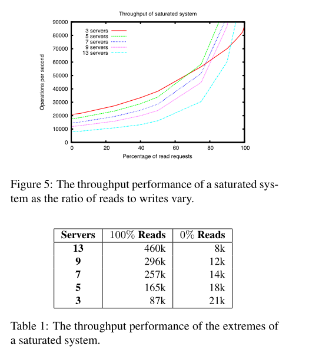

In Figure 5, we show throughput as we vary the ratio of read to write requests, and each curve corresponds to a different number of servers providing the ZooKeeper service. Table 1 shows the numbers at the extremes of the read loads. Read throughput is higher than write throughput because reads do not use atomic broadcast. The graph also shows that the number of servers also has a negative impact on the performance of the broadcast protocol. From these graphs, we observe that the number of servers in the system does not only impact the number of failures that the service can handle, but also the workload the service can handle. Note that the curve for three servers crosses the others around 60%. This situation is not exclusive of the three-server configuration, and happens for all configurations due to the parallelism local reads enable. It is not observable for other configurations in the figure, however, because we have capped the maximum y-axis throughput for readability.

在图5中，我们展示了吞吐量随着读写请求比例的变化，每条曲线对应于提供ZooKeeper服务的不同数量的服务器。表1显示了读负载极值处的数字。读取吞吐量高于写入吞吐量，因为读取不使用原子广播。图中还显示，服务器数量对广播协议性能也有负面影响。从这些图中，我们观察到系统中服务器的数量不仅影响服务可以处理的故障数量，还影响服务可以处理的工作负载。请注意，三个服务器的曲线在60%左右与其他曲线相交。这种情况并非仅限于三服务器配置，由于本地读取启用的并行性，所有配置都会发生这种情况。然而，在图中其他配置中并未观察到这一点，因为我们已经将最大y轴吞吐量限制在可读范围内。

There are two reasons for write requests taking longer than read requests. First, write requests must go through atomic broadcast, which requires some extra processing and adds latency to requests. The other reason for longer processing of write requests is that servers must ensure that transactions are logged to non-volatile store before sending acknowledgments back to the leader. In principle, this requirement is excessive, but for our production systems we trade performance for reliability since ZooKeeper constitutes application ground truth. We use more servers to tolerate more faults. We increase write throughput by partitioning the ZooKeeper data into multiple ZooKeeper ensembles. This performance trade off between replication and partitioning has been previously observed by Gray *et al.* [12].

有两个原因导致写请求的处理时间比读请求长。首先，写请求必须经过原子广播，这需要一些额外的处理并增加了请求的延迟。写请求处理时间较长的另一个原因是，服务器必须确保在将确认信息发送回领导者之前，将事务记录到非易失性存储中。从原则上讲，这个要求是过分的，但对于我们的生产系统，我们用可靠性换取性能，因为ZooKeeper构成了应用程序的基本事实。我们使用更多的服务器来容忍更多的故障。我们通过将ZooKeeper数据分区到多个ZooKeeper集合来提高写入吞吐量。Gray *et al.* [12]之前已经观察到了这种复制和分区之间的性能权衡。

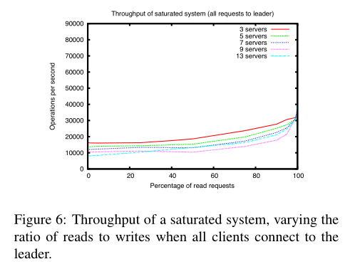

ZooKeeper is able to achieve such high throughput by distributing load across the servers that makeup the service. We can distribute the load because of our relaxed consistency guarantees. Chubby clients instead direct all requests to the leader. Figure 6 shows what happens if we do not take advantage of this relaxation and forced the clients to only connect to the leader. As expected the throughput is much lower for read-dominant workloads, but even for write-dominant workloads the throughput is lower. The extra CPU and network load caused by servicing clients impacts the ability of the leader to coordinate the broadcast of the proposals, which in turn adversely impacts the overall write performance.

ZooKeeper能够通过在组成服务的服务器之间分配负载来实现如此高的吞吐量。我们之所以能够分配负载，是因为我们的一致性保证较为宽松。Chubby客户端则将所有请求直接发送给领导者。图6显示了如果我们不利用这种松弛性并强制客户端仅连接到领导者会发生什么。如预期的那样，对于读取为主的工作负载，吞吐量要低得多，但即使对于写入为主的工作负载，吞吐量也较低。由于服务客户端而产生的额外CPU和网络负载影响了领导者协调广播提案的能力，这反过来又对整体写入性能产生了负面影响。

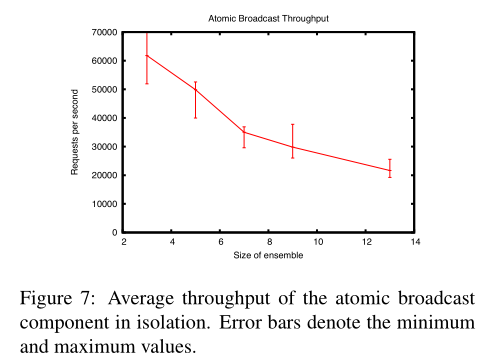

The atomic broadcast protocol does most of the work of the system and thus limits the performance of ZooKeeper more than any other component. Figure 7 shows the throughput of the atomic broadcast component. To benchmark its performance we simulate clients by generating the transactions directly at the leader, so there is no client connections or client requests and replies. At maximum throughput the atomic broadcast component becomes CPU bound. In theory the performance of Figure 7 would match the performance of ZooKeeper with 100% writes. However, the ZooKeeper client communication, ACL checks, and request to transaction conversions all require CPU. The contention for CPU lowers ZooKeeper throughput to substantially less than the atomic broadcast component in isolation. Because ZooKeeper is a critical production component, up to now our development focus for ZooKeeper has been correctness and robustness. There are plenty of opportunities for improving performance significantly by eliminating things like extra copies, multiple serializations of the same object, more efficient internal data structures, etc.

原子广播协议完成了系统的大部分工作，因此限制了ZooKeeper的性能，比其他任何组件都要多。图7显示了原子广播组件的吞吐量。为了对其性能进行基准测试，我们通过在领导者处直接生成事务来模拟客户端，因此没有客户端连接或客户端请求和回复。在最大吞吐量下，原子广播组件变得受CPU限制。理论上，图7的性能将与100%写入的ZooKeeper性能相匹配。然而，ZooKeeper客户端通信、ACL检查和请求到事务转换都需要CPU。争用CPU使ZooKeeper的吞吐量远低于原子广播组件在隔离状态下的吞吐量。因为ZooKeeper是一个关键的生产组件，所以到目前为止，我们对ZooKeeper的开发重点一直是正确性和稳健性。通过消除额外的副本、同一对象的多次序列化、更高效的内部数据结构等，有很多机会可以显著提高性能。

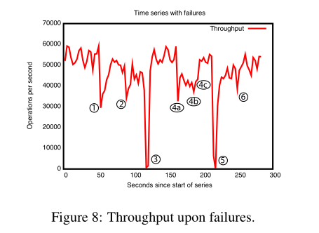

To show the behavior of the system over time as failures are injected we ran a ZooKeeper service made up of 5 machines. We ran the same saturation benchmark as before, but this time we kept the write percentage at a constant 30%, which is a conservative ratio of our expected workloads. Periodically we killed some of the server processes. Figure 8 shows the system throughput as it changes over time. The events marked in the figure are the following:

要展示随着故障注入而系统行为随时间变化，我们运行了一个由5台机器组成的ZooKeeper服务。我们运行了与之前相同的饱和基准测试，但这次我们将写入百分比保持在恒定的30%，这是我们预期工作负载的保守比例。我们定期杀死了一些服务器进程。图8显示了系统吞吐量随时间变化。图中标记的事件如下：

1. Failure and recovery of a follower;

1. 失败与追随者的恢复;

2. Failure and recovery of a different follower;

2. 失败和恢复一个不同的追随者;

3. Failure of the leader;

3. 领导者的失败;

4. Failure of two followers (a, b) in the first two marks, and recovery at the third mark (c);

4. 故障的两个追随者（a，b）在前两个标记处，以及在第三个标记处（c）的恢复;

5. Failure of the leader.

5. 领导者的失败。

6. Recovery of the leader.

6. 领导者的恢复。

There are a few important observations from this graph. First, if followers fail and recover quickly, then ZooKeeper is able to sustain a high throughput despite the failure. The failure of a single follower does not prevent servers from forming a quorum, and only reduces throughput roughly by the share of read requests that the server was processing before failing. Second, our leader election algorithm is able to recover fast enough to prevent throughput from dropping substantially. In our observations, ZooKeeper takes less than 200*ms* to elect a new leader. Thus, although servers stop serving requests for a fraction of second, we do not observe a throughput of zero due to our sampling period, which is on the order of seconds. Third, even if followers take more time to recover, ZooKeeper is able to raise throughput again once they start processing requests. One reason that we do not recover to the full throughput level after events 1, 2, and 4 is that the clients only switch followers when their connection to the follower is broken. Thus, after event 4 the clients do not redistribute themselves until the leader fails at events 3 and 5. In practice such imbalances work themselves out over time as clients come and go.

从这个图中可以得出一些重要的观察结果。首先，如果追随者失败并迅速恢复，那么ZooKeeper能够在失败的情况下保持高吞吐量。单个追随者的失败并不会阻止服务器形成法定人数，而只是大致减少了服务器在失败前处理的读请求的份额。其次，我们的领导者选举算法能够快速恢复，以防止吞吐量大幅下降。在我们的观察中，ZooKeeper在不到200*ms*的时间内选出新的领导者。因此，尽管服务器在一小段时间内停止处理请求，但由于我们的采样周期在几秒钟的数量级上，我们没有观察到吞吐量为零。第三，即使追随者需要更多的时间来恢复，ZooKeeper也能在它们开始处理请求后再次提高吞吐量。我们在事件1、2和4之后没有恢复到完全吞吐量的一个原因是，客户端只有在与追随者的连接断开时才会切换追随者。因此，在事件4之后，客户端在领导者在事件3和5失败之前不会重新分配。在实践中，随着客户端的进出，这种不平衡会随着时间的推移自行解决。

### 5.2 Latency of requests

To assess the latency of requests, we created a benchmark modeled after the Chubby benchmark [6]. We create a worker process that simply sends a create, waits for it to finish, sends an asynchronous delete of the new node, and then starts the next create. We vary the number of workers accordingly, and for each run, we have each worker create 50,000 nodes. We calculate the throughput by dividing the number of create requests completed by the total time it took for all the workers to complete.

为了评估请求的延迟，我们创建了一个基于Chubby基准测试[6]的基准测试。我们创建了一个工作进程，它只是发送一个创建请求，等待它完成，发送一个异步删除新节点的请求，然后开始下一个创建请求。我们相应地改变工作进程的数量，对于每次运行，我们让每个工作进程创建50,000个节点。我们通过将完成的创建请求的数量除以所有工作进程完成所需的总时间来计算吞吐量。

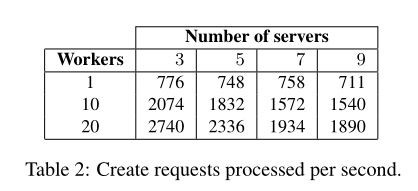

Table 2 show the results of our benchmark. The create requests include 1K of data, rather than 5 bytes in the Chubby benchmark, to better coincide with our expected use. Even with these larger requests, the throughput of ZooKeeper is more than 3 times higher than the published throughput of Chubby. The throughput of the single ZooKeeper worker benchmark indicates that the average request latency is 1*.*2ms for three servers and 1*.*4ms for 9 servers.

表2显示了我们基准测试的结果。创建请求包括1K的数据，而不是Chubby基准测试中的5字节，以更好地符合我们的预期用途。即使在这些较大的请求下，ZooKeeper的吞吐量也比Chubby公布的吞吐量高出3倍多。单个ZooKeeper工作器基准测试的吞吐量表明，对于三个服务器，平均请求延迟为1*.*2毫秒，对于9个服务器，为1*.*4毫秒。

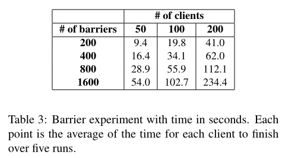

### 5.3 Performance of barriers

In this experiment, we execute a number of barriers sequentially to assess the performance of primitives implemented with ZooKeeper. For a given number of barriers *b*, each client first enters all *b* barriers, and then it leaves all *b* barriers in succession. As we use the double-barrier algorithm of Section 2.4, a client first waits for all other clients to execute the enter() procedure before moving to next call (similarly for leave()).

在这个实验中，我们顺序执行一定数量的障碍，以评估使用ZooKeeper实现的原语的性能。对于给定数量的障碍*b*，每个客户端首先进入所有*b*个障碍，然后依次离开所有*b*个障碍。由于我们使用了第2.4节的双重障碍算法，客户端首先等待所有其他客户端执行enter()过程，然后再移动到下一个调用（leave()过程也类似）。

We report the results of our experiments in Table 3. In this experiment, we have 50, 100, and 200 clients entering a number *b* of barriers in succession, *b* 200*,* 400*,* 800*,* 1600 . Although an application can have thousands of ZooKeeper clients, quite often a much smaller subset participates in each coordination operation as clients are often grouped according to the specifics of the application.

我们在表3中报告了我们的实验结果。在这个实验中，我们有50、100和200个客户端依次进入*b*个障碍，*b* 200*，* 400*，* 800*，* 1600。尽管一个应用程序可以有数千个ZooKeeper客户端，但很多时候，每个协调操作中参与的客户端数量要小得多，因为客户端通常根据应用程序的具体情况进行分组。

Two interesting observations from this experiment are that the time to process all barriers increase roughly linearly with the number of barriers, showing that concurrent access to the same part of the data tree did not produce any unexpected delay, and that latency increases proportionally to the number of clients. This is a consequence of not saturating the ZooKeeper service. In fact, we observe that even with clients proceeding in lock-step, the throughput of barrier operations (enter and leave) is between 1,950 and 3,100 operations per second in all cases. In ZooKeeper operations, this corresponds to throughput values between 10,700 and 17,000 operations per second. As in our implementation we have a ratio of reads to writes of 4:1 (80% of read operations), the throughput our benchmark code uses is much lower compared to the raw throughput ZooKeeper can achieve (over 40,000 according to Figure 5). This is due to clients waiting on other clients.

从这个实验中得出的两个有趣的观察结果是，处理所有屏障的时间大致与屏障数量成线性增长，表明对数据树的同一部分进行并发访问没有产生任何意外的延迟，以及延迟与客户端数量成正比。这是由于没有饱和ZooKeeper服务的结果。实际上，我们观察到，即使客户端按锁定步骤进行，屏障操作（进入和离开）的吞吐量在所有情况下都在每秒1,950到3,100次操作之间。在ZooKeeper操作中，这相当于每秒10,700到17,000次操作的吞吐量。由于在我们的实现中，读写比为4:1（80%的读操作），我们的基准代码使用的吞吐量与ZooKeeper可以实现的原始吞吐量相比要低得多（根据图5，超过40,000）。这是因为客户端在等待其他客户端。

## 6. Related work

ZooKeeper has the goal of providing a service that mitigates the problem of coordinating processes in distributed applications. To achieve this goal, its design uses ideas from previous coordination services, fault tolerant systems, distributed algorithms, and file systems.

ZooKeeper 的目标是提供一种服务，以缓解分布式应用程序中协调进程的问题。为实现这一目标，其设计采用了先前协调服务、容错系统、分布式算法和文件系统的思想。

We are not the first to propose a system for the coordination of distributed applications. Some early systems propose a distributed lock service for transactional applications [13], and for sharing information in clusters of computers [19]. More recently, Chubby proposes a system to manage advisory locks for distributed applications [6]. Chubby shares several of the goals of ZooKeeper. It also has a file-system-like interface, and it uses an agreement protocol to guarantee the consistency of the replicas. However, ZooKeeper is not a lock service. It can be used by clients to implement locks, but there are no lock operations in its API. Unlike Chubby, ZooKeeper allows clients to connect to any ZooKeeper server, not just the leader. ZooKeeper clients can use their local replicas to serve data and manage watches since its consistency model is much more relaxed than Chubby. This enables ZooKeeper to provide higher performance than Chubby, allowing applications to make more extensive use of ZooKeeper.

我们并非第一个提出分布式应用协调系统的人。一些早期系统提出了用于事务应用程序[13]和计算机集群中共享信息[19]的分布式锁服务。更近期地，Chubby 提出了一种用于分布式应用程序的建议锁管理系统[6]。Chubby 与 ZooKeeper 的几个目标相同。它还具有类似文件系统的界面，并使用一致性协议来保证副本的一致性。然而，ZooKeeper 不是锁服务。客户端可以使用它来实现锁，但其 API 中没有锁操作。与 Chubby 不同，ZooKeeper 允许客户端连接到任何 ZooKeeper 服务器，而不仅仅是领导者。ZooKeeper 客户端可以使用其本地副本提供数据和管理监听，因为其一致性模型比 Chubby 更为宽松。这使得 ZooKeeper 能够提供比 Chubby 更高的性能，从而使应用程序能够更广泛地使用 ZooKeeper。

There have been fault-tolerant systems proposed in the literature with the goal of mitigating the problem of building fault-tolerant distributed applications. One early system is ISIS [5]. The ISIS system transforms abstract type specifications into fault-tolerant distributed objects, thus making fault-tolerance mechanisms transparent to users. Horus [30] and Ensemble [31] are systems that evolved from ISIS. ZooKeeper embraces the notion of virtual synchrony of ISIS. Finally, Totem guarantees total order of message delivery in an architecture that exploits hardware broadcasts of local area networks [22]. ZooKeeper works with a wide variety of network topologies which motivated us to rely on TCP connections between server processes and not assume any special topology or hardware features. We also do not expose any of the ensemble communication used internally in ZooKeeper.

在文献中已经提出了容错系统，目的是缓解构建容错分布式应用程序的问题。一个早期的系统是ISIS [5]。ISIS系统将抽象类型规范转换为容错分布式对象，从而使容错机制对用户透明。Horus [30] 和 Ensemble [31] 是从ISIS演变而来的系统。ZooKeeper采用了ISIS的虚拟同步概念。最后，Totem在利用局域网硬件广播的架构中保证了消息传递的总顺序[22]。ZooKeeper适用于各种网络拓扑，这激励我们依赖于服务器进程之间的TCP连接，而不是假设任何特殊的拓扑或硬件特性。我们还没有暴露ZooKeeper内部使用的任何整体通信。

One important technique for building fault-tolerant services is state-machine replication [26], and Paxos [20] is an algorithm that enables efficient implementations of replicated state-machines for asynchronous systems. We use an algorithm that shares some of the characteristics of Paxos, but that combines transaction logging needed for consensus with write-ahead logging needed for data tree recovery to enable an efficient implementation. There have been proposals of protocols for practical implementations of Byzantine-tolerant replicated statemachines [7, 10, 18, 1, 28]. ZooKeeper does not assume that servers can be Byzantine, but we do employ mechanisms such as checksums and sanity checks to catch non-malicious Byzantine faults. Clement *et al.* discuss an approach to make ZooKeeper fully Byzantine fault-tolerant without modifying the current server code base [9]. To date, we have not observed faults in production that would have been prevented using a fully Byzantine fault-tolerant protocol. [29].

构建容错服务的一种重要技术是状态机复制[26]，Paxos[20]是一种能够实现异步系统中复制状态机的高效实现的算法。我们使用一种具有Paxos部分特征的算法，该算法将用于共识的事务日志记录与用于数据树恢复的预写日志记录相结合，以实现高效实现。已经有关于实用实现拜占庭容错复制状态机的协议的提议[7, 10, 18, 1, 28]。ZooKeeper并不假设服务器可能是拜占庭式的，但我们确实采用了诸如校验和和完整性检查之类的机制来捕获非恶意的拜占庭故障。Clement *等人*讨论了一种使ZooKeeper在不修改当前服务器代码库的情况下完全具有拜占庭容错能力的方法[9]。迄今为止，我们在生产中尚未观察到使用完全拜占庭容错协议可以防止的故障。[29]。

Boxwood [21] is a system that uses distributed lock servers. Boxwood provides higher-level abstractions to applications, and it relies upon a distributed lock service based on Paxos. Like Boxwood, ZooKeeper is a component used to build distributed systems. ZooKeeper, however, has high-performance requirements and is used more extensively in client applications. ZooKeeper exposes lower-level primitives that applications use to implement higher-level primitives.

"Boxwood [21]是一个使用分布式锁服务器的系统。Boxwood为应用程序提供更高级的抽象，并依赖于基于Paxos的分布式锁服务。与Boxwood一样，ZooKeeper是用于构建分布式系统的组件。然而，ZooKeeper具有高性能要求，并在客户端应用程序中得到了更广泛的应用。ZooKeeper暴露较低级别的原语，应用程序使用这些原语来实现更高级别的原语。"

ZooKeeper resembles a small file system, but it only provides a small subset of the file system operations and adds functionality not present in most file systems such as ordering guarantees and conditional writes. ZooKeeper watches, however, are similar in spirit to the cache callbacks of AFS [16].

ZooKeeper类似于一个小型文件系统，但它只提供了文件系统操作的一小部分，并添加了大多数文件系统中不存在的功能，如排序保证和条件写入。然而，Zoo-Keeper的监听与AFS[16]的缓存回调在精神上是相似的。

Sinfonia [2] introduces *mini-transactions*, a new paradigm for building scalable distributed systems. Sinfonia has been designed to store application data, whereas ZooKeeper stores application metadata. ZooKeeper keeps its state fully replicated and in memory for high performance and consistent latency. Our use of file system like operations and ordering enables functionality similar to mini-transactions. The znode is a convenient abstraction upon which we add watches, a functionality missing in Sinfonia. Dynamo [11] allows clients to get and put relatively small (less than 1M) amounts of data in a distributed key-value store. Unlike ZooKeeper, the key space in Dynamo is not hierarchal. Dynamo also does not provide strong durability and consistency guarantees for writes, but instead resolves conflicts on reads.

Sinfonia [2] 介绍了*迷你事务*，这是一种构建可扩展分布式系统的新范式。Sinfonia 旨在存储应用程序数据，而 ZooKeeper 存储应用程序元数据。ZooKeeper 保持其状态完全复制并存储在内存中，以实现高性能和一致的延迟。我们使用类似文件系统的操作和排序，实现类似迷你事务的功能。znode 是一个方便的抽象，我们在其基础上添加了监听器，这是 Sinfonia 中缺少的功能。Dynamo [11] 允许客户端在分布式键值存储中获取和存储相对较小（小于 1M）的数据量。与 ZooKeeper 不同，Dynamo 中的键空间不是分层的。Dynamo 也不为写操作提供强大的持久性和一致性保证，而是在读取时解决冲突。

DepSpace [4] uses a tuple space to provide a Byzantine fault-tolerant service. Like ZooKeeper DepSpace uses a simple server interface to implement strong synchronization primitives at the client. While DepSpace’s performance is much lower than ZooKeeper, it provides stronger fault tolerance and confidentiality guarantees.

DepSpace [4] 使用元组空间提供拜占庭容错服务。与ZooKeeper一样，DepSpace使用简单的服务器接口在客户端实现强同步原语。尽管DepSpace的性能比ZooKeeper低得多，但它提供了更强的容错和保密性保证。

## 7. Conclusions

ZooKeeper takes a wait-free approach to the problem of coordinating processes in distributed systems, by exposing wait-free objects to clients. We have found ZooKeeper to be useful for several applications inside and outside Yahoo!. ZooKeeper achieves throughput values of hundreds of thousands of operations per second for read-dominant workloads by using fast reads with watches, both of which served by local replicas. Although our consistency guarantees for reads and watches appear to be weak, we have shown with our use cases that this combination allows us to implement efficient and sophisticated coordination protocols at the client even though reads are not precedence-ordered and the implementation of data objects is wait-free. The wait-free property has proved to be essential for high performance.

ZooKeeper采用了无等待（wait-free）的方法来解决分布式系统中进程协调的问题，通过向客户端提供无等待对象。我们发现ZooKeeper在Yahoo!内外的多个应用中非常有用。通过使用快速读取和监听器（watches），ZooKeeper对于以读操作为主的工作负载可以达到每秒数十万个操作的吞吐量，这两个特性都由本地副本提供支持。尽管我们的读取和监听器的一致性保证似乎比较弱，但我们通过用例证明，这种组合使我们能够在客户端实现高效且复杂的协调协议，即使读取操作没有优先顺序，并且数据对象的实现是无等待的。无等待属性被证明对于高性能非常重要。

Although we have described only a few applications, there are many others using ZooKeeper. We believe such a success is due to its simple interface and the powerful abstractions that one can implement through this interface. Further, because of the high-throughput of ZooKeeper, applications can make extensive use of it, not only course-grained locking.

尽管我们只描述了一些应用程序，但还有许多其他应用程序使用ZooKeeper。我们相信这种成功是由于其简单的接口和可以通过此结构实现的强大抽象。此外，由于ZooKeeper的高吞吐量，应用程序可以大量使用它，不仅仅是粗粒度锁。

## Acknowledgements

We would like to thank Andrew Kornev and Runping Qi for their contributions to ZooKeeper; Zeke Huang and Mark Marchukov for valuable feedback; Brian Cooper and Laurence Ramontianu for their early contributions to ZooKeeper; Brian Bershad and Geoff Voelker made important comments on the presentation.

我们要感谢Andrew Kornev和Runping Qi对ZooKeeper的贡献；感谢Zeke Huang和Mark Marchukov的宝贵意见；感谢Brian Cooper和Laurence Ramontianu对ZooKeeper的早期贡献；感谢Brian Bershad和Geoff Voelker对演示的重要评论。

## References

1. M. Abd-El-Malek, G. R. Ganger, G. R. Goodson, M. K. Reiter, and J. J. Wylie. Fault-scalable byzantine fault-tolerant services. In *SOSP ’05: Proceedings of the twentieth ACM symposium on Operating systems principles*, pages 59–74, New York, NY, USA, 2005. ACM.

2. M. Aguilera, A. Merchant, M. Shah, A. Veitch, and C. Karamanolis. Sinfonia: A new paradigm for building scalable distributed systems. In *SOSP ’07: Proceedings of the 21st ACM symposium on Operating systems principles*, New York, NY, 2007.

3. Amazon. Amazon simple queue service. [http://aws.](http://aws/) amazon.com/sqs/, 2008.

4. A. N. Bessani, E. P. Alchieri, M. Correia, and J. da Silva Fraga. Depspace: A byzantine fault-tolerant coordination service. In *Proceedings of the 3rd ACM SIGOPS/EuroSys European Systems Conference EuroSys 2008*, Apr. 2008.

5. K. P. Birman. Replication and fault-tolerance in the ISIS system. In *SOSP ’85: Proceedings of the 10th ACM symposium on Operating systems principles*, New York, USA, 1985. ACM Press.

6. M. Burrows. The Chubby lock service for loosely-coupled distributed systems. In *Proceedings of the 7th ACM/USENIX Symposium on Operating Systems Design and Implementation (OSDI)*, 2006.

7. M. Castro and B. Liskov. Practical byzantine fault tolerance and proactive recovery. *ACM Transactions on Computer Systems*, 20(4), 2002.

8. T. Chandra, R. Griesemer, and J. Redstone. Paxos made live: An engineering perspective. In *Proceedings of the 26th annual ACM symposium on Principles of distributed computing (PODC)*, Aug. 2007.

9. A. Clement, M. Kapritsos, S. Lee, Y. Wang, L. Alvisi, M. Dahlin, and T. Riche. UpRight cluster services. In *Proceedings of the 22 nd ACM Symposium on Operating Systems Principles (SOSP)*, Oct. 2009.

10. J. Cowling, D. Myers, B. Liskov, R. Rodrigues, and L. Shira. Hq replication: A hybrid quorum protocol for byzantine fault tolerance. In *SOSP ’07: Proceedings of the 21st ACM symposium on Operating systems principles*, New York, NY, USA, 2007.

11. G. DeCandia, D. Hastorun, M. Jampani, G. Kakulapati, A. Lakshman, A. Pilchin, S. Sivasubramanian, P. Vosshall, and W. Vogels. Dynamo: Amazons highly available key-value store. In *SOSP ’07: Proceedings of the 21st ACM symposium on Operating systems principles*, New York, NY, USA, 2007. ACM Press.

12. J. Gray, P. Helland, P. O’Neil, and D. Shasha. The dangers of replication and a solution. In *Proceedings of SIGMOD ’96*, pages 173–182, New York, NY, USA, 1996. ACM.

13. A. Hastings. Distributed lock management in a transaction processing environment. In *Proceedings of IEEE 9th Symposium on Reliable Distributed Systems*, Oct. 1990.

14. M. Herlihy. Wait-free synchronization. *ACM Transactions on Programming Languages and Systems*, 13(1), 1991.

15. M. Herlihy and J. Wing. Linearizability: A correctness condition for concurrent objects. *ACM Transactions on Programming Languages and Systems*, 12(3), July 1990.

16. J. H. Howard, M. L. Kazar, S. G. Menees, D. A. Nichols, M. Satyanarayanan, R. N. Sidebotham, and M. J. West. Scale and performance in a distributed file system. *ACM Trans. Comput. Syst.*, 6(1), 1988.

17. Katta. Katta distribute lucene indexes in a grid. http:// katta.wiki.sourceforge.net/, 2008.

18. R. Kotla, L. Alvisi, M. Dahlin, A. Clement, and E. Wong. Zyzzyva: speculative byzantine fault tolerance. *SIGOPS Oper. Syst. Rev.*, 41(6):45–58, 2007.

19. N. P. Kronenberg, H. M. Levy, and W. D. Strecker. Vaxclusters (extended abstract): a closely-coupled distributed system. *SIGOPS Oper. Syst. Rev.*, 19(5), 1985.

20. L. Lamport. The part-time parliament. *ACM Transactions on Computer Systems*, 16(2), May 1998.

21. J. MacCormick, N. Murphy, M. Najork, C. A. Thekkath, and L. Zhou. Boxwood: Abstractions as the foundation for storage infrastructure. In *Proceedings of the 6th ACM/USENIX Symposium on Operating Systems Design and Implementation (OSDI)*, 2004.

22. L. Moser, P. Melliar-Smith, D. Agarwal, R. Budhia, C. LingleyPapadopoulos, and T. Archambault. The totem system. In *Proceedings of the 25th International Symposium on Fault-Tolerant Computing*, June 1995.

23. S. Mullender, editor. *Distributed Systems, 2nd edition*. ACM Press, New York, NY, USA, 1993.

24. B. Reed and F. P. Junqueira. A simple totally ordered broadcast protocol. In *LADIS ’08: Proceedings of the 2nd Workshop on Large-Scale Distributed Systems and Middleware*, pages 1–6, New York, NY, USA, 2008. ACM.

25. N. Schiper and S. Toueg. A robust and lightweight stable leader election service for dynamic systems. In *DSN*, 2008.

26. F. B. Schneider. Implementing fault-tolerant services using the state machine approach: A tutorial. *ACM Computing Surveys*, 22(4), 1990.

27. A. Sherman, P. A. Lisiecki, A. Berkheimer, and J. Wein. ACMS: The Akamai configuration management system. In *NSDI*, 2005.

28. A. Singh, P. Fonseca, P. Kuznetsov, R. Rodrigues, and P. Maniatis. Zeno: eventually consistent byzantine-fault tolerance. In *NSDI’09: Proceedings of the 6th USENIX symposium on Networked systems design and implementation*, pages 169–184, Berkeley, CA, USA, 2009. USENIX Association.

29. Y. J. Song, F. Junqueira, and B. Reed. BFT for the skeptics. <http://www.net.t-labs.tu-berlin.de/> ˜petr/BFTW3/abstracts/talk-abstract.pdf.

30. R. van Renesse and K. Birman. Horus, a flexible group communication systems. *Communications of the ACM*, 39(16), Apr. 1996.

31. R. van Renesse, K. Birman, M. Hayden, A. Vaysburd, and D. Karr. Building adaptive systems using ensemble. *Software* *Practice and Experience*, 28(5), July 1998.
